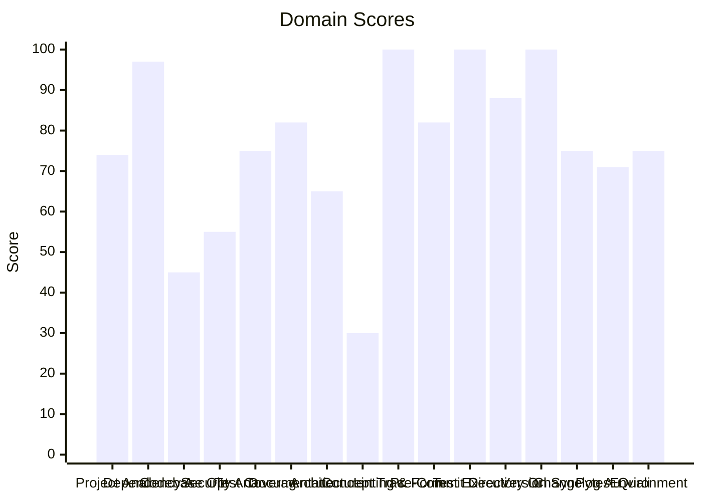

# 🔬 Code Enhancement Report

> **Generated**: 2026-05-22 22:44:22 UTC | **Target**: repository-manager | **Overall GPA**: 2.25/4.0

---

## 📊 Executive Summary

| Domain | Grade | Score | Status |
|--------|-------|-------|--------|
| Concept Traceability | 🔴 F | 30/100 | `██████░░░░░░░░░░░░░░` 30/100 |
| Codebase Optimization | 🔴 F | 45/100 | `█████████░░░░░░░░░░░` 45/100 |
| Security Analysis | 🔴 F | 55/100 | `███████████░░░░░░░░░` 55/100 |
| Architecture & Design Patterns | 🟠 D | 65/100 | `█████████████░░░░░░░` 65/100 |
| Pytest Quality | 🟡 C | 71/100 | `██████████████░░░░░░` 71/100 |
| Project Analysis | 🟡 C | 74/100 | `██████████████░░░░░░` 74/100 |
| Test Coverage | 🟡 C | 75/100 | `███████████████░░░░░` 75/100 |
| Changelog Audit | 🟡 C | 75/100 | `███████████████░░░░░` 75/100 |
| Environment Variables | 🟡 C | 75/100 | `███████████████░░░░░` 75/100 |
| Documentation & Governance | 🔵 B | 82/100 | `████████████████░░░░` 82/100 |
| Pre-Commit Compliance | 🔵 B | 82/100 | `████████████████░░░░` 82/100 |
| Directory Organization | 🔵 B | 88/100 | `█████████████████░░░` 88/100 |
| Dependency Audit | 🟢 A | 97/100 | `███████████████████░` 97/100 |
| Linting & Formatting | 🟢 A | 100/100 | `████████████████████` 100/100 |
| Test Execution | 🟢 A | 100/100 | `████████████████████` 100/100 |
| Version Sync Analysis | 🟢 A | 100/100 | `████████████████████` 100/100 |

---

## 📋 Domain Scorecards

### Project Analysis — 🟡 Grade: C (74/100)

`██████████████░░░░░░` 74/100

> [!NOTE]
> Detected ecosystem marker: agent-utilities → Agent-Utilities Ecosystem

| Criterion | Points | Evidence | Reasoning |
|-----------|--------|----------|-----------|
| has_pyproject | 10 | `pyproject.toml and requirements.txt` | Both pyproject.toml and requirements.txt exist, fulfilling mandatory Python proj |
| project_type_detected | 10 | `Agent-Utilities Ecosystem` | Identified 1 ecosystem marker(s) in dependencies |
| externalized_prompts | 0 | `/home/apps/workspace/agent-packages/agents/repository-manage` | No prompts/ directory found. Prompts may be hardcoded in source. |
| observability | 0 | `dependency list` | No observability tools (logfire, sentry, opentelemetry) found |
| testing_suite | 10 | `tests dir: True, pytest dep: True` | Tests directory exists, pytest in dependencies |
| agents_md | 10 | `/home/apps/workspace/agent-packages/agents/repository-manage` | AGENTS.md exists with comprehensive content |
| pre_commit_hooks | 10 | `/home/apps/workspace/agent-packages/agents/repository-manage` | Pre-commit configuration found for automated code quality checks |
| gitignore | 10 | `/home/apps/workspace/agent-packages/agents/repository-manage` | .gitignore exists to prevent committing build artifacts and secrets |
| env_template | 10 | `/home/apps/workspace/agent-packages/agents/repository-manage` | Environment template exists for onboarding and secret management |
| protocol_support | 4 | `MCP` | 1 communication protocol(s) detected |

**Findings:**
- Protocol support: MCP

---

### Dependency Audit — 🟢 Grade: A (97/100)

`███████████████████░` 97/100

> [!TIP]
> Minor update: pre-commit 4.5.1 (constraint — not installed) -> 4.6.0

| Criterion | Points | Evidence | Reasoning |
|-----------|--------|----------|-----------|
| dependency_freshness | 97 | `source=/home/apps/workspace/agent-packages/agents/repository` | Audited 8 deps (6 installed, 2 constraint-only). 0 major, 1 minor, 0 patch updates |

---

### Codebase Optimization — 🔴 Grade: F (45/100)

`█████████░░░░░░░░░░░` 45/100

> [!CAUTION]
> Moderate avg cyclomatic complexity: 7.5

| Criterion | Points | Evidence | Reasoning |
|-----------|--------|----------|-----------|
| code_quality | 45 | `{"file_count": 29, "total_lines": 8111, "function_count": 17` | Analyzed 29 files, 178 functions. Avg CC=7.5, max length=453, duplication=2.1%,  |

**Findings:**
- 4 functions exceed 200 lines (actionable refactoring targets): validate_projects (453L), main (353L), phased_bumpversion (230L), to_directory_report (209L)
- Monolithic: mcp_server.py (574L) — 1 functions with high complexity (worst: _get_job_status at 78L, CC=20); Low cohesion: 11 distinct concepts in one file
- Monolithic: repository_manager.py (3142L) — 11 functions with high complexity (worst: Git.validate_projects at 453L, CC=70); God class: Git (42 methods) — consider mixins/composition
- Monolithic: models.py (1452L) — 7 functions with high complexity (worst: ValidationReport.to_directory_report at 209L, CC=23); Low cohesion: 30 distinct concepts in one file

---

### Security Analysis — 🔴 Grade: F (55/100)

`███████████░░░░░░░░░` 55/100

> [!CAUTION]
> 3 HIGH severity vulnerabilities found

| Criterion | Points | Evidence | Reasoning |
|-----------|--------|----------|-----------|
| security_posture | 55 | `high=3 med=0 low=0 attack_surface={"subprocess_calls": 16, "` | Scanned 29 files. Found 3 security findings. High: -45pts, Med: -0pts, Low: -0pt |

---

### Test Coverage — 🟡 Grade: C (75/100)

`███████████████░░░░░` 75/100

> [!NOTE]
> Test suite lacks intent diversity (only one type)

| Criterion | Points | Evidence | Reasoning |
|-----------|--------|----------|-----------|
| test_coverage_quality | 75 | `{"test_file_count": 11, "test_count": 54, "source_file_count` | 54 tests across 11 files. Ratio: 1.86. Intent: {'unit': 54}. 2 without assertion |

**Findings:**
- 17 potential doc-test drift items

---

### Documentation & Governance — 🔵 Grade: B (82/100)

`████████████████░░░░` 82/100

> [!NOTE]
> README.md missing sections: usage|quick start

| Criterion | Points | Evidence | Reasoning |
|-----------|--------|----------|-----------|
| documentation_quality | 82 | `{"README.md": {"exists": true, "missing": ["usage|quick star` | Audited 6 standard docs + docs/ directory. 39 broken references, 5 docs present. |

**Findings:**
- 2 broken internal links in README.md
- README missing: Has a Table of Contents
- README missing: Has usage examples with code blocks
- 39 broken file references in documentation

---

### Architecture & Design Patterns — 🟠 Grade: D (65/100)

`█████████████░░░░░░░` 65/100

> [!WARNING]
> SRP: 5 modules exceed 500 lines (god modules)

| Criterion | Points | Evidence | Reasoning |
|-----------|--------|----------|-----------|
| architecture_quality | 65 | `{"layers": 0, "di_ratio": 0.08, "solid_violations": 2}` | Analyzed 29 files. 0/5 architecture layers present, DI ratio: 8%, 2 SOLID violat |

**Findings:**
- SRP: 1 classes have >15 methods
- No discernible layer architecture (no domain/service/adapter separation)
- Low dependency injection ratio: 8%

---

### Concept Traceability — 🔴 Grade: F (30/100)

`██████░░░░░░░░░░░░░░` 30/100

> [!CAUTION]
> Low traceability ratio: 0% concepts fully traced

| Criterion | Points | Evidence | Reasoning |
|-----------|--------|----------|-----------|
| concept_traceability | 30 | `{"total_concepts": 5, "well_traced": 0, "orphans": 5, "drift` | 5 unique concepts found. 0 fully traced (code+docs+tests), 5 orphans, 0 drifted. |

**Findings:**
- 54 test functions missing concept markers
- 67 significant functions (>10 lines) missing concept markers in docstrings

---

### Linting & Formatting — 🟢 Grade: A (100/100)

`████████████████████` 100/100

> [!TIP]
> Total lint findings: 0 (high/error: 0, medium/warning: 0, low: 0)

| Criterion | Points | Evidence | Reasoning |
|-----------|--------|----------|-----------|
| lint_compliance | 100 | `ruff=0, bandit=0, mypy=0` | 0 total findings across 3 tools. High/error: -0pts, Med/warning: -0pts, Low: -0p |

---

### Pre-Commit Compliance — 🔵 Grade: B (82/100)

`████████████████░░░░` 82/100

> [!NOTE]
> 3/25 pre-commit hooks failed: don't commit to branch, mypy, bandit

| Criterion | Points | Evidence | Reasoning |
|-----------|--------|----------|-----------|
| precommit_compliance | 82 | `{"total_hooks": 25, "passed": 21, "failed": 3, "skipped": 1,` | Ran pre-commit with 25 hooks: 21 passed, 3 failed, 1 skipped. 1 potentially outd |

**Findings:**
- 1 hook(s) may be outdated: ruff-pre-commit
- Pytest hooks skipped (handled by CE-016 Test Execution): local-pytest, pytest

---

### Test Execution — 🟢 Grade: A (100/100)

`████████████████████` 100/100

| Criterion | Points | Evidence | Reasoning |
|-----------|--------|----------|-----------|
| test_execution | 100 | `{"frameworks_detected": 1, "total_passed": 53, "total_failed` | Executed 1 framework(s). 53 passed, 0 failed, 0 errors. Pass rate: 100%. |

---

### Directory Organization — 🔵 Grade: B (88/100)

`█████████████████░░░` 88/100

> [!NOTE]
> 4 rogue/throwaway scripts detected (fix_*, validate_*, patch_*, etc.): scripts/debug_map.py, scripts/validate_agent.py, scripts/validate_ecosystem.py, scripts/validate_a2a_agent.py

| Criterion | Points | Evidence | Reasoning |
|-----------|--------|----------|-----------|
| directory_organization | 88 | `{"total_source_files": 64, "total_directories": 11, "max_dep` | 64 files across 11 directories. Max depth: 3, avg files/dir: 5.8. 0 crowded, 0 s |

---

### Version Sync Analysis — 🟢 Grade: A (100/100)

`████████████████████` 100/100

> [!TIP]
> All version '1.18.0' declarations appear to be tracked correctly.

| Criterion | Points | Evidence | Reasoning |
|-----------|--------|----------|-----------|
| bumpversion_exists | 20 | `/home/apps/workspace/agent-packages/agents/repository-manage` | .bumpversion.cfg found |
| current_version_defined | 20 | `1.18.0` | Current version tracked is 1.18.0 |
| files_tracked | 20 | `6 files tracked` | Found 6 files tracked in .bumpversion.cfg |
| version_drift_check | 40 | `0 drifted files` | No version drift detected in codebase files |

---

### Changelog Audit — 🟡 Grade: C (75/100)

`███████████████░░░░░` 75/100

> [!NOTE]
> CHANGELOG.md exists but could not be parsed — check format compliance

| Criterion | Points | Evidence | Reasoning |
|-----------|--------|----------|-----------|
| changelog_quality | 75 | `{"exists": true, "parseable": false, "version_count": 0, "ha` | CHANGELOG.md exists. 0 versions tracked. 0 dependency changelogs analyzed. |

**Findings:**
- No changelog entries within the last 30 days
- keepachangelog not installed — pip install 'universal-skills[code-enhancer]'

---

### Pytest Quality — 🟡 Grade: C (71/100)

`██████████████░░░░░░` 71/100

> [!NOTE]
> 2 test files exceed 500 lines — split into focused modules

| Criterion | Points | Evidence | Reasoning |
|-----------|--------|----------|-----------|
| pytest_quality | 71 | `{"test_files": 11, "total_tests": 54, "descriptive_name_rati` | 54 tests across 11 files. Naming: 20/20, Structure: 9/20, Fixtures: 11/20, Asserts |

**Findings:**
- Test directory lacks subdirectory organization (consider unit/, integration/, e2e/)
- Missing conftest.py for shared fixtures
- No @pytest.mark.parametrize usage — consider data-driven tests
- No shared fixtures in conftest.py

---

### Environment Variables — 🟡 Grade: C (75/100)

`███████████████░░░░░` 75/100

> [!NOTE]
> Partial env var documentation: 50% coverage

| Criterion | Points | Evidence | Reasoning |
|-----------|--------|----------|-----------|
| env_var_documentation | 75 | `{"total_vars": 30, "python_vars": 12, "dockerfile_vars": 4, ` | Found 30 unique env vars across 66 occurrences. README documents 15/30. Has .env |

**Findings:**
- Undocumented env vars: AUTH_TYPE, EUNOMIA_POLICY_FILE, EUNOMIA_TYPE, GIT_OPERATIONSTOOL, LLM_API_KEY, LLM_BASE_URL, MISCTOOL, OTEL_EXPORTER_OTLP_ENDPOINT, OTEL_EXPORTER_OTLP_PUBLIC_KEY, OTEL_EXPORTER_OTLP_SECRET_KEY
- 8 Python env vars not in .env.example: LLM_API_KEY, LLM_BASE_URL, MCP_URL, MODEL_ID, REPOSITORY_MANAGER_DEFAULT_BRANCH

---

## 🎯 Prioritized Action Items

| # | Priority | Domain | Action | Impact | Risk |
|---|----------|--------|--------|--------|------|
| 1 | 🔴 High | Codebase Optimization | Moderate avg cyclomatic complexity: 7.5 | High | High |
| 2 | 🔴 High | Codebase Optimization | 4 functions exceed 200 lines (actionable refactoring targets): validate_projects | High | High |
| 3 | 🔴 High | Codebase Optimization | Monolithic: mcp_server.py (574L) — 1 functions with high complexity (worst: _get | High | High |
| 4 | 🔴 High | Codebase Optimization | Monolithic: repository_manager.py (3142L) — 11 functions with high complexity (w | High | High |
| 5 | 🔴 High | Codebase Optimization | Monolithic: models.py (1452L) — 7 functions with high complexity (worst: Validat | High | High |
| 6 | 🔴 High | Codebase Optimization | 18 functions with nesting depth >4 | High | High |
| 7 | 🔴 High | Security Analysis | 3 HIGH severity vulnerabilities found | High | High |
| 8 | 🔴 High | Concept Traceability | Low traceability ratio: 0% concepts fully traced | High | High |
| 9 | 🔴 High | Concept Traceability | 54 test functions missing concept markers | High | High |
| 10 | 🔴 High | Concept Traceability | 67 significant functions (>10 lines) missing concept markers in docstrings | High | High |
| 11 | 🔴 High | Architecture & Design Patterns | SRP: 5 modules exceed 500 lines (god modules) | High | Medium |
| 12 | 🔴 High | Architecture & Design Patterns | SRP: 1 classes have >15 methods | High | Medium |
| 13 | 🔴 High | Architecture & Design Patterns | No discernible layer architecture (no domain/service/adapter separation) | High | Medium |
| 14 | 🔴 High | Architecture & Design Patterns | Low dependency injection ratio: 8% | High | Medium |
| 15 | 🟡 Medium | Project Analysis | Detected ecosystem marker: agent-utilities → Agent-Utilities Ecosystem | Medium | Low |
| 16 | 🟡 Medium | Project Analysis | Protocol support: MCP | Medium | Low |
| 17 | 🟡 Medium | Test Coverage | Test suite lacks intent diversity (only one type) | Medium | Low |
| 18 | 🟡 Medium | Test Coverage | 17 potential doc-test drift items | Medium | Low |
| 19 | 🟡 Medium | Changelog Audit | CHANGELOG.md exists but could not be parsed — check format compliance | Medium | Low |
| 20 | 🟡 Medium | Changelog Audit | No changelog entries within the last 30 days | Medium | Low |
| 21 | 🟡 Medium | Changelog Audit | keepachangelog not installed — pip install 'universal-skills[code-enhancer]' | Medium | Low |
| 22 | 🟡 Medium | Pytest Quality | 2 test files exceed 500 lines — split into focused modules | Medium | Low |
| 23 | 🟡 Medium | Pytest Quality | Test directory lacks subdirectory organization (consider unit/, integration/, e2 | Medium | Low |
| 24 | 🟡 Medium | Pytest Quality | Missing conftest.py for shared fixtures | Medium | Low |
| 25 | 🟡 Medium | Pytest Quality | No @pytest.mark.parametrize usage — consider data-driven tests | Medium | Low |
| 26 | 🟡 Medium | Pytest Quality | No shared fixtures in conftest.py | Medium | Low |
| 27 | 🟡 Medium | Pytest Quality | 2 tests have no assertions | Medium | Low |
| 28 | 🟡 Medium | Pytest Quality | 3 tests exceed 100 lines — likely doing too much per test | Medium | Low |
| 29 | 🟡 Medium | Environment Variables | Partial env var documentation: 50% coverage | Medium | Low |
| 30 | 🟡 Medium | Environment Variables | Undocumented env vars: AUTH_TYPE, EUNOMIA_POLICY_FILE, EUNOMIA_TYPE, GIT_OPERATI | Medium | Low |

---

## 🔄 SDD Handoff

Run `generate_sdd_handoff.py` with this report's JSON data to produce
structured TODO items compatible with the `spec-generator` → `task-planner` →
`sdd-implementer` pipeline. Output will be saved to `.specify/specs/`.
