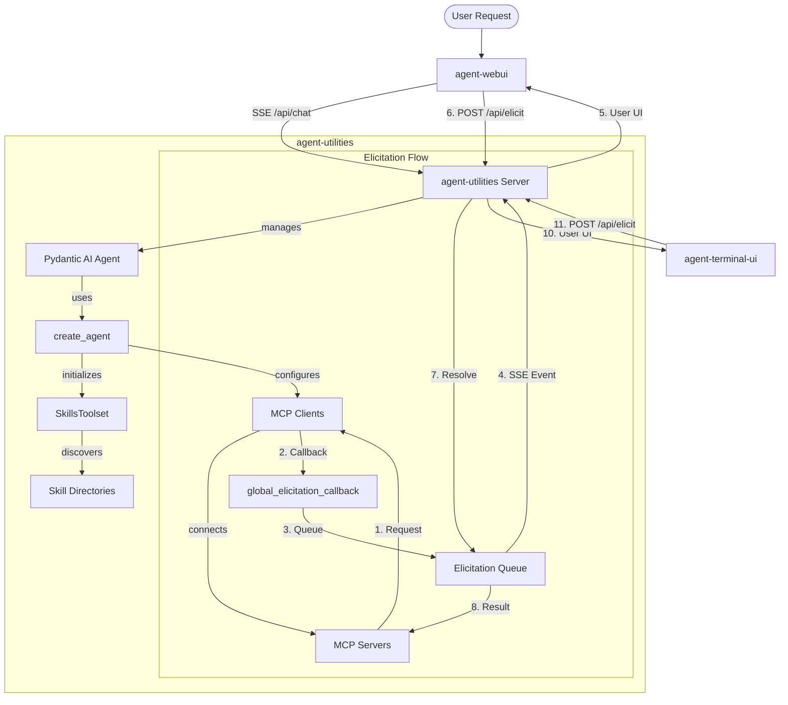
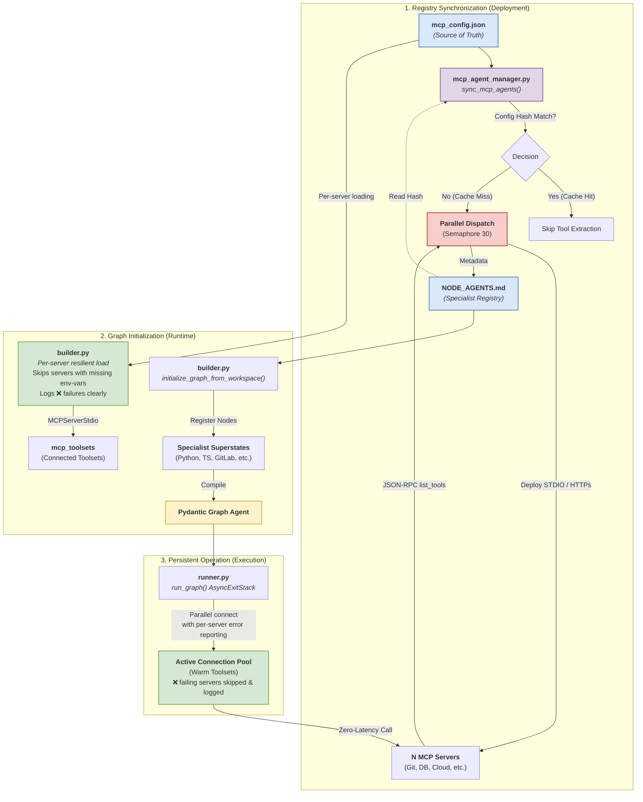
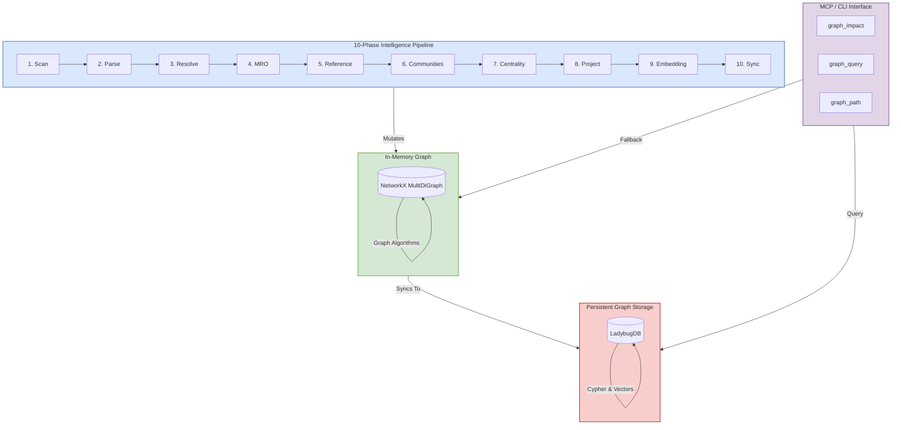

# Repository Manager Agent Documentation

This document provides an overview of the Repository Manager agent, its architecture, and how to use it.

## Tech Stack & Architecture
- **Language**: Python 3.10+
- **Core Framework**: [Pydantic AI](https://ai.pydantic.dev) & [Pydantic Graph](https://ai.pydantic.dev/pydantic-graph/)
- **Tooling**: `requests`, `pydantic`, `pyyaml`, `python-dotenv`, `fastapi`, `llama_index`, `FastMCP`
- **Architecture**: Centered around the `create_agent` factory from `agent-utilities`, which has been modernized to support a **Unified Skill Loading** model (`skill_types`) and automated **Graph Orchestration**.
- **Specialist Discovery**: Automated discovery of domain specialist agents from `NODE_AGENTS.md` (local) and `A2A_AGENTS.md` (remote) registries, enabling dynamic graph expansion without hardcoded nodes.
- **Key Principles**:
    - Functional and modular utility design.
    - Standardized workspace management (`IDENTITY.md`, `MEMORY.md`).
    - **Elicitation First**: Robust support for structured user input during tool calls, bridging MCP and Web UIs.

## Package Relationships
The Repository Manager agent is built on top of the `agent-utilities` package, which provides the core Python engine for LLM orchestration, tool execution, and the SSE streaming protocol.

- **Backend (`agent-utilities`)**: Handles LLM orchestration, tool execution, and the SSE streaming protocol.
- **Web Frontend (`agent-webui`)**: A React application that provides a cinematic chat interface and specialized UI components.
- **Communication**: Frontends talk to Backend via SSE for output and standard REST (POST) for input and elicitation responses.

## Validation & Diagnostics

To ensure the Repository Manager specialist and its graph lifecycle are functioning correctly, use the following validation tools:

### End-to-End Specialist Validation
High-fidelity testing of individual specialist nodes through the SSE streaming protocol. This bypasses the Web UI and provides granular execution logs to monitor tool calls and result registration.

**Usage:**
```bash
# From the repository-manager root
python scripts/verify_graph.py "List all projects in the workspace"
```

**Monitored Events:**
- **Graph Lifecycle**: `graph-start`, `node-start`, `graph-complete` events.
- **Tool Execution**: `expert_tool_call` and `expert_tool_result` events with detailed payloads.
- **Payload Integrity**: Verifies unified result storage in `results_registry` for expert nodes.

### Integration Test Suite
The local `tests/test_agent_integration.py` validates the entire stack from registry sync to tool execution:
- **Registry Sync**: Validates discovery of MCP tools and specialist tags from `mcp_config.json`.
- **Connection Resilience**: Tests parallel AnyIO initialization of toolsets without structured concurrency violations.
- **Port Stability**: Robust port cleanup and health check coordination for local development.

## Core Architecture Diagram


## MCP Loading & Registry Architecture
This diagram illustrates how MCP servers are discovered, specialized, and persisted in the graph.



## Graph Orchestration Architecture
```mermaid
graph TB
    Start([User Query]) --> UsageGuard[Usage Guard: Rate Limiting]
    UsageGuard -- "Allow" --> router_step[Router: Topology Selection]
    UsageGuard -- "Block" --> End([End Result])

    router_step --> planner_step[Planner: Global Strategy]
    planner_step --> mem_step[Memory: Context Retrieval]
    mem_step --> dispatcher[Dispatcher: Dynamic Routing]

    subgraph "Discovery Phase"
        direction TB
        Researcher["<b>Researcher</b><br/>---<br/><i>u-skill:</i> web-search, web-crawler, web-fetch<br/><i>t-tool:</i> project_search, read_workspace_file"]
        Architect["<b>Architect</b><br/>---<br/><i>u-skill:</i> c4-architecture, product-management, product-strategy, user-research<br/><i>t-tool:</i> developer_tools"]
        A2ADiscovery["<b>A2A Discovery</b><br/>---<br/><i>source:</i> AGENTS.md<br/><i>t-tool:</i> fetch_agent_card"]
        res_joiner[Research Joiner: Barrier Sync]
    end

    dispatcher -- "Parallel Dispatch" --> Researcher
    dispatcher -- "Parallel Dispatch" --> Architect
    dispatcher -- "Parallel Dispatch" --> A2ADiscovery
    Researcher --> res_joiner
    Architect --> res_joiner
    A2ADiscovery --> res_joiner
    res_joiner -- "Coalesced Context" --> dispatcher

    subgraph "Execution Phase"
        direction TB

        subgraph "Programmers"
            direction LR
            PyP["<b>Python</b><br/>---<br/><i>u-skill:</i> agent-builder, tdd-methodology, mcp-builder, jupyter-notebook<br/><i>g-skill:</i> python-docs, fastapi-docs, pydantic-ai-docs<br/><i>t-tool:</i> developer_tools"]
            TSP["<b>TypeScript</b><br/>---<br/><i>u-skill:</i> react-development, web-artifacts, tdd-methodology, canvas-design<br/><i>g-skill:</i> nodejs-docs, react-docs, nextjs-docs, shadcn-docs<br/><i>t-tool:</i> developer_tools"]
            GoP["<b>Go</b><br/>---<br/><i>u-skill:</i> tdd-methodology<br/><i>g-skill:</i> go-docs<br/><i>t-tool:</i> developer_tools"]
            RustP["<b>Rust</b><br/>---<br/><i>u-skill:</i> tdd-methodology<br/><i>g-skill:</i> rust-docs<br/><i>t-tool:</i> developer_tools"]
            CP["<b>C/C++</b><br/>---<br/><i>t-tool:</i> developer_tools"]
            JSP["<b>JavaScript</b><br/>---<br/><i>u-skill:</i> web-artifacts, canvas-design<br/><i>g-skill:</i> nodejs-docs, react-docs, nextjs-docs, shadcn-docs<br/><i>t-tool:</i> developer_tools]
        end

        subgraph "Infrastructure"
            direction LR
            DevOps["<b>DevOps</b><br/>---<br/><i>u-skill:</i> cloudflare-deploy<br/><i>g-skill:</i> docker-docs, terraform-docs<br/><i>t-tool:</i> developer_tools"]
            Cloud["<b>Cloud</b><br/>---<br/><i>u-skill:</i> c4-architecture<br/><i>g-skill:</i> aws-docs, azure-docs, gcp-docs<br/><i>t-tool:</i> developer_tools"]
            DBA["<b>Database</b><br/>---<br/><i>u-skill:</i> database-tools<br/><i>g-skill:</i> postgres-docs, mongodb-docs, redis-docs<br/><i>t-tool:</i> developer_tools]
        end

        subgraph Specialized ["Specialized & Quality"]
            direction LR
            Sec["<b>Security</b><br/>---<br/><i>u-skill:</i> security-tools<br/><i>g-skill:</i> linux-docs<br/><i>t-tool:</i> developer_tools]
            QA["<b>QA</b><br/>---<br/><i>u-skill:</i> qa-planning, tdd-methodology<br/><i>g-skill:</i> testing-library-docs<br/><i>t-tool:</i> developer_tools]
            UIUX["<b>UI/UX</b><br/>---<br/><i>u-skill:</i> theme-factory, brand-guidelines, algorithmic-art<br/><i>g-skill:</i> shadcn-docs, tailwind-docs, framer-docs<br/><i>t-tool:</i> developer_tools]
            Debug["<b>Debugger</b><br/>---<br/><i>u-skill:</i> developer-utilities, agent-builder<br/><i>t-tool:</i> developer_tools]
        end

        subgraph Ecosystem ["Agent Ecosystem"]
            direction TB

            subgraph Infra_Management ["Infrastructure & DevOps"]
                AdGuardHome["<b>AdGuard Home Agent</b><br/>---<br/><i>mcp-tool:</i> adguard-mcp"]
                AnsibleTower["<b>Ansible Tower Agent</b><br/>---<br/><i>mcp-tool:</i> ansible-tower-mcp"]
                ContainerManager["<b>Container Manager Agent</b><br/>---<br/><i>mcp-tool:</i> container-mcp"]
                Microsoft["<b>Microsoft Agent</b><br/>---<br/><i>mcp-tool:</i> microsoft-mcp"]
                Portainer["<b>Portainer Agent</b><br/>---<br/><i>mcp-tool:</i> portainer-mcp"]
                SystemsManager["<b>Systems Manager</b><br/>---<br/><i>mcp-tool:</i> systems-mcp"]
                TunnelManager["<b>Tunnel Manager</b><br/>---<br/><i>mcp-tool:</i> tunnel-mcp"]
                UptimeKuma["<b>Uptime Kuma Agent</b><br/>---<br/><i>mcp-tool:</i> uptime-mcp]
                RepositoryManager["<b>Repository Manager</b><br/>---<br/><i>mcp-tool:</i> repository-mcp]
            end

            subgraph Media_HomeLab ["Media & Home Lab"]
                ArchiveBox["<b>ArchiveBox API</b><br/>---<br/><i>mcp-tool:</i> archivebox-mcp"]
                Arr["<b>Arr (Radarr/Sonarr)</b><br/>---<br/><i>mcp-tool:</i> arr-mcp"]
                AudioTranscriber["<b>Audio Transcriber</b><br/>---<br/><i>mcp-tool:</i> audio-transcriber-mcp"]
                Jellyfin["<b>Jellyfin Agent</b><br/>---<br/><i>mcp-tool:</i> jellyfin-mcp]
                MediaDownloader["<b>Media Downloader</b><br/>---<br/><i>mcp-tool:</i> media-mcp]
                Owncast["<b>Owncast Agent</b><br/>---<br/><i>mcp-tool:</i> owncast-mcp]
                qBittorrent["<b>qBittorrent Agent</b><br/>---<br/><i>mcp-tool:</i> qbittorrent-mcp]
            end

            subgraph Productive_Dev ["Productivity & Development"]
                Atlassian["<b>Atlassian Agent</b><br/>---<br/><i>mcp-tool:</i> atlassian-mcp"]
                Genius["<b>Genius Agent</b><br/>---<br/><i>mcp-tool:</i> genius-mcp]
                GitHub["<b>GitHub Agent</b><br/>---<br/><i>mcp-tool:</i> github-mcp]
                GitLab["<b>GitLab API</b><br/>---<br/><i>mcp-tool:</i> gitlab-mcp]
                Langfuse["<b>Langfuse Agent</b><br/>---<br/><i>mcp-tool:</i> langfuse-mcp]
                LeanIX["<b>LeanIX Agent</b><br/>---<br/><i>mcp-tool:</i> leanix-mcp]
                Plane["<b>Plane Agent</b><br/>---<br/><i>mcp-tool:</i> plane-mcp]
                Postiz["<b>Postiz Agent</b><br/>---<br/><i>mcp-tool:</i> postiz-mcp]
                ServiceNow["<b>ServiceNow API</b><br/>---<br/><i>mcp-tool:</i> servicenow-mcp]
                StirlingPDF["<b>StirlingPDF Agent</b><br/>---<br/><i>mcp-tool:</i> stirlingpdf-mcp]
            end

            subgraph Data_Lifestyle ["Data & Lifestyle"]
                DocumentDB["<b>DocumentDB Agent</b><br/>---<br/><i>mcp-tool:</i> documentdb-mcp]
                HomeAssistant["<b>Home Assistant Agent</b><br/>---<br/><i>mcp-tool:</i> home-assistant-mcp]
                Mealie["<b>Mealie Agent</b><br/>---<br/><i>mcp-tool:</i> mealie-mcp]
                Nextcloud["<b>Nextcloud Agent</b><br/>---<br/><i>mcp-tool:</i> nextcloud-mcp]
                Searxng["<b>Searxng Agent</b><br/>---<br/><i>mcp-tool:</i> searxng-mcp]
                Vector["<b>Vector Agent</b><br/>---<br/><i>mcp-tool:</i> vector-mcp]
                Wger["<b>Wger Agent</b><br/>---<br/><i>mcp-tool:</i> wger-mcp]
            end
        end
    end

    dispatcher -- "Parallel Dispatch" --> Programmers
    dispatcher -- "Parallel Dispatch" --> Infrastructure
    dispatcher -- "Parallel Dispatch" --> Specialized
    dispatcher -- "Parallel Dispatch" --> Ecosystem

    Programmers --> exe_joiner[Execution Joiner: Barrier Sync]
    Infrastructure --> exe_joiner
    Specialized --> exe_joiner
    Ecosystem --> exe_joiner

    exe_joiner -- "Implementation Results" --> dispatcher

    dispatcher -- "Final Validation" --> verifier[Verifier: Quality Gate]
    verifier -- "Success" --> End
    verifier -- "Critical Fault" --> router_step
    dispatcher -- "Terminal Failure" --> End

    %% Styling
    style Researcher fill:#e1d5e7,stroke:#9673a6,stroke-width:2px
    style Architect fill:#e1d5e7,stroke:#9673a6,stroke-width:2px
    style A2ADiscovery fill:#e1d5e7,stroke:#9673a6,stroke-width:2px

    style Programmers fill:#dae8fe,stroke:#6c8ebf,stroke-width:2px
    style PyP fill:#dae8fe,stroke:#6c8ebf,stroke-width:1px
    style TSP fill:#dae8fe,stroke:#6c8ebf,stroke-width:1px
    style GoP fill:#dae8fe,stroke:#6c8ebf,stroke-width:1px
    style RustP fill:#dae8fe,stroke:#6c8ebf,stroke-width:1px
    style CP fill:#dae8fe,stroke:#6c8ebf,stroke-width:1px
    style JSP fill:#dae8fe,stroke:#6c8ebf,stroke-width:1px

    style Infrastructure fill:#fad9b8,stroke:#d6b656,stroke-width:2px
    style DevOps fill:#fad9b8,stroke:#d6b656,stroke-width:1px
    style Cloud fill:#fad9b8,stroke:#d6b656,stroke-width:1px
    style DBA fill:#fad9b8,stroke:#d6b656,stroke-width:1px

    style Specialized fill:#e0d3f5,stroke:#82b366,stroke-width:2px
    style Sec fill:#e0d3f5,stroke:#82b366,stroke-width:1px
    style QA fill:#e0d3f5,stroke:#82b366,stroke-width:1px
    style UIUX fill:#e0d3f5,stroke:#82b366,stroke-width:1px
    style Debug fill:#e0d3f5,stroke:#82b366,stroke-width:1px

    style Ecosystem fill:#f5f1d3,stroke:#d6b656,stroke-width:2px
    style Infra_Management fill:#fef9e7,stroke:#d6b656,stroke-width:1px
    style Media_HomeLab fill:#fef9e7,stroke:#d6b656,stroke-weight:1px
    style Productive_Dev fill:#fef9e7,stroke:#d6b656,stroke-weight:1px
    style Data_Lifestyle fill:#fef9e7,stroke:#d6b656,stroke-weight:1px

    style verifier fill:#fff2cc,stroke:#d6b656,stroke-weight:2px
    style End fill:#f8cecc,stroke:#b85450,stroke-weight:2px
    style res_joiner fill:#f5f5f5,stroke:#666,stroke-dasharray: 5 5
    style exe_joiner fill:#f5f5f5,stroke:#666,stroke-dasharray: 5 5
    style dispatcher fill:#f5f5f5,stroke:#666,stroke-weight:2px
    style Start color:#000000,fill:#38B6FF
    style subGraph0 color:#000000,fill:#f5ebd3
    style subGraph5 color:#000000,fill:#f5f1d3
    style dispatcher fill:#d5e8d4,stroke:#666,stroke-weight:2px
    style Ecosystem fill:#f5d0ef,stroke:#d6b656,stroke-weight:2px
    style LocalAgents fill:#f5d0ef,stroke:#d6b656,stroke-weight:1px
    style RemotePeers fill:#f5d0ef,stroke:#d6b656,stroke-weight:1px
```

## Unified Hybrid Graph Architecture

The Repository Manager leverages a powerful 12-phase topological DAG pipeline (inspired by GitNexus) implemented in Python, paired with NetworkX for in-memory graph algorithms and LadybugDB for persistent Cypher search.



### 10-Phase Intelligence Pipeline

To provide robust cross-repository intelligence, the graph is built using a sequential, topological DAG pipeline. Each phase adds a layer of intelligence:

| Phase | Name | Purpose |
|-------|------|---------|
| 1 | **Scan** | Walks the filesystem, respects `.gitignore`, and identifies all code files. |
| 2 | **Parse** | AST parsing (tree-sitter) to extract symbols (Classes, Functions, Imports). |
| 3 | **Resolve** | Maps raw import strings to actual `File` or `Symbol` nodes across the workspace. |
| 4 | **MRO** | Resolves Method Resolution Order and inheritance chains for OO structures. |
| 5 | **Reference** | Builds the call graph by identifying where symbols are invoked. |
| 6 | **Communities** | Clusters nodes into tightly-coupled modules using the Leiden/Louvain algorithms. |
| 7 | **Centrality** | Calculates PageRank/Betweenness to identify critical path "God Objects". |
| 8 | **Project** | Groups files into logical projects based on `pyproject.toml` or `package.json`. |
| 9 | **Embedding** | Generates semantic vector embeddings for all symbols and file content. |
| 10 | **Sync** | Finalizes the build by projecting the NetworkX graph into LadybugDB (Cypher). |

## Hierarchical State Machine (HSM) Architecture

The graph orchestration system is a **Hierarchical State Machine**. It follows the same formal model used in robotics,
game engines, UML statecharts, and SCXML workflow engines. Understanding the HSM framing provides critical guidance for
future enhancements.

### HSM Level Mapping
```
Level 0: Root Graph (18 Orchestration Nodes)
├── usage_guard → router → planner → memroy_selection → dispatcher
├── researcher, architect, verifier (discovery/validation)
├── parallel_batch_processor → expert_executor (fan-out)
└── research_joiner, execution_joiner (fan-in)

Level 1: Superstates - Specialist Agents
├── 21 Hardcoded Agents (NODE_SKILL_MAP: python_programmer, typescript_programmer, ...)
│   Each loads: dedicated prompt + filtered skills + filtered MCP toolsets
└── N Dynamic MCP Agents (from NODE_AGENTS.md: branches, commits, projects, ...)
    Each loads: generated prompt + scoped MCP toolset for one tag

Level 2: Substates - Agent Internal Loop
└── Pydantic AI Agent.run() = UserPromptNode → ModelRequestNode → CallToolsNode → ...
    Multi-turn tool iteration (max 3 iterations per specialist)

Level 3: Leaf States - MCP Tool Execution
└── Each tool call invokes an MCP server subprocess via stdio/HTTP
    Atomic operations: get_project(), list_branches(), run_cypher_query(), etc.
```

### Maintaining the Specialist Registry (`NODE_SKILL_MAP`)

The **Universal Skills** and **Skill Graphs** are dynamically embedded into Graph Agents via the `NODE_SKILL_MAP` (located in `agent_utilities/graph/config_helpers.py`). This forms the primary routing capability and specialized proficiency of each node in the cluster.

**How it works**
1. Each key in `NODE_SKILL_MAP` (e.g. `python_programmer`, `ui_ux_designer`) matches directly to a `.md` markdown file located in `agent_utilities/prompts/`.
2. When the `builder.py` Graph generator spawns the orchestrator, it reads the keys from `NODE_SKILL_MAP`, bypassing the need to hardcode `GraphBuilder.step()` edges.
3. The specified array of string skill tags will be automatically linked via the skill installer to grant those specific external capabilities to that internal superstate node.

**Future Enhancements & Best Practices**
- When adding a new role, you **must** create the correspondng `[role].md` based on `_template.md` in the `prompts/` directory.
- Add the exact filename without the `.md` extension as a new key to the `NODE_SKILL_MAP`.
- Assign 100% of newly developed universal-skills proportionally among agents to prevent orphaned skills. Check documentation to ensure each agent is capable of fulfilling their domain successfully before assigning entirely new skills.
- The `agent-webui` interface will naturally ingest the new node ID and emit it via the graph activity viewer. Keep role IDs in `snake_case`.

### Concept Mapping
| agent-utilities Concept        | HSM Concept           | Details                       |
|--------------------------------|-----------------------|-------------------------------|
| Root graph                     | Root state machine    | 18 Orchestration nodes        |
| Router → Planner → Dispatcher  | Top-level transitions | Sequential pipeline           |
| `NODE_SKILL_MAP` agents        | Superstates (L1)      | 21 hardcoded domains          |
| MCP dynamic agents             | Superstates (L1)      | N from `mcp_config.json`      |
| `_execute_specialized_step()`  | Enter superstate      | Loads prompt + skills         |
| `_execute_dynamic_mcp_agent()` | Enter superstate      | Loads prompt + MCP tools      |
| `Agent.run()` internal loop    | Substates (L2)        | Model request/tool cycles     |
| MCP tool call (stdio)          | Leaf states (L3)      | Atomic operations             |
| `return "execution_joiner"`    | Exist superstate      | Returns to parent             |
| Verifier feedback loop         | Re-entry transition   | Parent re-dispatches to child |
| Circuit breaker (open)         | Guard condition       | Blocks entry to failed state  |
| Specialist fallback            | Default transition    | Redirects on failure          |

### HSM Design Principals for Future Growth

1. **Treat subgraphs as macro-states.** A specialist should behave as a single opaque state to the dispatcher. Define
   clear input/output contracts. Never route from the parent into a specialist's internal state.
2. **Scale horizonatally, not vertically.** Instead of adding nodes to an existing graph, add new subgraphs (new MCP servers, new agent packages). This keeps graph sizes small and startup cost bounded.
3. **Plan enhancements by level.** Routing concern → L0. Planning concern → L0 planner.
   Domain behavior → L1 specialist. Tool-level fix → L3 MCP. This prevents "logic gravity" where everything sinks into one layer.
4. **Use types as boundaries.** `ExecutionStep`, `GraphPlan`, `GraphResponse`, and `MCPAgent` are the boundary
   contracts between levels. Internal state is private.
5. **Defer flattening.** Never try to visualize or reason about the full system as one graph. Visualize one level at a time. Debug at the current level.
6. **The growth test:** If you feel tempted to add more nodes to a graph, pause and ask whether you should add a new state machine instead.

### Behavior Tree (BT) Concepts

The graph also incorporates key Behavior Tree patterns **inside** the HSM structure.
The principle: *graphs decide where you are; BT-style logic decides what to do next inside that place.*

| agent-utilities Concept                                                                | Behavior Tree (BT) Concept   | Details                                                                         |
|----------------------------------------------------------------------------------------|------------------------------|---------------------------------------------------------------------------------|
| `_attempt_specialist_fallback`, `static_route_query`, `check_specialist_preconditions` | Selector (priority/fallback) | Specialist fallback chain, static route before LLM call |
| `dispatcher_step`, `assert_state_valid`                                                | Sequence (fail-fast)         | Plan step execution with cursor, state invariant assertions                     |
| `_execute_dynamic_mcp_agent`, `expert_executor_step`                                   | Retry decorator              | Tool-level retries with exponential backoff, expert retries, re-plan on failure |
| `asyncio.wait_for()` in specialist execution                                           | Timeout decorator            | Per-node timeout via `ExecutionStep.timeout`                                    |
| `graph.NodeResult`                                                                     | Tri-state result             | `NodeResult.SUCCESS / FAILURE / RUNNING` enum                                   |
| `check_specialist_preconditions`                                                       | Precondition guard           | Check server health + tool availability before entering specialist               |
| `assert_state_valid()`                                                                 | Boundary re-evaluation       | State invariants at dispatcher and verifier boundaries                          |

**Design rule:** If logic chooses between options → BT concept. If logic defines long-lived phases → HSM concept.

## Commands (run these exactly)

# Development & Quality
ruff check --fix .
ruff format .
pytest

# Running a single test
# To run a specific test file:
#   pytest tests/test_example.py
# To run a specific test function in a file:
#   pytest tests/test_example.py::test_function_name
# To run tests matching a keyword:
#   pytest -k "keyword"

# Installation
pip install -e .      # Install in editable mode
pip install -e .[all] # Install with all optional extras

## Project Structure Quick Reference
- `agent_utilities/agent/` → Agent templates and `IDENTITY.md` definitions.
- `agent_utilities/agent_utilities.py` → Main entry point for `create_agent` and `create_agent_server`.
- `agent_utilities/agent_factory.py` → CLI factory for creating agents with argparse.
- `agent_utilities/mcp_utilities.py` → Utilities for FastMCP and MCP tool registration.
- `agent_utilities/base_utilities.py` → Generic helpers for file handling, type conversions, and CLI flags.
- `agent_utilities/tools/` → Built-in agent tools (developer_tools, git_tools, workspace_tools).
- `agent_utilities/embedding_utilities.py` → Vector DB and embedding integration (LlamaIndex based).
- `agent_utilities/api_utilities.py` → Generic API helpers
- `agent_utilities/models.py` → Shared Pydantic models (`GraphResponse`, `GraphPlan`, `MCPAgent`, etc.)
- `agent_utilities/chat_persistence.py` → Chat history persistence utilities
- `agent_utilities/config.py` → Configuration management
- `agent_utilities/custom_observability.py` → Custom observability and tracing utilities
- `agent_utilities/decorators.py` → Utility decorators for caching, retries, etc.
- `agent_utilities/exceptions.py` → Custom exception classes
- `agent_utilities/graph/` → **Graph orchestration subpackage** (the core engine):
  - `graph/builder.py` → `initialize_graph_from_workspace()`, per-server resilient MCP loading
  - `graph/runner.py` → `run_graph()` with sequential MCP connect + clear failure reporting
  - `graph/steps.py` → All graph node step functions (router, dispatcher, verifier, etc.)
  - `graph/executor.py` → Specialist execution with unified result storage (`results_registry`)
  - `graph/state.py` → `GraphState`, `GraphDeps` Pydantic models
  - `graph/hsm.py` → HSM/BT entry/exit hooks, preconditions, static routing
  - `graph/config_helpers.py` → `load_mcp_agents_registry()`, `NODE_SKILL_MAP`, emit helpers
- `agent_utilities/model_factory.py` → Factory for creating LLM models
- `agent_utilities/memory.py` → Memory management for agents
- `agent_utilities/middlewares.py` → HTTP middleware utilities
- `agent_utilities/persistence.py` → General persistence utilities
- `agent_utilities/prompt_builder.py` → Prompt construction utilities
- `agent_utilities/scheduler.py` → Task scheduling utilities
- `agent_utilities/server.py` → HTTP server implementation
- `agent_utilities/tool_filtering.py` → Tool filtering utilities for tag-based access control
- `agent_utilities/tool_guard.py` → Universal tool guard implementation
- `agent_utilities/workspace.py` → Workspace management utilities
- `agent_utilities/a2a.py` → Agent-to-Agent communication utilities
- `agent_utilities/prompts/` → Prompt templates (one `.md` per specialist role)
- `agent_utilities/agent_data/` → Workspace data files (IDENTITY.md, MEMORY.md, NODE_AGENTS.md, etc.)
- `repository_manager/graph/` → **Hybrid Workspace Graph Engine** (NetworkX + LadybugDB)
  - `graph/engine.py` → Multi-faceted Search Engine (Semantic Vector + Structural Cypher)
  - `graph/schema.py` → Unified graph schema for workspace symbols and cross-repo dependencies

## Code Style & Conventions

**Always:**
- Use the `try/except ImportError` guardrail pattern for optional dependencies.
- Use `agent_utilities.base_utilities.to_boolean` for parsing environment variables and CLI flags.
- Support `SSL_VERIFY` environment variable and `--insecure` CLI flag for all network operations.
- Prefer `pathlib.Path` for file path manipulations.

**Imports:**
- Standard library imports first, then third-party, then local application imports.
- Within each group, sort alphabetically.
- Avoid wildcard imports (`from module import *`).

**Formatting:**
- Maximum line length: 88 characters (as per Ruff/Black).
- Use 4 spaces per indentation level.
- No trailing whitespace.
- Use empty lines to separate functions and classes (2 blank lines before a class or function, 1 blank line between methods in a class).

**Types:**
- Use type hints for all function arguments and return values.
- Use `typing` module for complex types (List, Dict, Optional, etc.).
- Avoid using `Any` unless absolutely necessary.

**Naming Conventions:**
- Classes: CapWords (PascalCase).
- Functions and variables: snake_case.
- Constants: UPPER_SNAKE_CASE.
- Private functions and variables: single leading underscore (_snake_case).
- Private classes: single leading underscore (_CapWords) [though rare].

**Error Handling:**
- Catch specific exceptions, not bare `except:`.
- When raising exceptions, provide a clear error message.
- Use custom exception classes for module-specific errors.
- In general, prefer to raise exceptions and let the caller handle them, unless you can handle them locally.

**Good example (Guardrail):**
```python
try:
    from some_external_lib import feature
except ImportError:
    print("Error: Missing 'some_external_lib'. Please install with extras.")
    sys.exit(1)
```

## Dos and Don'ts

**Do:**
- Use `create_agent` for all new agent instances to ensure consistent workspace setup.
- Use `create_agent_factory` for CLI agent creation with argparse.
- Register tools with descriptive docstrings as they are parsed by the LLM.
- Keep `base_utilities` free of heavy dependencies.
- Utilize lazy imports for optional dependencies like FastAPI and LlamaIndex.
- Follow the existing patterns in each module when adding new functionality.

**Don't:**
- Import `fastapi` or `llama_index` at the top level (use lazy imports inside functions or classes).
- Hardcode file paths; use relative paths from the workspace root or environment variables.
- Modify global state unnecessarily; prefer functional approaches.

## Safety & Boundaries

**Always do:**
- Validate user-provided file paths to prevent traversal attacks.
- Run `ruff` and `pytest` before submitting PRs.
- Test error conditions and edge cases.

**Ask first:**
- Introducing new top-level dependencies.
- Changes to the `IDENTITY.md` or `MEMORY.md` management logic.
- Major architectural changes to the agent creation or graph orchestration systems.

**Never do:**
- Commit API keys or hardcoded secrets.
- Run tests that require external API access without proper mocks or environment configuration.
- Break backward compatibility without a strong justification.

## Universal Tool Guard (Global Safety)

By default, `agent-utilities` implements a **Universal Tool Guard** that automatically intercepts sensitive tool calls from MCP servers.

Any tool matching specific "danger" patterns (e.g., `delete_*`, `write_*`, `execute_*`, `drop_*`) will **automatically** trigger an elicitation request. The tool will not execute until you explicitly confirm it in the Web UI.

### Key Features
- **Zero Config**: Protections are applied automatically based on tool names.
- **Fail-Safe**: If elicitations aren't supported or fail, the sensitive tool is blocked by default.
- **Customizable**: You can disable the guard by setting `DISABLE_TOOL_GUARD=True` in your environment.

### Sensitive Patterns
The guard currently monitors for:
`delete`, `write`, `execute`, `rm_`, `rmdir`, `drop`, `truncate`, `update`, `patch`, `post`, `put`.

---

## How to use Elicitation
Elicitation is used when a tool requires additional structured input or confirmation from the user.

### In MCP Tools (FastMCP)
```python
from fastmcp import FastMCP, Context

mcp = FastMCP("MyServer")

@mcp.tool()
async def book_table(restaurant: str, ctx: Context) -> str:
    # Trigger elicitation for confirmation and additional details
    confirmation = await ctx.elicit(
        message=f"Please confirm booking for {restaurant}",
        schema={
            "type": "object",
            "properties": {
                "guests": {"type": "integer", "description": "Number of guests"},
                "time": {"type": "string", "description": "Time of booking"}
            },
            "required": ["guests", "time"]
        }
    )

    if confirmation.get("_action") == "cancel":
        return "Booking cancelled by user."

    return f"Booked for {confirmation['guests']} at {confirmation['time']}"
```

### Flow Details
1.  **Request**: Tool calls `ctx.elicit`.
2.  **Streaming**: Backend sends an `elicitation` event to `agent-webui`.
3.  **UI**: Component in `Part.tsx` renders a form.
4.  **Response**: User submits, backend resolves the `Future`, and the tool call resumes with the data.

## When Stuck
- Refer to `agent_utilities.py` for the implementation details of `create_agent`.
- Refer to `agent_factory.py` for CLI agent creation implementation.
- Review `mcp_utilities.py` for how tools are being registered and exposed to MCP.
- Review `graph_orchestration.py` for graph-based agent orchestration.
- Ask for clarification if the multi-agent supervisor logic is unclear.

## Agent Data Files

The `agent_utilities/agent_data/` directory contains important workspace files:
- `IDENTITY.md` - Defines the agent's identity, purpose, and behavior guidelines
- `MEMORY.md` - Persistent memory for the agent across sessions
- `USER.md` - Information about the current user
- `A2A_AGENTS.md` - Agent-to-Agent communication protocols
- `CRON.md` - Scheduled task definitions
- `CRON_LOG.md` - Execution logs for cron tasks
- `HEARTBEAT.md` - Agent health and status indicators

These files are automatically managed by the workspace system and should be referenced when building agents that need to maintain state or identity.

## Adding New Modules

When adding new utility modules to the agent_utilities package:
1. Follow the existing code style and conventions
2. Add appropriate type hints
3. Include comprehensive docstrings
4. Add unit tests in the tests/ directory
5. Export public functions/classes in `__init__.py` if they should be part of the public API
6. Consider if the module should have lazy imports for heavy dependencies
7. Follow the pattern of existing similar modules for consistency
8. Update this AGENTS.md file to document the new module's purpose

## Testing Guidelines

- Write tests for all new functionality
- Aim for high test coverage, especially for utility functions
- Use pytest fixtures for common test setup
- Mock external dependencies when possible
- Test both success and failure paths
- Follow the existing test patterns in the tests/ directory

## Documentation Standards

- All public functions and classes should have docstrings
- Docstrings should follow Google or NumPy style
- Complex algorithms should include explanatory comments
- Examples should be provided for non-trivial functions
- Keep documentation up-to-date when making changes

## Dependency Management

- Prefer to keep dependencies minimal
- For optional dependencies, use try/except ImportError patterns
- Document any new dependencies in pyproject.toml
- Consider if heavy dependencies should be lazy-loaded
- Follow semantic versioning for dependencies when possible

## Recent Changes
- **Consolidated Architecture**: Centralized core repo logic into the `Git` class (`repository_manager.py`), refactoring `mcp_server.py` into a thin client.
- **Enhanced Hybrid Graph Intelligence**: Implemented a multi-faceted graph search defaulting to `hybrid` mode, which merges structural NetworkX data with semantic vector results for higher precision.
- **Modernized Documentation**: Updated `README.md` and `AGENTS.md` to reflect the streamlined CLI toolset and hybrid search capabilities.
