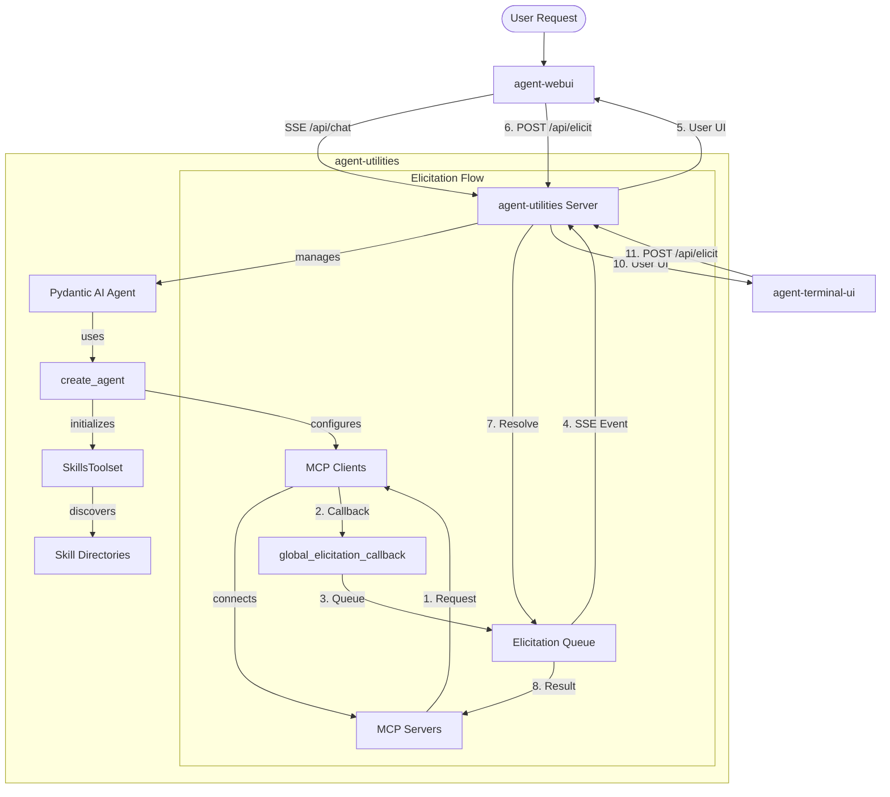
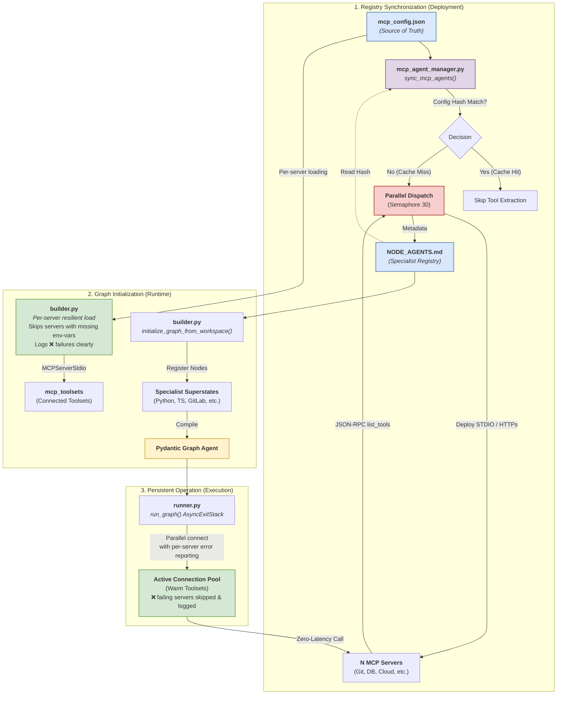
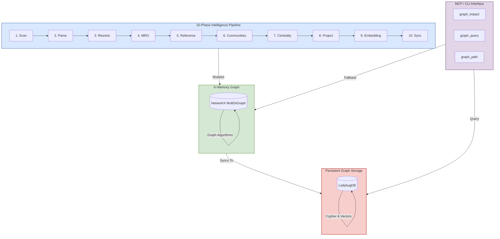

# Repository Manager Agent Documentation

> Claude Code loads this file via `CLAUDE.md` (`@AGENTS.md` import) — the two stay
> in sync. Edit **this** file, not `CLAUDE.md`.

This document provides an overview of the Repository Manager agent, its architecture, and how to use it.

## Tech Stack & Architecture
- **Language**: Python 3.11–3.14
- **Core Framework**: [Pydantic AI](https://ai.pydantic.dev) & [Pydantic Graph](https://ai.pydantic.dev/pydantic-graph/)
- **Tooling**: `requests`, `pydantic`, `pyyaml`, `python-dotenv`, `fastapi`, `llama_index`, `FastMCP`
- **Architecture**: Centered around the `create_agent` factory from `agent-utilities`, which has been modernized to support a **Unified Skill Loading** model (`skill_types`) and automated **Graph Orchestration**.
- **Specialist Discovery**: Automated discovery of domain specialist agents from `NODE_AGENTS.md` (local) and `A2A_AGENTS.md` (remote) registries, enabling dynamic graph expansion without hardcoded nodes.
- **Key Principles**:
    - Functional and modular utility design.
    - Standardized workspace management (`IDENTITY.md`, `MEMORY.md`).
    - **Elicitation First**: Robust support for structured user input during tool calls, bridging MCP and Web UIs.

## Package Relationships
The Repository Manager agent is built on top of the `agent-utilities` package, which provides the core Python engine for LLM orchestration, tool execution, and the SSE streaming protocol.

- **Backend (`agent-utilities`)**: Handles LLM orchestration, tool execution, and the SSE streaming protocol.
- **Web Frontend (`agent-webui`)**: A React application that provides a cinematic chat interface and specialized UI components.
- **Communication**: Frontends talk to Backend via SSE for output and standard REST (POST) for input and elicitation responses.

## Validation & Diagnostics

To ensure the Repository Manager specialist and its graph lifecycle are functioning correctly, use the following validation tools:

### End-to-End Specialist Validation
High-fidelity testing of individual specialist nodes through the SSE streaming protocol. This bypasses the Web UI and provides granular execution logs to monitor tool calls and result registration.

**Usage:**
```bash
# From the repository-manager root
python scripts/verify_graph.py "List all projects in the workspace"
```

**Monitored Events:**
- **Graph Lifecycle**: `graph-start`, `node-start`, `graph-complete` events.
- **Tool Execution**: `expert_tool_call` and `expert_tool_result` events with detailed payloads.
- **Payload Integrity**: Verifies unified result storage in `results_registry` for expert nodes.

### Integration Test Suite
The local `tests/test_agent_integration.py` validates the entire stack from registry sync to tool execution:
- **Registry Sync**: Validates discovery of MCP tools and specialist tags from `mcp_config.json`.
- **Connection Resilience**: Tests parallel AnyIO initialization of toolsets without structured concurrency violations.
- **Port Stability**: Robust port cleanup and health check coordination for local development.

## Core Architecture Diagram

```mermaid
graph TD
    User([User Request]) --> WebUI[agent-webui]
    WebUI -- SSE /api/chat --> Backend[agent-utilities Server]

    subgraph AgentUtilities [agent-utilities]
        Backend -- manages --> Agent[Pydantic AI Agent]
        Agent -- uses --> CA[create_agent]
        CA -- initializes --> ST[SkillsToolset]
        CA -- configures --> MCP[MCP Clients]
        ST -- discovers --> SkillDir[Skill Directories]
        MCP -- connects --> MCPServer[MCP Servers]

        subgraph ElicitationFlow [Elicitation Flow]
            MCPServer -- 1. Request --> MCP
            MCP -- 2. Callback --> GEC[global_elicitation_callback]
            GEC -- 3. Queue --> EQ[Elicitation Queue]
            EQ -- 4. SSE Event --> Backend
        end
    end

    Backend -- 5. User UI --> WebUI
    WebUI -- 6. POST /api/elicit --> Backend
    Backend -- 7. Resolve --> EQ
    EQ -- 8. Result --> MCPServer

    Backend -- 10. User UI --> TerminalUI[agent-terminal-ui]
    TerminalUI -- 11. POST /api/elicit --> Backend
```

## MCP Loading & Registry Architecture
This diagram illustrates how MCP servers are discovered, specialized, and persisted in the graph.


```mermaid
graph TD
    subgraph Registry_Phase ["1. Registry Synchronization (Deployment)"]
        Config["<b>mcp_config.json</b><br/><i>(Source of Truth)</i>"] --> Manager["<b>mcp_agent_manager.py</b><br/><i>sync_mcp_agents()</i>"]
        Registry["<b>NODE_AGENTS.md</b><br/><i>(Specialist Registry)</i>"] -.->|Read Hash| Manager

        Manager -->|Config Hash Match?| Branch{Decision}
        Branch -- "Yes (Cache Hit)" --> Skip["Skip Tool Extraction"]
        Branch -- "No (Cache Miss)" --> Parallel["<b>Parallel Dispatch</b><br/>(Semaphore 30)"]

        Parallel -->|Deploy STDIO / HTTPs| Servers["<b>N MCP Servers</b><br/>(Git, DB, Cloud, etc.)"]
        Servers -->|JSON-RPC list_tools| Parallel
        Parallel -->|Metadata| Registry
    end

    subgraph Initialization_Phase ["2. Graph Initialization (Runtime)"]
        Config -->|Per-server loading| Loader["<b>builder.py</b><br/><i>Per-server resilient load</i><br/>Skips servers with missing env-vars<br/>Logs ❌ failures clearly"]
        Registry --> Builder["<b>builder.py</b><br/><i>initialize_graph_from_workspace()</i>"]
        Loader -->|MCPServerStdio| ToolPool["<b>mcp_toolsets</b><br/>(Connected Toolsets)"]
        Builder -->|Register Nodes| Specialists["<b>Specialist Superstates</b><br/>(Python, TS, GitLab, etc.)"]
        Specialists -->|Compile| Graph["<b>Pydantic Graph Agent</b>"]
    end

    subgraph Operation_Phase ["3. Persistent Operation (Execution)"]
        Graph --> Lifespan["<b>runner.py</b><br/><i>run_graph() AsyncExitStack</i>"]
        Lifespan -->|Parallel connect<br/>with per-server error reporting| ConnPool["<b>Active Connection Pool</b><br/>(Warm Toolsets)<br/>❌ failing servers skipped & logged"]
        ConnPool -->|Zero-Latency Call| Servers
    end

    %% Styling
    style Config fill:#dae8fe,stroke:#6c8ebf,stroke-width:2px
    style Registry fill:#dae8fe,stroke:#6c8ebf,stroke-width:2px
    style Manager fill:#e1d5e7,stroke:#9673a6,stroke-width:2px
    style Parallel fill:#f8cecc,stroke:#b85450,stroke-width:2px
    style ConnPool fill:#d5e8d4,stroke:#82b366,stroke-width:2px
    style Graph fill:#fff2cc,stroke:#d6b656,stroke-width:2px
    style Loader fill:#d5e8d4,stroke:#82b366,stroke-width:2px
```

## Graph Orchestration Architecture

```mermaid
graph TB
    Start([User Query]) --> UsageGuard[Usage Guard: Rate Limiting]
    UsageGuard -- "Allow" --> router_step[Router: Topology Selection]
    UsageGuard -- "Block" --> End([End Result])

    router_step --> planner_step[Planner: Global Strategy]
    planner_step --> mem_step[Memory: Context Retrieval]
    mem_step --> dispatcher[Dispatcher: Dynamic Routing]

    subgraph "Discovery Phase"
        direction TB
        Researcher["<b>Researcher</b><br/>---<br/><i>u-skill:</i> web-search, web-crawler, web-fetch<br/><i>t-tool:</i> project_search, read_workspace_file"]
        Architect["<b>Architect</b><br/>---<br/><i>u-skill:</i> c4-architecture, product-management, product-strategy, user-research<br/><i>t-tool:</i> developer_tools"]
        A2ADiscovery["<b>A2A Discovery</b><br/>---<br/><i>source:</i> AGENTS.md<br/><i>t-tool:</i> fetch_agent_card"]
        res_joiner[Research Joiner: Barrier Sync]
    end

    dispatcher -- "Parallel Dispatch" --> Researcher
    dispatcher -- "Parallel Dispatch" --> Architect
    dispatcher -- "Parallel Dispatch" --> A2ADiscovery
    Researcher --> res_joiner
    Architect --> res_joiner
    A2ADiscovery --> res_joiner
    res_joiner -- "Coalesced Context" --> dispatcher

    subgraph "Execution Phase"
        direction TB

        subgraph "Programmers"
            direction LR
            PyP["<b>Python</b><br/>---<br/><i>u-skill:</i> agent-builder, tdd-methodology, mcp-builder, jupyter-notebook<br/><i>g-skill:</i> python-docs, fastapi-docs, pydantic-ai-docs<br/><i>t-tool:</i> developer_tools"]
            TSP["<b>TypeScript</b><br/>---<br/><i>u-skill:</i> react-development, web-artifacts, tdd-methodology, canvas-design<br/><i>g-skill:</i> nodejs-docs, react-docs, nextjs-docs, shadcn-docs<br/><i>t-tool:</i> developer_tools"]
            GoP["<b>Go</b><br/>---<br/><i>u-skill:</i> tdd-methodology<br/><i>g-skill:</i> go-docs<br/><i>t-tool:</i> developer_tools"]
            RustP["<b>Rust</b><br/>---<br/><i>u-skill:</i> tdd-methodology<br/><i>g-skill:</i> rust-docs<br/><i>t-tool:</i> developer_tools"]
            CP["<b>C/C++</b><br/>---<br/><i>t-tool:</i> developer_tools"]
            JSP["<b>JavaScript</b><br/>---<br/><i>u-skill:</i> web-artifacts, canvas-design<br/><i>g-skill:</i> nodejs-docs, react-docs, nextjs-docs, shadcn-docs<br/><i>t-tool:</i> developer_tools"]
        end

        subgraph "Infrastructure"
            direction LR
            DevOps["<b>DevOps</b><br/>---<br/><i>u-skill:</i> cloudflare-deploy<br/><i>g-skill:</i> docker-docs, terraform-docs<br/><i>t-tool:</i> developer_tools"]
            Cloud["<b>Cloud</b><br/>---<br/><i>u-skill:</i> c4-architecture<br/><i>g-skill:</i> aws-docs, azure-docs, gcp-docs<br/><i>t-tool:</i> developer_tools"]
            DBA["<b>Database</b><br/>---<br/><i>u-skill:</i> database-tools<br/><i>g-skill:</i> postgres-docs, mongodb-docs, redis-docs<br/><i>t-tool:</i> developer_tools"]
        end

        subgraph Specialized ["Specialized & Quality"]
            direction LR
            Sec["<b>Security</b><br/>---<br/><i>u-skill:</i> security-tools<br/><i>g-skill:</i> linux-docs<br/><i>t-tool:</i> developer_tools"]
            QA["<b>QA</b><br/>---<br/><i>u-skill:</i> qa-planning, tdd-methodology<br/><i>g-skill:</i> testing-library-docs<br/><i>t-tool:</i> developer_tools"]
            UIUX["<b>UI/UX</b><br/>---<br/><i>u-skill:</i> theme-factory, brand-guidelines, algorithmic-art<br/><i>g-skill:</i> shadcn-docs, tailwind-docs, framer-docs<br/><i>t-tool:</i> developer_tools"]
            Debug["<b>Debugger</b><br/>---<br/><i>u-skill:</i> developer-utilities, agent-builder<br/><i>t-tool:</i> developer_tools"]
        end

        subgraph Ecosystem ["Agent Ecosystem"]
            direction TB

            subgraph Infra_Management ["Infrastructure & DevOps"]
                AdGuardHome["<b>AdGuard Home Agent</b><br/>---<br/><i>mcp-tool:</i> adguard-mcp"]
                AnsibleTower["<b>Ansible Tower Agent</b><br/>---<br/><i>mcp-tool:</i> ansible-tower-mcp"]
                ContainerManager["<b>Container Manager Agent</b><br/>---<br/><i>mcp-tool:</i> container-mcp"]
                Microsoft["<b>Microsoft Agent</b><br/>---<br/><i>mcp-tool:</i> microsoft-mcp"]
                Portainer["<b>Portainer Agent</b><br/>---<br/><i>mcp-tool:</i> portainer-mcp"]
                SystemsManager["<b>Systems Manager</b><br/>---<br/><i>mcp-tool:</i> systems-mcp"]
                TunnelManager["<b>Tunnel Manager</b><br/>---<br/><i>mcp-tool:</i> tunnel-mcp"]
                UptimeKuma["<b>Uptime Kuma Agent</b><br/>---<br/><i>mcp-tool:</i> uptime-mcp"]
                RepositoryManager["<b>Repository Manager</b><br/>---<br/><i>mcp-tool:</i> repository-mcp"]
            end

            subgraph Media_HomeLab ["Media & Home Lab"]
                ArchiveBox["<b>ArchiveBox API</b><br/>---<br/><i>mcp-tool:</i> archivebox-mcp"]
                Arr["<b>Arr (Radarr/Sonarr)</b><br/>---<br/><i>mcp-tool:</i> arr-mcp"]
                AudioTranscriber["<b>Audio Transcriber</b><br/>---<br/><i>mcp-tool:</i> audio-transcriber-mcp"]
                Jellyfin["<b>Jellyfin Agent</b><br/>---<br/><i>mcp-tool:</i> jellyfin-mcp"]
                MediaDownloader["<b>Media Downloader</b><br/>---<br/><i>mcp-tool:</i> media-mcp"]
                Owncast["<b>Owncast Agent</b><br/>---<br/><i>mcp-tool:</i> owncast-mcp"]
                qBittorrent["<b>qBittorrent Agent</b><br/>---<br/><i>mcp-tool:</i> qbittorrent-mcp"]
            end

            subgraph Productive_Dev ["Productivity & Development"]
                Atlassian["<b>Atlassian Agent</b><br/>---<br/><i>mcp-tool:</i> atlassian-mcp"]
                Genius["<b>Genius Agent</b><br/>---<br/><i>mcp-tool:</i> genius-mcp"]
                GitHub["<b>GitHub Agent</b><br/>---<br/><i>mcp-tool:</i> github-mcp"]
                GitLab["<b>GitLab API</b><br/>---<br/><i>mcp-tool:</i> gitlab-mcp"]
                Langfuse["<b>Langfuse Agent</b><br/>---<br/><i>mcp-tool:</i> langfuse-mcp"]
                LeanIX["<b>LeanIX Agent</b><br/>---<br/><i>mcp-tool:</i> leanix-mcp"]
                Plane["<b>Plane Agent</b><br/>---<br/><i>mcp-tool:</i> plane-mcp"]
                Postiz["<b>Postiz Agent</b><br/>---<br/><i>mcp-tool:</i> postiz-mcp"]
                ServiceNow["<b>ServiceNow API</b><br/>---<br/><i>mcp-tool:</i> servicenow-mcp"]
                StirlingPDF["<b>StirlingPDF Agent</b><br/>---<br/><i>mcp-tool:</i> stirlingpdf-mcp"]
            end

            subgraph Data_Lifestyle ["Data & Lifestyle"]
                DocumentDB["<b>DocumentDB Agent</b><br/>---<br/><i>mcp-tool:</i> documentdb-mcp"]
                HomeAssistant["<b>Home Assistant Agent</b><br/>---<br/><i>mcp-tool:</i> home-assistant-mcp"]
                Mealie["<b>Mealie Agent</b><br/>---<br/><i>mcp-tool:</i> mealie-mcp"]
                Nextcloud["<b>Nextcloud Agent</b><br/>---<br/><i>mcp-tool:</i> nextcloud-mcp"]
                Searxng["<b>Searxng Agent</b><br/>---<br/><i>mcp-tool:</i> searxng-mcp"]
                Vector["<b>Vector Agent</b><br/>---<br/><i>mcp-tool:</i> vector-mcp"]
                Wger["<b>Wger Agent</b><br/>---<br/><i>mcp-tool:</i> wger-mcp"]
            end
        end
    end

    dispatcher -- "Parallel Dispatch" --> Programmers
    dispatcher -- "Parallel Dispatch" --> Infrastructure
    dispatcher -- "Parallel Dispatch" --> Specialized
    dispatcher -- "Parallel Dispatch" --> Ecosystem

    Programmers --> exe_joiner[Execution Joiner: Barrier Sync]
    Infrastructure --> exe_joiner
    Specialized --> exe_joiner
    Ecosystem --> exe_joiner

    exe_joiner -- "Implementation Results" --> dispatcher

    dispatcher -- "Final Validation" --> verifier[Verifier: Quality Gate]
    verifier -- "Success" --> End
    verifier -- "Critical Fault" --> router_step
    dispatcher -- "Terminal Failure" --> End

    %% Styling
    style Researcher fill:#e1d5e7,stroke:#9673a6,stroke-width:2px
    style Architect fill:#e1d5e7,stroke:#9673a6,stroke-width:2px
    style A2ADiscovery fill:#e1d5e7,stroke:#9673a6,stroke-width:2px

    style Programmers fill:#dae8fe,stroke:#6c8ebf,stroke-width:2px
    style PyP fill:#dae8fe,stroke:#6c8ebf,stroke-width:1px
    style TSP fill:#dae8fe,stroke:#6c8ebf,stroke-width:1px
    style GoP fill:#dae8fe,stroke:#6c8ebf,stroke-width:1px
    style RustP fill:#dae8fe,stroke:#6c8ebf,stroke-width:1px
    style CP fill:#dae8fe,stroke:#6c8ebf,stroke-width:1px
    style JSP fill:#dae8fe,stroke:#6c8ebf,stroke-width:1px

    style Infrastructure fill:#fad9b8,stroke:#d6b656,stroke-width:2px
    style DevOps fill:#fad9b8,stroke:#d6b656,stroke-width:1px
    style Cloud fill:#fad9b8,stroke:#d6b656,stroke-width:1px
    style DBA fill:#fad9b8,stroke:#d6b656,stroke-width:1px

    style Specialized fill:#e0d3f5,stroke:#82b366,stroke-width:2px
    style Sec fill:#e0d3f5,stroke:#82b366,stroke-width:1px
    style QA fill:#e0d3f5,stroke:#82b366,stroke-width:1px
    style UIUX fill:#e0d3f5,stroke:#82b366,stroke-width:1px
    style Debug fill:#e0d3f5,stroke:#82b366,stroke-width:1px

    style Ecosystem fill:#f5f1d3,stroke:#d6b656,stroke-width:2px
    style Infra_Management fill:#fef9e7,stroke:#d6b656,stroke-width:1px
    style Media_HomeLab fill:#fef9e7,stroke:#d6b656,stroke-weight:1px
    style Productive_Dev fill:#fef9e7,stroke:#d6b656,stroke-weight:1px
    style Data_Lifestyle fill:#fef9e7,stroke:#d6b656,stroke-weight:1px

    style verifier fill:#fff2cc,stroke:#d6b656,stroke-weight:2px
    style End fill:#f8cecc,stroke:#b85450,stroke-weight:2px
    style res_joiner fill:#f5f5f5,stroke:#666,stroke-dasharray: 5 5
    style exe_joiner fill:#f5f5f5,stroke:#666,stroke-dasharray: 5 5
    style dispatcher fill:#f5f5f5,stroke:#666,stroke-weight:2px
    style Start color:#000000,fill:#38B6FF
    style subGraph0 color:#000000,fill:#f5ebd3
    style subGraph5 color:#000000,fill:#f5f1d3
    style dispatcher fill:#d5e8d4,stroke:#666,stroke-weight:2px
    style Ecosystem fill:#f5d0ef,stroke:#d6b656,stroke-weight:2px
    style LocalAgents fill:#f5d0ef,stroke:#d6b656,stroke-weight:1px
    style RemotePeers fill:#f5d0ef,stroke:#d6b656,stroke-weight:1px
```

## Unified Hybrid Graph Architecture

The Repository Manager leverages a powerful 12-phase topological DAG pipeline (inspired by GitNexus) implemented in Python, paired with NetworkX for in-memory graph algorithms and LadybugDB for persistent Cypher search.


```mermaid
graph TD
    subgraph Ingestion_Pipeline [10-Phase Intelligence Pipeline]
        direction LR
        Scan[1. Scan] --> Parse[2. Parse]
        Parse --> Resolve[3. Resolve]
        Resolve --> MRO[4. MRO]
        MRO --> Ref[5. Reference]
        Ref --> Comm[6. Communities]
        Comm --> Cent[7. Centrality]
        Cent --> Proj[8. Project]
        Proj --> Emb[9. Embedding]
        Emb --> Sync[10. Sync]
    end

    subgraph Memory_Layer [In-Memory Graph]
        direction TB
        NX[(NetworkX MultiDiGraph)]
        NX -- "Graph Algorithms" --> NX
    end

    subgraph Persistence_Layer [Persistent Graph Storage]
        direction TB
        LDB[(LadybugDB)]
        LDB -- "Cypher & Vectors" --> LDB
    end

    subgraph Query_Layer [MCP / CLI Interface]
        direction LR
        Q_Impact[graph_impact]
        Q_Query[graph_query]
        Q_Path[graph_path]
    end

    Ingestion_Pipeline -- "Mutates" --> Memory_Layer
    Memory_Layer -- "Syncs To" --> Persistence_Layer
    Query_Layer -- "Query" --> Persistence_Layer
    Query_Layer -- "Fallback" --> Memory_Layer

    %% Styling
    style Ingestion_Pipeline fill:#dae8fe,stroke:#6c8ebf,stroke-width:2px
    style Memory_Layer fill:#d5e8d4,stroke:#82b366,stroke-width:2px
    style Persistence_Layer fill:#f8cecc,stroke:#b85450,stroke-width:2px
    style Query_Layer fill:#e1d5e7,stroke:#9673a6,stroke-width:2px
```

### 10-Phase Intelligence Pipeline

To provide robust cross-repository intelligence, the graph is built using a sequential, topological DAG pipeline. Each phase adds a layer of intelligence:

| Phase | Name | Purpose |
|-------|------|---------|
| 1 | **Scan** | Walks the filesystem, respects `.gitignore`, and identifies all code files. |
| 2 | **Parse** | AST parsing (tree-sitter) to extract symbols (Classes, Functions, Imports). |
| 3 | **Resolve** | Maps raw import strings to actual `File` or `Symbol` nodes across the workspace. |
| 4 | **MRO** | Resolves Method Resolution Order and inheritance chains for OO structures. |
| 5 | **Reference** | Builds the call graph by identifying where symbols are invoked. |
| 6 | **Communities** | Clusters nodes into tightly-coupled modules using the Leiden/Louvain algorithms. |
| 7 | **Centrality** | Calculates PageRank/Betweenness to identify critical path "God Objects". |
| 8 | **Project** | Groups files into logical projects based on `pyproject.toml` or `package.json`. |
| 9 | **Embedding** | Generates semantic vector embeddings for all symbols and file content. |
| 10 | **Sync** | Finalizes the build by projecting the NetworkX graph into LadybugDB (Cypher). |

## Hierarchical State Machine (HSM) Architecture

The graph orchestration system is a **Hierarchical State Machine**. It follows the same formal model used in robotics,
game engines, UML statecharts, and SCXML workflow engines. Understanding the HSM framing provides critical guidance for
future enhancements.

### HSM Level Mapping
```
Level 0: Root Graph (18 Orchestration Nodes)
├── usage_guard → router → planner → memroy_selection → dispatcher
├── researcher, architect, verifier (discovery/validation)
├── parallel_batch_processor → expert_executor (fan-out)
└── research_joiner, execution_joiner (fan-in)

Level 1: Superstates - Specialist Agents
├── 21 Hardcoded Agents (NODE_SKILL_MAP: python_programmer, typescript_programmer, ...)
│   Each loads: dedicated prompt + filtered skills + filtered MCP toolsets
└── N Dynamic MCP Agents (from NODE_AGENTS.md: branches, commits, projects, ...)
    Each loads: generated prompt + scoped MCP toolset for one tag

Level 2: Substates - Agent Internal Loop
└── Pydantic AI Agent.run() = UserPromptNode → ModelRequestNode → CallToolsNode → ...
    Multi-turn tool iteration (max 3 iterations per specialist)

Level 3: Leaf States - MCP Tool Execution
└── Each tool call invokes an MCP server subprocess via stdio/HTTP
    Atomic operations: get_project(), list_branches(), run_cypher_query(), etc.
```

### Maintaining the Specialist Registry (`NODE_SKILL_MAP`)

The **Universal Skills** and **Skill Graphs** are dynamically embedded into Graph Agents via the `NODE_SKILL_MAP` (located in `agent_utilities/graph/config_helpers.py`). This forms the primary routing capability and specialized proficiency of each node in the cluster.

**How it works**
1. Each key in `NODE_SKILL_MAP` (e.g. `python_programmer`, `ui_ux_designer`) matches directly to a `.md` markdown file located in `agent_utilities/prompts/`.
2. When the `builder.py` Graph generator spawns the orchestrator, it reads the keys from `NODE_SKILL_MAP`, bypassing the need to hardcode `GraphBuilder.step()` edges.
3. The specified array of string skill tags will be automatically linked via the skill installer to grant those specific external capabilities to that internal superstate node.

**Future Enhancements & Best Practices**
- When adding a new role, you **must** create the correspondng `[role].md` based on `_template.md` in the `prompts/` directory.
- Add the exact filename without the `.md` extension as a new key to the `NODE_SKILL_MAP`.
- Assign 100% of newly developed universal-skills proportionally among agents to prevent orphaned skills. Check documentation to ensure each agent is capable of fulfilling their domain successfully before assigning entirely new skills.
- The `agent-webui` interface will naturally ingest the new node ID and emit it via the graph activity viewer. Keep role IDs in `snake_case`.

### Concept Mapping
| agent-utilities Concept        | HSM Concept           | Details                       |
|--------------------------------|-----------------------|-------------------------------|
| Root graph                     | Root state machine    | 18 Orchestration nodes        |
| Router → Planner → Dispatcher  | Top-level transitions | Sequential pipeline           |
| `NODE_SKILL_MAP` agents        | Superstates (L1)      | 21 hardcoded domains          |
| MCP dynamic agents             | Superstates (L1)      | N from `mcp_config.json`      |
| `_execute_specialized_step()`  | Enter superstate      | Loads prompt + skills         |
| `_execute_dynamic_mcp_agent()` | Enter superstate      | Loads prompt + MCP tools      |
| `Agent.run()` internal loop    | Substates (L2)        | Model request/tool cycles     |
| MCP tool call (stdio)          | Leaf states (L3)      | Atomic operations             |
| `return "execution_joiner"`    | Exist superstate      | Returns to parent             |
| Verifier feedback loop         | Re-entry transition   | Parent re-dispatches to child |
| Circuit breaker (open)         | Guard condition       | Blocks entry to failed state  |
| Specialist fallback            | Default transition    | Redirects on failure          |

### HSM Design Principals for Future Growth

1. **Treat subgraphs as macro-states.** A specialist should behave as a single opaque state to the dispatcher. Define
   clear input/output contracts. Never route from the parent into a specialist's internal state.
2. **Scale horizonatally, not vertically.** Instead of adding nodes to an existing graph, add new subgraphs (new MCP servers, new agent packages). This keeps graph sizes small and startup cost bounded.
3. **Plan enhancements by level.** Routing concern → L0. Planning concern → L0 planner.
   Domain behavior → L1 specialist. Tool-level fix → L3 MCP. This prevents "logic gravity" where everything sinks into one layer.
4. **Use types as boundaries.** `ExecutionStep`, `GraphPlan`, `GraphResponse`, and `MCPAgent` are the boundary
   contracts between levels. Internal state is private.
5. **Defer flattening.** Never try to visualize or reason about the full system as one graph. Visualize one level at a time. Debug at the current level.
6. **The growth test:** If you feel tempted to add more nodes to a graph, pause and ask whether you should add a new state machine instead.

### Behavior Tree (BT) Concepts

The graph also incorporates key Behavior Tree patterns **inside** the HSM structure.
The principle: *graphs decide where you are; BT-style logic decides what to do next inside that place.*

| agent-utilities Concept                                                                | Behavior Tree (BT) Concept   | Details                                                                         |
|----------------------------------------------------------------------------------------|------------------------------|---------------------------------------------------------------------------------|
| `_attempt_specialist_fallback`, `static_route_query`, `check_specialist_preconditions` | Selector (priority/fallback) | Specialist fallback chain, static route before LLM call |
| `dispatcher_step`, `assert_state_valid`                                                | Sequence (fail-fast)         | Plan step execution with cursor, state invariant assertions                     |
| `_execute_dynamic_mcp_agent`, `expert_executor_step`                                   | Retry decorator              | Tool-level retries with exponential backoff, expert retries, re-plan on failure |
| `asyncio.wait_for()` in specialist execution                                           | Timeout decorator            | Per-node timeout via `ExecutionStep.timeout`                                    |
| `graph.NodeResult`                                                                     | Tri-state result             | `NodeResult.SUCCESS / FAILURE / RUNNING` enum                                   |
| `check_specialist_preconditions`                                                       | Precondition guard           | Check server health + tool availability before entering specialist               |
| `assert_state_valid()`                                                                 | Boundary re-evaluation       | State invariants at dispatcher and verifier boundaries                          |

**Design rule:** If logic chooses between options → BT concept. If logic defines long-lived phases → HSM concept.

## Commands (run these exactly)

# Development & Quality
ruff check --fix .
ruff format .
pytest

# Running a single test
# To run a specific test file:
#   pytest tests/test_example.py
# To run a specific test function in a file:
#   pytest tests/test_example.py::test_function_name
# To run tests matching a keyword:
#   pytest -k "keyword"

# Installation
pip install -e .      # Install in editable mode
pip install -e .[all] # Install with all optional extras

## Project Structure Quick Reference
- `agent_utilities/agent/` → Agent templates and `IDENTITY.md` definitions.
- `agent_utilities/agent_utilities.py` → Main entry point for `create_agent` and `create_agent_server`.
- `agent_utilities/agent_factory.py` → CLI factory for creating agents with argparse.
- `agent_utilities/mcp_utilities.py` → Utilities for FastMCP and MCP tool registration.
- `agent_utilities/base_utilities.py` → Generic helpers for file handling, type conversions, and CLI flags.
- `agent_utilities/tools/` → Built-in agent tools (developer_tools, git_tools, workspace_tools).
- `agent_utilities/embedding_utilities.py` → Vector DB and embedding integration (LlamaIndex based).
- `agent_utilities/api_utilities.py` → Generic API helpers
- `agent_utilities/models.py` → Shared Pydantic models (`GraphResponse`, `GraphPlan`, `MCPAgent`, etc.)
- `agent_utilities/chat_persistence.py` → Chat history persistence utilities
- `agent_utilities/config.py` → Configuration management
- `agent_utilities/custom_observability.py` → Custom observability and tracing utilities
- `agent_utilities/decorators.py` → Utility decorators for caching, retries, etc.
- `agent_utilities/exceptions.py` → Custom exception classes
- `agent_utilities/graph/` → **Graph orchestration subpackage** (the core engine):
  - `graph/builder.py` → `initialize_graph_from_workspace()`, per-server resilient MCP loading
  - `graph/runner.py` → `run_graph()` with sequential MCP connect + clear failure reporting
  - `graph/steps.py` → All graph node step functions (router, dispatcher, verifier, etc.)
  - `graph/executor.py` → Specialist execution with unified result storage (`results_registry`)
  - `graph/state.py` → `GraphState`, `GraphDeps` Pydantic models
  - `graph/hsm.py` → HSM/BT entry/exit hooks, preconditions, static routing
  - `graph/config_helpers.py` → `load_mcp_agents_registry()`, `NODE_SKILL_MAP`, emit helpers
- `agent_utilities/model_factory.py` → Factory for creating LLM models
- `agent_utilities/memory.py` → Memory management for agents
- `agent_utilities/middlewares.py` → HTTP middleware utilities
- `agent_utilities/persistence.py` → General persistence utilities
- `agent_utilities/prompt_builder.py` → Prompt construction utilities
- `agent_utilities/scheduler.py` → Task scheduling utilities
- `agent_utilities/server.py` → HTTP server implementation
- `agent_utilities/tool_filtering.py` → Tool filtering utilities for tag-based access control
- `agent_utilities/tool_guard.py` → Universal tool guard implementation
- `agent_utilities/workspace.py` → Workspace management utilities
- `agent_utilities/a2a.py` → Agent-to-Agent communication utilities
- `agent_utilities/prompts/` → Prompt templates (one `.md` per specialist role)
- `agent_utilities/agent_data/` → Workspace data files (IDENTITY.md, MEMORY.md, NODE_AGENTS.md, etc.)
- `repository_manager/graph/` → **Hybrid Workspace Graph Engine** (NetworkX + LadybugDB)
  - `graph/engine.py` → Multi-faceted Search Engine (Semantic Vector + Structural Cypher)
  - `graph/schema.py` → Unified graph schema for workspace symbols and cross-repo dependencies
- `repository_manager/execution/` → **Local fixed-argv execution boundary**
  - `executor.py` → authorized-root validation, bounded cancellation, heartbeats, and fences
  - `process_supervisor.py` → non-shell process groups and TERM/KILL/reap escalation
  - `bounded_log.py` → redacted bounded streaming and terminal tails
  - `fakes.py` → deterministic clock/process/executor fixtures for downstream lanes

## Code Style & Conventions

**Always:**
- Use the `try/except ImportError` guardrail pattern for optional dependencies.
- Use `agent_utilities.base_utilities.to_boolean` for parsing environment variables and CLI flags.
- Use `resolve_configured_tls_profile(service)` and its client adapters for every
  network operation; transport policy comes from AgentConfig and never from a
  boolean verification switch.
- Prefer `pathlib.Path` for file path manipulations.

**Imports:**
- Standard library imports first, then third-party, then local application imports.
- Within each group, sort alphabetically.
- Avoid wildcard imports (`from module import *`).

**Formatting:**
- Maximum line length: 88 characters (as per Ruff/Black).
- Use 4 spaces per indentation level.
- No trailing whitespace.
- Use empty lines to separate functions and classes (2 blank lines before a class or function, 1 blank line between methods in a class).

**Types:**
- Use type hints for all function arguments and return values.
- Use `typing` module for complex types (List, Dict, Optional, etc.).
- Avoid using `Any` unless absolutely necessary.

**Naming Conventions:**
- Classes: CapWords (PascalCase).
- Functions and variables: snake_case.
- Constants: UPPER_SNAKE_CASE.
- Private functions and variables: single leading underscore (_snake_case).
- Private classes: single leading underscore (_CapWords) [though rare].

**Error Handling:**
- Catch specific exceptions, not bare `except:`.
- When raising exceptions, provide a clear error message.
- Use custom exception classes for module-specific errors.
- In general, prefer to raise exceptions and let the caller handle them, unless you can handle them locally.

**Good example (Guardrail):**
```python
try:
    from some_external_lib import feature
except ImportError:
    print("Error: Missing 'some_external_lib'. Please install with extras.")
    sys.exit(1)
```

## Dos and Don'ts

**Do:**
- Use `create_agent` for all new agent instances to ensure consistent workspace setup.
- Use `create_agent_factory` for CLI agent creation with argparse.
- Register tools with descriptive docstrings as they are parsed by the LLM.
- Keep `base_utilities` free of heavy dependencies.
- Utilize lazy imports for optional dependencies like FastAPI and LlamaIndex.
- Follow the existing patterns in each module when adding new functionality.

**Don't:**
- Import `fastapi` or `llama_index` at the top level (use lazy imports inside functions or classes).
- Hardcode file paths; use relative paths from the workspace root or environment variables.
- Modify global state unnecessarily; prefer functional approaches.

## Safety & Boundaries

**Always do:**
- Validate user-provided file paths to prevent traversal attacks.
- Run `ruff` and `pytest` before submitting PRs.
- Test error conditions and edge cases.

**Ask first:**
- Introducing new top-level dependencies.
- Changes to the `IDENTITY.md` or `MEMORY.md` management logic.
- Major architectural changes to the agent creation or graph orchestration systems.

**Never do:**
- Commit API keys or hardcoded secrets.
- Run tests that require external API access without proper mocks or environment configuration.
- Break backward compatibility without a strong justification.

## Universal Tool Guard (Global Safety)

By default, `agent-utilities` implements a **Universal Tool Guard** that automatically intercepts sensitive tool calls from MCP servers.

Any tool matching specific "danger" patterns (e.g., `delete_*`, `write_*`, `execute_*`, `drop_*`) will **automatically** trigger an elicitation request. The tool will not execute until you explicitly confirm it in the Web UI.

### Key Features
- **Zero Config**: Protections are applied automatically based on tool names.
- **Fail-Safe**: If elicitations aren't supported or fail, the sensitive tool is blocked by default.
- **Customizable**: You can disable the guard by setting `DISABLE_TOOL_GUARD=True` in your environment.

### Sensitive Patterns
The guard currently monitors for:
`delete`, `write`, `execute`, `rm_`, `rmdir`, `drop`, `truncate`, `update`, `patch`, `post`, `put`.

---

## How to use Elicitation
Elicitation is used when a tool requires additional structured input or confirmation from the user.

### In MCP Tools (FastMCP)
```python
from fastmcp import FastMCP, Context

mcp = FastMCP("MyServer")

@mcp.tool()
async def book_table(restaurant: str, ctx: Context) -> str:
    # Trigger elicitation for confirmation and additional details
    confirmation = await ctx.elicit(
        message=f"Please confirm booking for {restaurant}",
        schema={
            "type": "object",
            "properties": {
                "guests": {"type": "integer", "description": "Number of guests"},
                "time": {"type": "string", "description": "Time of booking"}
            },
            "required": ["guests", "time"]
        }
    )

    if confirmation.get("_action") == "cancel":
        return "Booking cancelled by user."

    return f"Booked for {confirmation['guests']} at {confirmation['time']}"
```

### Flow Details
1.  **Request**: Tool calls `ctx.elicit`.
2.  **Streaming**: Backend sends an `elicitation` event to `agent-webui`.
3.  **UI**: Component in `Part.tsx` renders a form.
4.  **Response**: User submits, backend resolves the `Future`, and the tool call resumes with the data.

## When Stuck
- Refer to `agent_utilities.py` for the implementation details of `create_agent`.
- Refer to `agent_factory.py` for CLI agent creation implementation.
- Review `mcp_utilities.py` for how tools are being registered and exposed to MCP.
- Review `graph_orchestration.py` for graph-based agent orchestration.
- Ask for clarification if the multi-agent supervisor logic is unclear.

## Agent Data Files

The `agent_utilities/agent_data/` directory contains important workspace files:
- `IDENTITY.md` - Defines the agent's identity, purpose, and behavior guidelines
- `MEMORY.md` - Persistent memory for the agent across sessions
- `USER.md` - Information about the current user
- `A2A_AGENTS.md` - Agent-to-Agent communication protocols
- `CRON.md` - Scheduled task definitions
- `CRON_LOG.md` - Execution logs for cron tasks
- `HEARTBEAT.md` - Agent health and status indicators

These files are automatically managed by the workspace system and should be referenced when building agents that need to maintain state or identity.

## Adding New Modules

When adding new utility modules to the agent_utilities package:
1. Follow the existing code style and conventions
2. Add appropriate type hints
3. Include comprehensive docstrings
4. Add unit tests in the tests/ directory
5. Export public functions/classes in `__init__.py` if they should be part of the public API
6. Consider if the module should have lazy imports for heavy dependencies
7. Follow the pattern of existing similar modules for consistency
8. Update this AGENTS.md file to document the new module's purpose

## Testing Guidelines

- Write tests for all new functionality
- Aim for high test coverage, especially for utility functions
- Use pytest fixtures for common test setup
- Mock external dependencies when possible
- Test both success and failure paths
- Follow the existing test patterns in the tests/ directory

## Documentation Standards

- All public functions and classes should have docstrings
- Docstrings should follow Google or NumPy style
- Complex algorithms should include explanatory comments
- Examples should be provided for non-trivial functions
- Keep documentation up-to-date when making changes

## Dependency Management

- Prefer to keep dependencies minimal
- For optional dependencies, use try/except ImportError patterns
- Document any new dependencies in pyproject.toml
- Consider if heavy dependencies should be lazy-loaded
- Follow semantic versioning for dependencies when possible

## Gate Execution — the ledger, `retest`, and the fast development loop

**Stop validating a fix by re-running the whole wave.** On 2026-08-21 a single
`epistemic-graph` push cost roughly **six hours** because every one of six
failing pre-commit hooks was re-proven, on every fix, by re-running the
repo's entire 90-minute heavy wave — there was no way to ask "just the hooks
that were failing." The same push's integration suite was independently
reporting ~500 timeout errors that turned out to be **one** cold `cargo
build` blowing a 60-second per-test fixture timeout, which hid **17 real
failures** underneath the noise. Both gaps are now closed, and the loop an
agent should actually run is:

```
rm_gates(action="run", stage=<fast|heavy>)        # populate the ledger
# ... fix what failed ...
rm_gates(action="retest", stage=<fast|heavy>)      # only what failed, re-run
# all requested hooks pass -> automatic full-wave escalation, submitted
# from inside the retest job itself, the instant it returns
rm_gates(action="profile")                         # find the slow hooks fleet-wide
```

CLI equivalents: `repository-manager --gate fast|heavy` /
`--gate-retest fast|heavy [--same-node]`. Both the MCP tool and the CLI call
the exact same `repository_manager.gate_runner.dispatch(action, **kwargs)` —
one chokepoint, so the two front ends can never quietly diverge on what "run
the gate" or "retest" means (`run`/`status`/`explain`/`profile`/`retest`).

### `gate_ledger` — durable memory of what a gate actually found

`repository_manager.gate_ledger.GateLedger` is a local SQLite projection at
`${XDG_STATE_HOME}/repository-manager/gate_ledger.sqlite3` (same shape as
`LaneRegistry`/`CapacityStore`: WAL, `synchronous=FULL`, monotonic
`version`). It replaces the old process-local `dict` job store, which died
with the process and could never answer "what failed last time" across a
restart. Semantics that are easy to get wrong, because getting them wrong is
silent:

- **It is a FAILURE ledger, not a pass matrix.** `pytest -q` prints no line
  per passing test, so `test_results` only records what *failed*. "Not
  present" means "not observed failing" — it is never the same claim as
  "observed passing." Every consumer has to be written against that
  distinction.
- **Clear-on-improve.** When a hook re-runs, any `test_latest` row for that
  `(repo, stage, hook)` whose test id is absent from the new failing set is
  deleted. Upsert-only would leave a fixed test marked failed forever.
- **`unrunnable` hooks are never retest candidates.** A hook whose executable
  was missing found nothing about the code; re-running it in the same broken
  environment will find nothing again. Treating a missing toolchain as "still
  failing, retry it" is exactly how a missing tool masquerades as a code
  defect — `LedgerHook.failed` deliberately excludes it.
- **`is_shippable()` requires a `full_wave` row at the CURRENT sha.** A
  narrowed `retest` pass alone never certifies a repo shippable — by
  construction it cannot observe an interaction that only appears when the
  whole suite runs together. Only a `scope="full_wave"` run recorded at the
  exact commit sha on disk counts; anything at a different sha is reported
  **stale**, and staleness is a status returned to the caller, never a
  silent reuse.
- **It is a local, best-effort projection — never an authority.** A ledger
  outage must never look like a gate failure (every write is swallowed on a
  storage error), and nothing may treat a ledger row as permission to skip
  work it would otherwise do.

### `rm_gates action=retest` — narrow the re-run to what actually failed

Reads the ledger for the target repo/stage and decides what to run:

- **No prior run recorded** → nothing to narrow against, so it degrades to a
  **full wave** and says so plainly (`"baseline": "missing"`). Treating
  "never ran" as "ran clean" would fabricate evidence.
- **Prior run, nothing failing** → no job submitted.
- **Prior run, hooks failing** → only those hook ids are requested.
- **Baseline stale** (ledger rows recorded against a different sha than HEAD
  right now) → never trusted; degrades to the full wave exactly like
  "missing," and the response says which case it was.

On an all-pass narrowed retest (`escalate=True`, the default), a **second**
job — the full wave, `trigger="retest-escalate"`, `scope="full_wave"` — is
submitted automatically, from inside the first job's own background thread
the instant its subprocess returns. A narrowed pass by itself is never
sufficient evidence of shippability; see `GateLedger.is_shippable`'s
docstring for the deadlock that survived 95 clean isolated runs before this
existed.

### `ensure_no_fail_fast` now strips as well as adds

`repository_manager.test_commands.ensure_no_fail_fast` is applied by the
runner at the process-launch chokepoint, immediately before
`subprocess.run`, so a declared command cannot reach the shell without the
never-stop-early guarantee. It now goes **both directions**, because cargo's
and pytest's/go's truncation defaults are opposite:

- **cargo** (`cargo test` / `cargo nextest run`) truncates by **omission** —
  the missing `--no-fail-fast` flag IS the truncation — so the fix is to
  **append** it if absent (idempotent).
- **pytest**/**go test** truncate by **opt-in** — `-x` / `--exitfirst` /
  `--maxfail=N` (nonzero; `--maxfail=0` means "no limit" and is left alone) /
  bundled shorts like `-xvs`, and go's `-failfast` — so the fix is to
  **strip** those tokens if present.

Everything else (`cargo check`, `cargo clippy`, a build, an unrecognized
program) is returned byte-for-byte unchanged.

### `fail_fast_audit` — detection only, say so honestly

`repository_manager.fail_fast_audit` statically scans a repo's
`.pre-commit-config.yaml` hook `entry:` strings for the same fail-fast flags
`ensure_no_fail_fast` knows how to fix in argv this package constructs
itself. **It cannot fix what it finds.** `gates.py` never builds a
pre-commit hook's argv — it shells to `pre-commit run --hook-stage <stage>`
and pre-commit parses each repo's own `entry:` as opaque shell text this
package never touches. A fail-fast flag hand-authored into a repo's own
config is the same defect as an unguarded argv, wearing a different hat, and
nothing upstream of a human reading that YAML currently notices it — this
module is that reading, done mechanically and across the fleet. It is not
currently wired into `rm_gates` or a CLI flag; call
`repository_manager.fail_fast_audit.dispatch("check"|"check_fleet", ...)`
directly (or import `check_repo`/`check_fleet`) until it is.

### `forge_status` — CI-run status, abstracted over GitHub and GitLab

`repository_manager.forge_status` answers "is the tag's release run still
running, or did it already conclude?" over `github-agent` (GitHub Actions)
or `gitlab-api` (GitLab CI), selected by remote host. It is the earliest,
cheapest signal that a publish is never coming — cheaper than burning a full
`wait_minutes` retry ceiling polling the package index for an artifact a
already-failed CI run will never produce. Missing client, unreachable forge,
a ref that never ran, or any response it cannot positively interpret all
degrade to `state="unknown"` with a logged `FORGE_STATUS_UNAVAILABLE` line —
**never a silent skip**, and never claimed as a conclusion this module did
not actually obtain. Fail-closed on a *confirmed* failure, fail-open
(degrade to today's index-polling behavior) on an *unknown* one — those are
different problems and must never be conflated into one bit.

### `dependency_readiness` — three new gaps closed in the Layer-2 wave barrier

`await_gate_readiness` (Layer 2 of the `phased_push` dependency-readiness
gate) gained:

- **Targets cross-check** (`cross_check_targets`). The barrier only
  gate-checks the `targets` slice its caller computed. If that narrowing
  misses a repo that genuinely names the just-published package, the phase
  "succeeds" for the wrong reason — because nothing the barrier was told
  about declared the constraint, not because nothing actually depends on it.
  `cross_check_targets` independently rescans a full `candidate_repos`
  universe (never the caller's own narrowed list) and reports any omission
  as a **hard abort** with a distinct `TARGETS_INCOMPLETE` reason.
- **Partial-publish detection.** A publish uploads a wheel and an sdist as
  two separate requests; a version whose Simple-API listing shows only one
  of the two is mid-publish, not absent and not unsatisfiable. Reporting it
  as plain `"unsatisfied"` is indistinguishable from "will never work" —
  exactly the confusion behind the 2026-08-12 incident this module already
  guards against. It is now its own `CheckStatus`, `"partial_publish"` —
  still a failure for gating purposes, but with its own remediation ("wait
  for the other half," not "give up").
- **CI-run barrier.** Before retrying a downstream repo's gate at all,
  `await_gate_readiness` can ask the publishing repo's own forge (via
  `forge_status.backend_for_remote`) whether the release run already
  concluded, and abort immediately with the run's own URL on a non-success
  conclusion instead of burning the retry ceiling.

### `xdist_rollout` — plan/apply, dry-run by default, never a blind rewrite

`repository_manager.xdist_rollout` gives repos that already declare
`pytest-xdist` (but never pass `-n` at collection) the same
`-n auto --dist loadfile -p no:randomly -rfE` switch `agent-utilities` itself
proved out (17,974 tests in one process is why its own pre-push gate used to
exceed 90 minutes). Three gates, ALL required, before it will touch a repo:
the dependency must be declared, the repo's pytest hook `entry:` must be
**byte-identical** to the fleet boilerplate (a customized entry is reported
`skipped: non-boilerplate entry, no blind patch`, never force-patched), and
there must be no `.rm-gates-no-xdist` opt-out marker. `apply` defaults to
`dry_run=True` — a rollout across dozens of repos' gate configs is not a
read, and the default must never write one as a side effect of an
exploratory call. Like `fail_fast_audit`, it is not yet wired into `rm_gates`
or a CLI flag — call `repository_manager.xdist_rollout.dispatch("plan"|
"apply", ...)` directly.

### Three environment traps that produce FALSE verdicts — agents keep rediscovering these

- **`systemd-run --user` gives a minimal `PATH`.** A hook fails with
  "executable not found" for a tool that IS installed — the process just
  can't see it. Don't conclude the tool is missing from the box; check the
  unit's actual `PATH` first.
- **`pip install` silently no-ops when a stale same-version package already
  sits in `~/.local`.** A July 2026 build once produced 16 fabricated
  failures this way — the "installed" package was never actually updated,
  so every test ran against old code and failed for reasons that didn't
  exist in the fix. Force-reinstall or check the installed version, don't
  trust exit code 0 alone.
- **Bare `python3`/`uv run pytest` can pick the wrong interpreter.** Use
  `python scripts/run_agent_utilities_gate.py --module pytest -- ...` (or
  the workspace's equivalent per-repo gate runner) rather than a bare
  interpreter invocation, and print `sys.executable` when a result looks
  suspicious.

## Recent Changes
- **Gate ledger + `rm_gates action=retest`**: `repository_manager.gate_ledger` durably records what a gate wave found (SQLite, `${XDG_STATE_HOME}/repository-manager/gate_ledger.sqlite3`), and `retest` narrows a re-run to whatever it last recorded failing instead of re-running the whole wave, escalating to a full wave on an all-pass. Closes the measured 2026-08-21 incident (~6h push validated by full 90-minute waves per fix). See "Gate Execution" above for the full contract, plus the sibling additions landed alongside it: `test_commands.ensure_no_fail_fast` now strips pytest/go fail-fast flags as well as adding cargo's; `fail_fast_audit` statically detects (never fixes) fail-fast flags hiding in `.pre-commit-config.yaml` `entry:` text; `forge_status` abstracts CI-run status over GitHub/GitLab; `dependency_readiness` gained a targets cross-check, partial-publish detection, and a CI-run barrier; `xdist_rollout` is dry-run-by-default plan/apply for the fleet's `pytest-xdist` rollout.
- **Consistent nested-path resolution for git sub-actions**: `rm_git` pull/push/add/commit now resolve a bare repo name through the workspace `project_map` (`_resolve_repo_dir`) instead of flat-joining `git.path + name`. Fixes `[Errno 2] No such file or directory` failures on nested repos (e.g. `push projects=agent-utilities` looked for `<ws>/agent-utilities` while the repo lives at `<ws>/agent-packages/agent-utilities`), making the git actions agree with `validate`. Absolute paths and existing flat repos are unchanged; unknown names keep the prior fallback.
- **Cascade-deadlock root causes eliminated** (`633ffd4`): `_latest_jobs()` collapses repo-scoped jobs to the most-recent per repo so a fixed+re-validated repo drops out of `failed_projects`; `_reap_stale_jobs()` (env `RM_JOB_STALE_SECONDS`, default 1800) self-heals wedged `running` jobs. Note: a long-lived RM-MCP process must be **restarted** to pick these up — they are loaded at import time.
- **Consolidated Architecture**: Centralized core repo logic into the `Git` class (`repository_manager.py`), refactoring `mcp_server.py` into a thin client.
- **Enhanced Hybrid Graph Intelligence**: Implemented a multi-faceted graph search defaulting to `hybrid` mode, which merges structural NetworkX data with semantic vector results for higher precision.
- **Modernized Documentation**: Updated `README.md` and `AGENTS.md` to reflect the streamlined CLI toolset and hybrid search capabilities.

## Testing with Timeout

To run tests with a timeout to prevent hanging, use the `pytest-timeout` plugin. You can combine it with the `-k` flag to run specific tests:

```bash
uv run pytest --timeout=60 -k "test_name_pattern"
```

## ⛔ No Scratch or Temporary Files in Repository

**NEVER write any of the following to this repository:**
- Temporary test scripts (`test_*.py`, `debug_*.py` outside of `tests/`)
- Scratch scripts or experimental one-off files
- Log files (`.log`, `.txt` command output)
- Random text files with command output or debug dumps
- Any file that is NOT production source code, tests in `tests/`, or documentation

**Why:** These files expose private filesystem paths, credentials, and internal infrastructure details when pushed to GitHub publicly.

**Where to put scratch work instead:**
- Use `~/workspace/scratch/` for temporary scripts and experiments
- Use `~/workspace/reports/` for command output and reports
- Keep test scripts in the `tests/` directory following proper pytest conventions

## ⛔ Keep the Repository Root Pristine — No Scratch / Temp / Debug Files

**The repository ROOT must contain only canonical project files** (packaging,
config, docs, lockfiles). The only hidden directories allowed at root are
`.git/`, `.github/`, and `.specify/` (plus a local, git-ignored `.venv/`).

**NEVER write any of the following — anywhere in the repo, and ESPECIALLY at the root:**
- One-off / debug / migration scripts: `fix_*.py`, `migrate_*.py`, `refactor_*.py`,
  `replace_*.py`, `update_*.py`, `debug_*.py`, or `test_*.py` **at the root**
  (real tests live in `tests/` only).
- Databases / data dumps: `*.db`, `*.db-wal`, `*.sqlite*`, `*.corrupted`.
- Logs / command output: `*.log`, scratch `*.txt`, `*.orig`, `*.rej`, `*.bak`.
- Build artifacts: `*.tsbuildinfo`, compiled binaries, coverage files.
- AI agent scratch directories: `.agent/`, `.agents/`, `.agent_data/`, `.tmp/`,
  `.hypothesis/`, or any per-tool cache committed to git.
- Any file that is NOT production source, a test in `tests/`, documentation, or
  a recognized config/lockfile.

**Why:** scratch at the root leaks private paths/credentials, bloats the tree,
and erodes a pristine codebase.

**Where scratch goes instead:** `~/workspace/scratch/` (experiments),
`~/workspace/reports/` (command output); tests go in `tests/` (pytest).
Before finishing a task, run `git status` and confirm no stray root files were added.

## Working Discipline — think, simplify, stay surgical, verify

These four habits cut the most common LLM coding mistakes. For trivial tasks, use
judgment; the bias here is correctness over speed.

- **Think before coding.** State your assumptions explicitly. If a request has more than
  one reasonable reading, surface the options instead of silently picking one. If a
  simpler approach exists, say so and push back when warranted. When something is
  genuinely unclear, stop and name what's confusing — ask, don't guess.
- **Simplicity first.** Write the minimum code that solves the stated problem — no
  speculative features, no abstraction for single-use code, no configurability that
  wasn't requested, no error handling for impossible states. If you wrote 200 lines and
  it could be 50, rewrite it. (Name code from its purpose, never `wave0`/`phase2`/`v2`.)
- **Stay surgical.** Every changed line should trace directly to the task. Don't refactor,
  reformat, or "improve" working code adjacent to your change; match the existing style
  even where you'd do it differently. Remove only the imports/symbols your own change
  orphaned; if you spot unrelated dead code, mention it rather than deleting it inline.
  *Exception — the Quality Bar below:* lint/format/type errors the pre-commit gate flags
  get fixed regardless of who introduced them. In short: **surgical on behavior, clean on
  lint.**
- **Verify against a goal.** Turn the task into a checkable outcome before you start:
  "fix the bug" → "write a failing test that reproduces it, then make it pass"; "add
  validation" → "tests for the invalid inputs pass". For multi-step work, state the short
  plan and the check for each step, then loop until the checks pass.

## Quality Bar — Leave the Codebase Clean (REQUIRED)

After completing any code change, run the project's pre-commit suite and drive it
**fully green** before committing:

```bash
pre-commit run --all-files
```

Resolve **every** issue it reports — failures, lint errors, type errors, and
warnings — **including problems that pre-date your change and were not caused by
your edits**. The standing goal is a clean, working codebase with **no errors and
no warnings**. Do not silence checks (`# noqa`, `# type: ignore`, `SKIP=`,
`--no-verify`) to force green unless the exception is already documented in this
file as a known, unavoidable limitation. Only commit once `pre-commit run
--all-files` passes cleanly; if a check legitimately cannot pass, stop and explain
why rather than bypassing it.

## Working with Git Worktrees (multi-session)

Multiple agents/sessions work the `agent-packages/*` repos concurrently. **Do not
edit the canonical checkout** (`$AGENT_UTILITIES_WORKSPACE_ROOT/agent-packages/<repo>`) —
a background `repository-manager` sync runs checkouts against it (default-branch
sync, `rm_worktree add`/`merge`'s park/switch checkouts) that can collide with
concurrent edits there. Take your own git worktree on your own branch instead:

**The dirty-tree guard (CONCEPT:RM-CANON-GUARD,
`repository_manager/canonical_guard.py`):** every one of those checkouts now goes
through `guarded_canonical_mutation`, which checks `git status --porcelain`
(tracked modifications **and** untracked files, in one pass) immediately before
mutating and — if the canonical tree is dirty — **skips the checkout and logs a
loud, actionable warning naming the repo and what it found** instead of running
it. It also takes a short-lived cross-process lease
(`<canonical>/.git/repository-manager.lease`, an `flock`) for the duration of
its own check-then-mutate sequence, so two repository-manager-initiated
mutations against the same canonical serialize instead of racing each other.
**What this does not close:** an external process (e.g. a human running
`pre-commit` by hand directly in the canonical checkout, against this exact
warning) never takes that lease on its own, so the classic TOCTOU window — tree
clean when repository-manager checks it, dirtied a moment later by that
external process — is narrowed, not eliminated. If you must run a long
operation directly in canonical (**strongly discouraged — use a worktree**),
make it visible to the guard by wrapping it with the same lease:

```bash
python -m repository_manager.canonical_guard agent-packages/<repo> -- pre-commit run --all-files
```

This is the concrete lease/marker primitive offered to the workspace's general
concurrent-development protocol (PARTITION / APPEND-ONLY / LEASE / READ-ONLY)
to generalize — see the coordination note below.

```bash
# preferred — repository-manager MCP:
rm_worktree add <repo> <your-branch>      # -> $REPOSITORY_MANAGER_WORKTREE_ROOT/<repo>/<your-branch>

# raw-git fallback:
git -C agent-packages/<repo> checkout main
git -C agent-packages/<repo> worktree add "$REPOSITORY_MANAGER_WORKTREE_ROOT/<repo>/<branch>" -b <branch>
```

Work in the worktree and **commit often** (commits survive a working-tree reset).
Each session must use a **distinct branch** — git allows a branch in only one
worktree, which is what keeps concurrent sessions from colliding. Worktrees live
under `$REPOSITORY_MANAGER_WORKTREE_ROOT` (outside the workspace scan, so the sync leaves them
alone).

**Finishing work in a worktree** — run this sequence before calling it done:
1. **Pre-commit green** — `pre-commit run --all-files`; resolve every issue per the
   Quality Bar above (including pre-existing), no `--no-verify`.
2. **Commit** in the worktree.
3. **Merge to main locally** — `rm_worktree merge <repo> <branch> --into main`
   (or `git merge --no-ff`). Push only when the user asks.
4. **Clean up** — remove the worktree and delete the merged branch:
   `rm_worktree remove <repo> <branch> --delete-branch`; `rm_worktree prune` clears
   stale entries. (Raw-git: `git worktree remove <path> && git branch -d <branch>`.)

**The prune guard (CONCEPT:RM-PRUNE-GUARD, `repository_manager/prune_guard.py`):**
`rm_worktree audit --prune-merged` used to treat a `merged` classification as
authorisation to remove the worktree *and* run `git branch -D`. On 2026-07-31
that took a live lane's `agent-utilities` worktree and branch ref out from under
it (registry `D-FE-9`): the lane had merged an intermediate chunk back to `main`
and kept working, so its branch really was an ancestor of `main` and its tree
really was clean. **`merged` says the work is captured in `base`; it never says
the worktree is unoccupied.** Three things follow, and none of them is a flag you
can forget to set:

- **A ref is gated harder than a directory.** Removing a clean worktree is
  recoverable — `git worktree add` puts it back. Deleting the branch ref is what
  turns commits into garbage. So deletion never uses `git branch -D`. It reads
  the tip, re-asks `git merge-base --is-ancestor <tip> <base>` *at the moment of
  deletion*, points `refs/lane-backup/<branch>` at that tip, and then defers to
  `git branch -d`, which re-decides reachability itself under git's own ref lock.
  This applies to `rm_worktree remove --delete-branch` too: `--force` covers the
  recoverable directory, never the ref. The result reports `branch_anchor` (the
  recovery ref) or `branch_kept_reason` (why it declined).
- **A worktree sitting exactly on `base` is not prunable.** `ahead == 0` is
  equally true of a lane that has finished and one that has not started, so
  `merged` additionally requires `behind > 0` — proof `base` carries something
  this branch contributed. A worktree at base reports `at_base` and classifies
  `active`.
- **Occupancy comes from the lane protocol, not a new mechanism.** Each removal
  runs inside `agent_utilities.governance.lanes.guarded_tree_mutation` (the
  repo-scoped lease in the shared `--git-common-dir`, plus
  `require_resettable_tree`), and `_branch_state` is re-derived *inside* that
  lease, so a classification that went stale during the audit scan is caught
  rather than acted on. A merge/rebase in progress, uncommitted work, a live
  lease held by that lane, and git's own `worktree lock` all mean "skip".

**What this does not close:** a lease only binds actors that take it, and a lane
that is merely between operations holds nothing, so it still looks like an
abandoned worktree (`D-PS-1`). What is closed is the *consequence* — even when
occupancy detection is wrong, the branch ref survives, so the worst case is a
directory to re-add rather than a lane's commits to hunt for in `git fsck`.

**Never `pkill`/`kill` a process by command-line text on a shared host
(`D-CDX-105`).** On 2026-08-02 a lane ran `pkill -f "git commit"` and
`pkill -f "pre-commit"`, intending to interrupt only its own stalled commit
attempt. Those patterns match **every concurrent lane's identically-named
processes** — this SIGTERM'd sibling lanes' `git`/`pre-commit` processes
mid-write, at least once. The visible symptom was not a crashed command but a
**corrupted shared on-disk artifact**: the linked worktree's `.git/index`
truncated to 1–12 tracked files (from ~4634), which silently breaks every
subsequent `git status`/`add`/`commit`/`diff` in that worktree until repaired
— across at least 8 sibling worktrees in one session. Working-tree file
*contents* were never touched; only the index.

- **Rule:** kill a process by the exact PID you spawned (`kill <pid>`,
  `SIGTERM` first, `SIGKILL` only if it doesn't respond), never by a
  command-line-text pattern (`pkill -f`, `pkill <name>`) on a host any other
  lane might be running on. If you don't have the PID, don't kill it blind —
  find it first (e.g. `ps -o pid,cmd --ppid <your-shell-pid>`), or leave it
  and let it finish/time out.
- **Recovery, if it happens anyway:** `cd <worktree> && git read-tree HEAD`
  rebuilds the index from the branch's own `HEAD` — it never touches the
  working directory, so no file content is lost. **Never** `git reset --hard`
  or `git checkout .` for this: the working tree is intact and correct; only
  the index is broken. Anything that was `git add`ed but not yet committed
  will need to be re-staged (its content survives; only its staged/unstaged
  status resets to match `HEAD`).
- **A second, independent cause can look identical:** the same corruption
  pattern kept recurring on a *rotating* set of different worktrees well
  after one lane stopped issuing any such command, consistent with abrupt
  OOM-kill under extreme concurrent-lane load rather than a stray `pkill`
  alone — both are real and neither excuses the other. `lane doctor` does
  not yet detect a truncated index directly; a cheap `git ls-files | wc -l`
  sanity check against a known-good baseline count is the proposed guard
  (tracked as the still-open half of `D-CDX-105`).

**Build/CI hosts should never mount a live git repository over NFS at
all** — not even with the worktree isolation convention above, which only
addresses concurrent *local* sessions on one checkout, not a repository
shared as a mutable mount across *hosts*. 2026-08-13's R820 incident (an
NFSv4 client livelock — 555,965 stuck delegations pinning a kernel thread
at ~98% CPU for hours, wedging that host's whole load average) traced
directly back to build/test I/O against `/home/apps/workspace`/
`/home/apps/worktrees` over NFS. The fix is `dispatch_build`
(`repository_manager.remote_worker_actions`, both CLI `--remote-workers
dispatch_build` and MCP `rm_remote_workers`): stage an immutable commit SHA
onto the build host's own **local** disk over SSH (`git clone`/`fetch`/
`checkout`, no NFS, no shared `.git`), run the build there, no different
in kind from what a human does when they `git clone` a repo onto a new
machine. See `docs/architecture/nfs-buildhost-migration.md` for the full
diagnosis, the rsync-vs-git-vs-NFS tradeoff, and the migration steps —
validated live against R820 during that same incident.

<!-- BEGIN concept-coordination (generated) -->
## Concept-ID Coordination (multi-session)

Working in parallel with other sessions/worktrees? **Reserve a concept id before you write its `CONCEPT:` marker** so two sessions never collide:

```bash
agent-utilities --json concept reserve --ns EG-KG.compute.backend   # or a package prefix, e.g. KEY
```

Full protocol (ledger, merge=union, reconcile, MCP/REST): <https://knuckles-team.github.io/agent-utilities/concept_coordination/>
<!-- END concept-coordination (generated) -->

## Version & lockfile drift edict (keep the version mirrors AND every generated lock artifact in sync)

The two most common release-breakers in this fleet are **version drift** (the version in
`pyproject.toml`/`.bumpversion.cfg` advancing while `README.md`, `docker/Dockerfile`, and the
module `__version__`s lag) and a **stale generated lock artifact** (shipping known-vulnerable
transitive deps, or a dependency floor that has quietly become unsatisfiable). A version mismatch
makes the next `bump-my-version` throw `VersionNotFoundException`; a stale lock is what Dependabot
flags. "Generated lock artifact" means **every file `uv` derives from `pyproject.toml` and that a
consumer installs from** — at minimum `uv.lock` AND any `requirements.txt` this repo ships (a
`uv export`/`uv pip compile` output CI installs from is a second lockfile in every way that
matters here, even though nothing text-registers it in `.bumpversion.cfg`) — plus any other such
artifact a repo adds later (e.g. a `constraints.txt`, a per-extra `requirements-*.txt`). Naming
`uv.lock` only, as this edict once did, is how a stale `requirements.txt` pinning an unpublishable
`agent-utilities` shipped from two fleet repos with nothing catching it (C2). Rules:

1. **Never hand-edit a version string.** Change the version ONLY via
   `bump-my-version bump {patch|minor|major}` (a.k.a. `bump2version`), which rewrites every file
   registered in `.bumpversion.cfg` in one atomic, tagged commit. If you edited the version in
   `pyproject.toml` by hand, you created drift — revert and use the bumper.
2. **Every version-bearing file must be registered in `.bumpversion.cfg`** — at minimum
   `pyproject.toml` AND `README.md`, plus `docker/Dockerfile` and any module `__version__`. Never
   add a file that embeds the version without a `[bumpversion:file:...]` entry for it.
3. **Re-lock on every dependency change, in EVERY generated lock artifact.** After editing
   `pyproject.toml` deps/extras, run `uv lock` and commit `uv.lock` in the SAME change; if this
   repo also ships a `requirements.txt`, regenerate it the same way in the same change. A
   version-mirror gate (`scripts/check_lockfile_version_mirrors.py`, run as part of the
   `check-bumpversion` pre-commit hook — the same gate, not a parallel one, per B6) fails when
   `uv.lock`'s own self-package version or `requirements.txt`'s declared ranges disagree with
   `pyproject.toml` — never bypass it. The committed lock artifacts are the Dependabot/security
   surface.
4. **Patch CVEs with a version floor at the source, then re-lock.** `uv` resolves one version
   graph-wide, so a lower-bound in the extra that pulls a dependency raises it for the whole lock
   — and for every generated lock artifact derived from it.

## Upstream currency edict — target the newest release; a pin is a hypothesis, not a fact (READ BEFORE capping, deferring, or opt-in-gating an upgrade)

This governs how we treat **other people's** releases, deprecations, and version caps in
this repo (fleet-wide edict, propagated from `agent-utilities/AGENTS.md`).

1. **Latest by default.** Target the newest upstream release -- including a pre-release
   where the ecosystem has already moved onto it. Sitting on an old major because the
   upgrade is work is not a reason to defer it.
2. **A conservative upstream pin is a hypothesis, not a fact -- test it, don't inherit
   it.** Upstream maintainers cap defensively (an unreleased major, an untested surface)
   as often as they cap for a known break. Worked example (from `agent-utilities`):
   `pydantic-ai-slim` 2.18.0 declared `fastmcp-slim[client]>=3.3.0` with no upper bound;
   2.19.0 added `<4` purely as a defensive guard while fastmcp 4 was still pre-release --
   not because of an observed incompatibility. Blocking an upgrade on that kind of cap
   without testing it is the wrong default.
3. **Forward-fix only.** When an upgrade breaks something, fix the break to proceed --
   do not pin backwards, vendor a fork, or route around it. If a break is genuinely
   unfixable inside this repo, say exactly what and why, and carry a plan to unblock it
   -- never an indefinite pin.
4. **Deprecations are fixed on sight, in code AND in tests.** A `DeprecationWarning` from
   an upstream library is a defect to fix now, not noise to filter. **Never** silence one
   with a warning filter, `# noqa`, or a pytest `filterwarnings` entry in order to go
   green.
5. **Adopt upstream features rather than reimplementing them.** If upstream ships a
   capability this repo hand-rolled, migrate to theirs and delete the local one.
6. **Nothing built on an upgrade ships opt-in.** A new capability an upgrade unlocks is
   default-on unless it genuinely costs compute, in which case it is policy-selected,
   never flag-gated. An opt-in extra or a dependency-conflict fork is an interim state
   that must carry a written plan to become the default, never a resting place.
