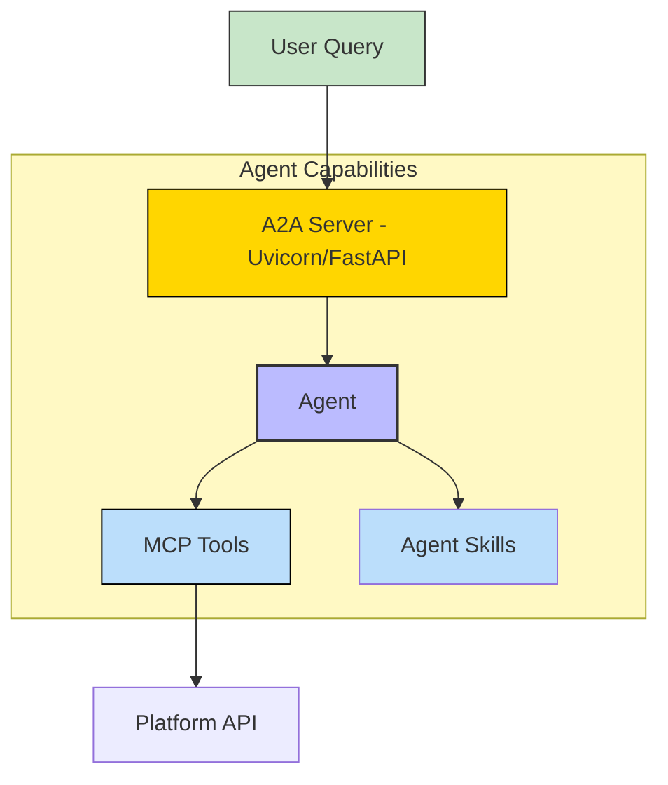
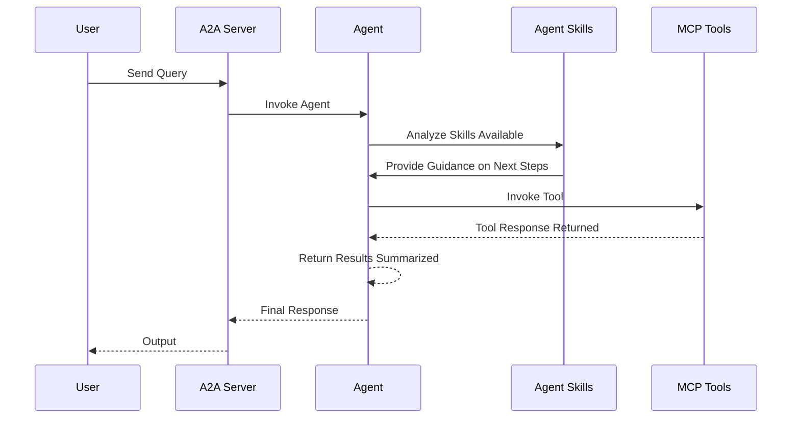

# Repository Manager - A2A | AG-UI | MCP


*Version: 1.2.17*

## Overview

A Ralph Wiggum inspired coding agent and repository manager!

This powerful agent can manage your repositories in bulk, implement new features using Ralph Wiggum methodology, run git commands, create and edit code in multiple projects, and query your code base!

Run all Git supported tasks using Git Actions command

Run as an MCP Server for Agentic AI with an A2A/AG-UI/Web Server!

## MCP

AI Prompt:
```text
Clone all the git projects located in the file "/home/genius/Development/repositories-list/repositories.txt" to my "/home/genius/Development" workspace.
Afterwards, pull all the projects located in the "/home/genius/Development" repository workspace.
```

AI Response:
```text
All projects in "/home/genius/Development/repositories-list/repositories.txt" have been cloned to "/home/genius/Development"
and all projects in "/home/genius/Development" and been pulled from the repositories. Let me know if you need any further actions! 🚀.
```

This repository is actively maintained - Contributions are welcome!

## A2A Agent

### Architecture:



### Component Interaction Diagram



## Usage

### CLI

| Short Flag | Long Flag        | Description                            |
|------------|------------------|----------------------------------------|
| -h         | --help           | See Usage                              |
| -b         | --default-branch | Checkout default branch                |
| -c         | --clone          | Clone projects specified               |
| -w         | --workspace      | Workspace to clone/pull projects       |
| -f         | --file           | File with repository links             |
| -p         | --pull           | Pull projects in parent directory      |
| -r         | --repositories   | Comma separated Git URLs               |
| -t         | --threads        | Number of parallel threads - Default 4 |

```bash
repository-manager \
    --clone  \
    --pull  \
    --workspace '/home/user/Downloads'  \
    --file '/home/user/Downloads/repositories.txt'  \
    --repositories 'https://github.com/Knucklessg1/media-downloader,https://github.com/Knucklessg1/genius-bot' \
    --threads 8
```

### MCP CLI

| Short Flag | Long Flag                          | Description                                                                 |
|------------|------------------------------------|-----------------------------------------------------------------------------|
| -h         | --help                             | Display help information                                                    |
| -t         | --transport                        | Transport method: 'stdio', 'http', or 'sse' [legacy] (default: stdio)       |
| -s         | --host                             | Host address for HTTP transport (default: 0.0.0.0)                          |
| -p         | --port                             | Port number for HTTP transport (default: 8000)                              |
|            | --auth-type                        | Authentication type: 'none', 'static', 'jwt', 'oauth-proxy', 'oidc-proxy', 'remote-oauth' (default: none) |
|            | --token-jwks-uri                   | JWKS URI for JWT verification                                              |
|            | --token-issuer                     | Issuer for JWT verification                                                |
|            | --token-audience                   | Audience for JWT verification                                              |
|            | --oauth-upstream-auth-endpoint     | Upstream authorization endpoint for OAuth Proxy                             |
|            | --oauth-upstream-token-endpoint    | Upstream token endpoint for OAuth Proxy                                    |
|            | --oauth-upstream-client-id         | Upstream client ID for OAuth Proxy                                         |
|            | --oauth-upstream-client-secret     | Upstream client secret for OAuth Proxy                                     |
|            | --oauth-base-url                   | Base URL for OAuth Proxy                                                   |
|            | --oidc-config-url                  | OIDC configuration URL                                                     |
|            | --oidc-client-id                   | OIDC client ID                                                             |
|            | --oidc-client-secret               | OIDC client secret                                                         |
|            | --oidc-base-url                    | Base URL for OIDC Proxy                                                    |
|            | --remote-auth-servers              | Comma-separated list of authorization servers for Remote OAuth             |
|            | --remote-base-url                  | Base URL for Remote OAuth                                                  |
|            | --allowed-client-redirect-uris     | Comma-separated list of allowed client redirect URIs                       |
|            | --eunomia-type                     | Eunomia authorization type: 'none', 'embedded', 'remote' (default: none)   |
|            | --eunomia-policy-file              | Policy file for embedded Eunomia (default: mcp_policies.json)              |
|            | --eunomia-remote-url               | URL for remote Eunomia server                                              |


### A2A CLI

| Short Flag | Long Flag         | Description                                                            |
|------------|-------------------|------------------------------------------------------------------------|
| -h         | --help            | Display help information                                               |
|            | --host            | Host to bind the server to (default: 0.0.0.0)                          |
|            | --port            | Port to bind the server to (default: 9000)                             |
|            | --reload          | Enable auto-reload                                                     |
|            | --provider        | LLM Provider: 'openai', 'anthropic', 'google', 'huggingface'           |
|            | --model-id        | LLM Model ID (default: qwen3:4b)                                       |
|            | --base-url        | LLM Base URL (for OpenAI compatible providers)                         |
|            | --api-key         | LLM API Key                                                            |
|            | --smart-coding-mcp-enable | Enable Smart Coding MCP configuration                                  |
|            | --python-sandbox-enable | Enable Python Sandbox MCP configuration                                  |
|            | --workspace            | Workspace to scan for git projects (default: current directory)       |


### Smart Coding MCP Integration

The Repository Manager A2A Agent can automatically configure `smart-coding-mcp` for any Git projects found in a specified directory.

```bash
repository_manager_a2a --smart-coding-mcp-enable --workspace /path/to/my/projects
```

This will:
1. Scan `/path/to/my/projects` for any subdirectories containing a `.git` folder.
2. Update `mcp_config.json` to include a `smart-coding-mcp` server entry for each found project.
3. Start the agent with access to these new MCP servers, allowing for semantic code search within your projects.

### Python Sandbox Integration

The Agent can execute Python code in a secure Deno sandbox using `mcp-run-python`.

```bash
repository_manager_a2a --python-sandbox-enable
```

This will:
1.  Configure `mcp_config.json` to include the `python-sandbox` server.
2.  Enable the `Python Sandbox` skill, allowing the agent to run scripts for calculation, testing, or logic verification.

### Default Repository List

The agent will automatically load the `repositories-list.txt` file included in the package as the default project list if no `PROJECTS_FILE` environment variable is set. This ensures the agent always has a list of repositories to work with.


### Using as an MCP Server

The MCP Server can be run in two modes: `stdio` (for local testing) or `http` (for networked access). To start the server, use the following commands:

#### Run in stdio mode (default):
```bash
repository-manager-mcp --transport "stdio"
```

#### Run in HTTP mode:
```bash
repository-manager-mcp --transport "http"  --host "0.0.0.0"  --port "8000"
```

### Use in Python

```python
from repository_manager.repository_manager import Git

gitlab = Git()

gitlab.set_workspace("<workspace>")

gitlab.set_threads(threads=8)

gitlab.set_git_projects("<projects>")

gitlab.set_default_branch(set_to_default_branch=True)

gitlab.clone_projects_in_parallel()

gitlab.pull_projects_in_parallel()
```


### Deploy MCP Server as a Service

The ServiceNow MCP server can be deployed using Docker, with configurable authentication, middleware, and Eunomia authorization.

#### Using Docker Run

```bash
docker pull knucklessg1/repository-manager:latest

docker run -d \
  --name repository-manager-mcp \
  -p 8004:8004 \
  -e HOST=0.0.0.0 \
  -e PORT=8004 \
  -e TRANSPORT=http \
  -e AUTH_TYPE=none \
  -e EUNOMIA_TYPE=none \
  -v development:/root/Development \
  knucklessg1/repository-manager:latest
```

For advanced authentication (e.g., JWT, OAuth Proxy, OIDC Proxy, Remote OAuth) or Eunomia, add the relevant environment variables:

```bash
docker run -d \
  --name repository-manager-mcp \
  -p 8004:8004 \
  -e HOST=0.0.0.0 \
  -e PORT=8004 \
  -e TRANSPORT=http \
  -e AUTH_TYPE=oidc-proxy \
  -e OIDC_CONFIG_URL=https://provider.com/.well-known/openid-configuration \
  -e OIDC_CLIENT_ID=your-client-id \
  -e OIDC_CLIENT_SECRET=your-client-secret \
  -e OIDC_BASE_URL=https://your-server.com \
  -e ALLOWED_CLIENT_REDIRECT_URIS=http://localhost:*,https://*.example.com/* \
  -e EUNOMIA_TYPE=embedded \
  -e EUNOMIA_POLICY_FILE=/app/mcp_policies.json \
  -v development:/root/Development \
  knucklessg1/repository-manager:latest
```

#### Using Docker Compose

Create a `docker-compose.yml` file:

```yaml
services:
  repository-manager-mcp:
    image: knucklessg1/repository-manager:latest
    environment:
      - HOST=0.0.0.0
      - PORT=8004
      - TRANSPORT=http
      - AUTH_TYPE=none
      - EUNOMIA_TYPE=none
    volumes:
      - development:/root/Development
    ports:
      - 8004:8004
```

For advanced setups with authentication and Eunomia:

```yaml
services:
  repository-manager-mcp:
    image: knucklessg1/repository-manager:latest
    environment:
      - HOST=0.0.0.0
      - PORT=8004
      - TRANSPORT=http
      - AUTH_TYPE=oidc-proxy
      - OIDC_CONFIG_URL=https://provider.com/.well-known/openid-configuration
      - OIDC_CLIENT_ID=your-client-id
      - OIDC_CLIENT_SECRET=your-client-secret
      - OIDC_BASE_URL=https://your-server.com
      - ALLOWED_CLIENT_REDIRECT_URIS=http://localhost:*,https://*.example.com/*
      - EUNOMIA_TYPE=embedded
      - EUNOMIA_POLICY_FILE=/app/mcp_policies.json
    ports:
      - 8004:8004
    volumes:
      - development:/root/Development
      - ./mcp_policies.json:/app/mcp_policies.json
```

Run the service:

```bash
docker-compose up -d
```

#### Configure `mcp.json` for AI Integration

```json
{
  "mcpServers": {
    "repository_manager": {
      "command": "uv",
      "args": [
        "run",
        "--with",
        "repository-manager",
        "repository-manager-mcp"
      ],
      "env": {
        "REPOSITORY_MANAGER_WORKSPACE": "/home/user/Development/",                       // Optional - Can be specified at prompt
        "REPOSITORY_MANAGER_THREADS": "12",                                              // Optional - Can be specified at prompt
        "REPOSITORY_MANAGER_DEFAULT_BRANCH": "True",                                     // Optional - Can be specified at prompt
        "REPOSITORY_MANAGER_PROJECTS_FILE": "/home/user/Development/repositories.txt"    // Optional - Can be specified at prompt
      },
      "timeout": 300000
    }
  }
}

```

### A2A

#
#### Endpoints
- **Web UI**: `http://localhost:8000/` (if enabled)
- **A2A**: `http://localhost:8000/a2a` (Discovery: `/a2a/.well-known/agent.json`)
- **AG-UI**: `http://localhost:8000/ag-ui` (POST)

#### A2A CLI

| Short Flag | Long Flag         | Description                                                            |
|------------|-------------------|------------------------------------------------------------------------|
| -h         | --help            | Display help information                                               |
|            | --host            | Host to bind the server to (default: 0.0.0.0)                          |
|            | --port            | Port to bind the server to (default: 9000)                             |
|            | --reload          | Enable auto-reload                                                     |
|            | --provider        | LLM Provider: 'openai', 'anthropic', 'google', 'huggingface'           |
|            | --model-id        | LLM Model ID (default: qwen3:4b)                                       |
|            | --base-url        | LLM Base URL (for OpenAI compatible providers)                         |
|            | --api-key         | LLM API Key                                                            |
|            | --api-key         | LLM API Key                                                            |
| --mcp-url         | MCP Server URL (default: http://localhost:8000/mcp)                    |
| --web             | Enable Pydantic AI Web UI                                              | False (Env: ENABLE_WEB_UI) |


## Install Python Package

```bash
python -m pip install --upgrade repository-manager
```

or

```bash
uv pip install --upgrade repository-manager
```


## Repository Owners


