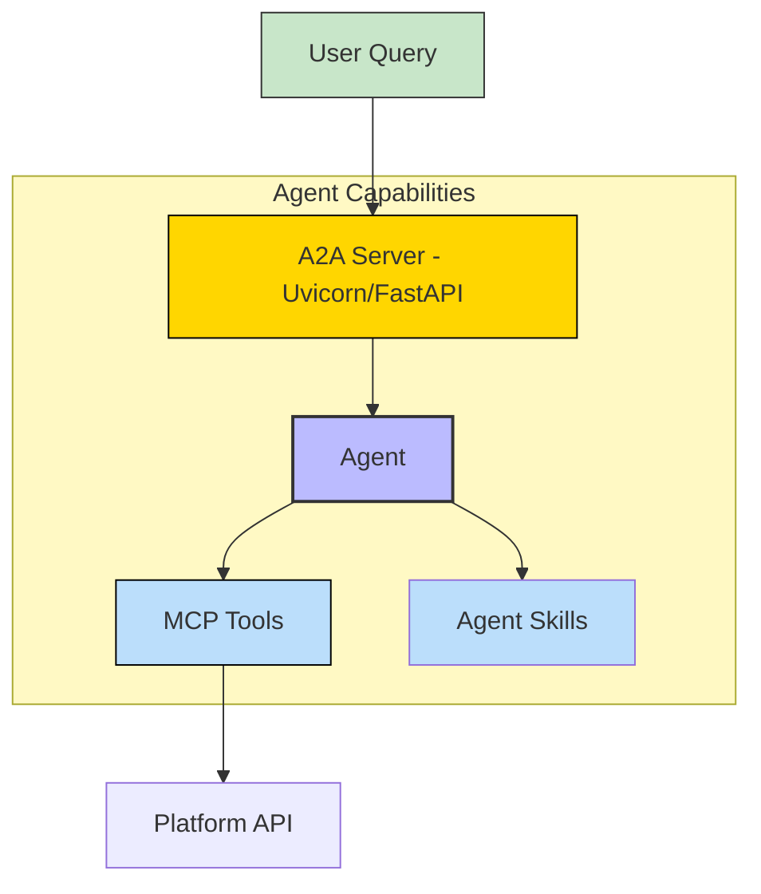
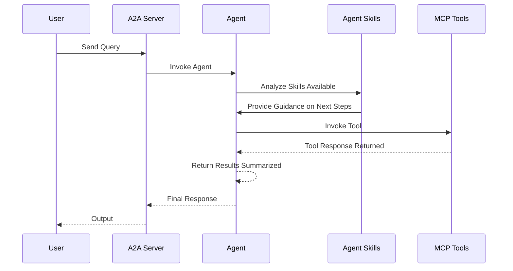
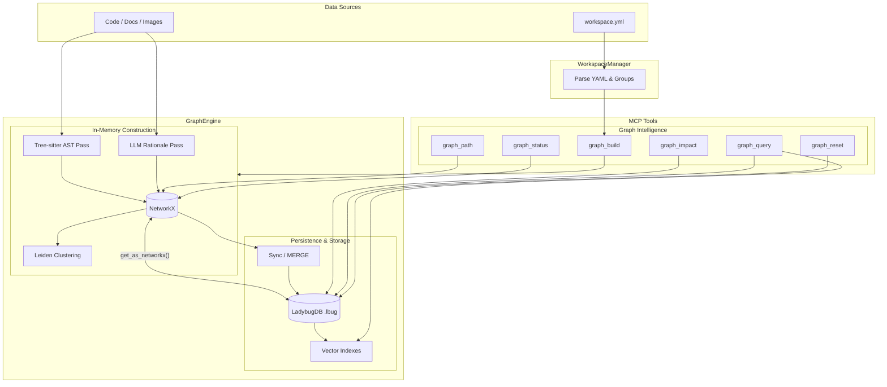

# Repository Manager - A2A | AG-UI | MCP


*Version: 1.11.1*

## Overview

- **Pydantic Graph Architecture**: 19 specialized domain nodes (Git, File, Workspace, and 15+ integrated engineering skills) for intelligent, granular task routing.
- **Declarative Workspace**: Manage your entire ecosystem via `workspace.yml`, validated by strict Pydantic V2 models.
- **Idempotent Synchronization**: One-click setup that intelligently clones missing repositories and pulls existing ones into their correct hierarchical paths.
- **Workspace Visualization**:
    - **ASCII Tree**: Generate beautiful folder structures directly in the CLI or via MCP.
    - **Mermaid Diagrams**: Export your workspace model as a visual graph for documentation.
- **Integrated Skills**: Native support for `agent-builder`, `mcp-builder`, `web-search`, and more, coupled with expert documentation for `FastMCP`, `Pydantic AI`, and `Docker`.
- **Hybrid Graph Intelligence**: A 10-phase topological pipeline that unifies NetworkX in-memory analysis with LadybugDB Cypher persistence for cross-repository symbol mapping.

## 🧠 Graph Intelligence

The Repository Manager implements a sophisticated 10-phase pipeline to map and analyze your workspace. This system combines **NetworkX** (for topological algorithms) and **LadybugDB** (for persistent Cypher queries and hybrid search).

### The 10-Phase Intelligence Pipeline

| Phase | Name | Purpose |
| :--- | :--- | :--- |
| **1** | **Scan** | Performs the initial directory walk, respecting `.gitignore`, to identify all source code files. |
| **2** | **Parse** | AST parsing (tree-sitter) to extract high-level symbols (Classes, Functions) and raw import statements. |
| **3** | **Resolve** | Resolves raw import strings into actual graph edges between `File` and `Symbol` nodes (handling absolute and relative paths). |
| **4** | **MRO** | Calculates Method Resolution Order and inheritance hierarchies across the entire workspace. |
| **5** | **Reference** | Builds the call graph by identifying where specific symbols are referenced or invoked. |
| **6** | **Communities** | Clusters nodes into tightly-coupled modules using topological algorithms like Leiden or Louvain. |
| **7** | **Centrality** | Runs PageRank/Betweenness analysis to identify critical path "God Objects" and high-traffic modules. |
| **8** | **Project** | Maps file groups to logical project/repository nodes based on manifest files (`pyproject.toml`, `package.json`). |
| **9** | **Embedding** | Generates semantic vector embeddings for code snippets and documentation to enable high-fidelity vector search. |
| **10** | **Sync** | Finalizes the build by projecting the in-memory NetworkX graph into the persistent LadybugDB Cypher store. |

1. **Nodes**: Specialized agents for high-context domains (e.g., `GitOpsNode`, `KnowledgeNode`).
2. **Router**: Automatically directs intent based on tool tags (`git_operations`, `workspace_management`, etc.).
3. **Engine**: The core `WorkspaceManager` processes the `workspace.yml` model to maintain state.

## 🛠️ Usage

### Workspace Configuration (`workspace.yml`)
Define your world in a single file:

```yaml
name: "My Workspace"
path: "./workspace"
repositories:
  - url: "https://github.com/org/repo-core.git"
subdirectories:
  agents:
    repositories:
      - url: "https://github.com/org/agent-1.git"
maintenance:
  phases:
    - name: "Phase 1: Core"
      phase: 1
      project: "repo-core"
```

## MCP

AI Prompt:
```text
Setup my workspace using the workspace.yml configuration. Also, install and validate all projects in the workspace.
```

AI Response:
```text
Workspace setup complete: Missing repositories have been cloned and existing ones updated.
Bulk operations finished: All projects installed and validated (agent/mcp) across the workspace.
```

This repository is actively maintained - Contributions are welcome!

## A2A Agent

### Architecture:


```mermaid
---
config:
  layout: dagre
---
flowchart TB
 subgraph subGraph0["Agent Capabilities"]
        C["Agent"]
        B["A2A Server - Uvicorn/FastAPI"]
        D["MCP Tools"]
        F["Agent Skills"]
  end
    C --> D & F
    A["User Query"] --> B
    B --> C
    D --> E["Platform API"]

     C:::agent
     B:::server
     A:::server
    classDef server fill:#f9f,stroke:#333
    classDef agent fill:#bbf,stroke:#333,stroke-width:2px
    style B stroke:#000000,fill:#FFD600
    style D stroke:#000000,fill:#BBDEFB
    style F fill:#BBDEFB
    style A fill:#C8E6C9
    style subGraph0 fill:#FFF9C4
```

### Component Interaction Diagram


```mermaid
sequenceDiagram
    participant User
    participant Server as A2A Server
    participant Agent as Agent
    participant Skill as Agent Skills
    participant MCP as MCP Tools

    User->>Server: Send Query
    Server->>Agent: Invoke Agent
    Agent->>Skill: Analyze Skills Available
    Skill->>Agent: Provide Guidance on Next Steps
    Agent->>MCP: Invoke Tool
    MCP-->>Agent: Tool Response Returned
    Agent-->>Agent: Return Results Summarized
    Agent-->>Server: Final Response
    Server-->>User: Output
```

## Usage

### CLI

| Short Flag | Long Flag        | Description                                  |
|------------|------------------|----------------------------------------------|
| -h         | --help           | See Usage                                    |
| -b         | --default-branch | Checkout default branch                      |
| -c         | --clone          | Clone projects specified in workspace file   |
| -p         | --pull           | Pull all projects in workspace               |
| -w         | --workspace      | Specify the workspace root directory         |
| -f         | --file           | Specify the workspace YAML file (Default)    |
| -r         | --repositories   | Comma separated Git URLs (Override)          |
| -t         | --threads        | Number of parallel threads (Default: 12)     |
| -m         | --maintain       | Run phased maintenance workflow              |
|            | --pre-commit     | Run parallel pre-commit checks               |
|            | --bump           | Bulk version bump (patch, minor, major)      |
|            | --phase          | Start maintenance at Phase N (1-5)           |
|            | --dry-run        | Preview changes without applying them        |
|            | --skip-pre-commit| Skip pre-commit phase in maintenance         |
|            | --install        | Bulk install all Python projects       |
|            | --build          | Bulk build all Python projects         |
|            | --validate       | Bulk validate all agent/MCP servers    |
|            | --type           | Validation filter: agent, mcp, or all        |
|            | --tree           | Generate ASCII workspace tree          |
|            | --mermaid        | Generate Mermaid workspace diagram     |
|            | --setup          | Sync workspace from YAML config        |
|            | --graph-query    | Query Hybrid Graph (semantic, structural, or hybrid) |
|            | --graph-mode     | Graph query mode (semantic, structural, or hybrid)       |
|            | --graph-path     | Find path between two symbols          |
|            | --graph-status   | Show current graph metrics             |
|            | --graph-reset    | Purge graph database                   |
|            | --graph-impact   | Calculate multi-repo impact            |

```bash
repository-manager \
    --clone  \
    --pull  \
    --workspace '/home/user/Downloads'  \
    --file '/home/user/Downloads/repositories.txt'  \
    --repositories 'https://github.com/Knucklessg1/media-downloader,https://github.com/Knucklessg1/genius-bot' \
    --threads 8
```

### MCP CLI

| Short Flag | Long Flag                          | Description                                                                 |
|------------|------------------------------------|-----------------------------------------------------------------------------|
| -h         | --help                             | Display help information                                                    |
| -t         | --transport                        | Transport method: 'stdio', 'http', or 'sse' [legacy] (default: stdio)       |
| -s         | --host                             | Host address for HTTP transport (default: 0.0.0.0)                          |
| -p         | --port                             | Port number for HTTP transport (default: 8000)                              |
|            | --auth-type                        | Authentication type: 'none', 'static', 'jwt', 'oauth-proxy', 'oidc-proxy', 'remote-oauth' (default: none) |
|            | --token-jwks-uri                   | JWKS URI for JWT verification                                              |
|            | --token-issuer                     | Issuer for JWT verification                                                |
|            | --token-audience                   | Audience for JWT verification                                              |
|            | --oauth-upstream-auth-endpoint     | Upstream authorization endpoint for OAuth Proxy                             |
|            | --oauth-upstream-token-endpoint    | Upstream token endpoint for OAuth Proxy                                    |
|            | --oauth-upstream-client-id         | Upstream client ID for OAuth Proxy                                         |
|            | --oauth-upstream-client-secret     | Upstream client secret for OAuth Proxy                                     |
|            | --oauth-base-url                   | Base URL for OAuth Proxy                                                   |
|            | --oidc-config-url                  | OIDC configuration URL                                                     |
|            | --oidc-client-id                   | OIDC client ID                                                             |
|            | --oidc-client-secret               | OIDC client secret                                                         |
|            | --oidc-base-url                    | Base URL for OIDC Proxy                                                    |
|            | --remote-auth-servers              | Comma-separated list of authorization servers for Remote OAuth             |
|            | --remote-base-url                  | Base URL for Remote OAuth                                                  |
|            | --allowed-client-redirect-uris     | Comma-separated list of allowed client redirect URIs                       |
|            | --eunomia-type                     | Eunomia authorization type: 'none', 'embedded', 'remote' (default: none)   |
|            | --eunomia-policy-file              | Policy file for embedded Eunomia (default: mcp_policies.json)              |
|            | --eunomia-remote-url               | URL for remote Eunomia server                                              |


### A2A CLI

| Short Flag | Long Flag         | Description                                                            |
|------------|-------------------|------------------------------------------------------------------------|
| -h         | --help            | Display help information                                               |
|            | --host            | Host to bind the server to (default: 0.0.0.0)                          |
|            | --port            | Port to bind the server to (default: 9000)                             |
|            | --reload          | Enable auto-reload                                                     |
|            | --provider        | LLM Provider: 'openai', 'anthropic', 'google', 'huggingface'           |
|            | --model-id        | LLM Model ID (default: nvidia/nemotron-3-super)                                       |
|            | --base-url        | LLM Base URL (for OpenAI compatible providers)                         |
|            | --api-key         | LLM API Key                                                            |
|            | --python-sandbox-enable | Enable Python Sandbox MCP configuration                                  |
|            | --workspace            | Workspace to scan for git projects (default: current directory)       |


The Repository Manager natively integrates **LadybugDB**, **NetworkX**, and semantic embeddings into a single `GraphEngine` architecture. This provides deep structural and multimodal intelligence across your Workspace. The system defaults to **Hybrid Search**, which merges semantic concepts (vector) with structural relationships (Cypher) for maximum precision.


```mermaid
flowchart TD
    subgraph Data Sources
        YAML[workspace.yml]
        Files[Code / Docs / Images]
    end

    subgraph WorkspaceManager
        Parse[Parse YAML & Groups]
    end

    subgraph GraphEngine
        direction TB
        subgraph GraphConstruction [In-Memory Construction]
            NX[(NetworkX)]
            AST[Tree-sitter AST Pass]
            Semantic[LLM Rationale Pass]
            Leiden[Leiden Clustering]
        end

        subgraph GraphPersistence [Persistence & Storage]
            LB[(LadybugDB .lbug)]
            Sync[Sync / MERGE]
            Vector[Vector Indexes]
        end

        AST --> NX
        Semantic --> NX
        NX --> Leiden
        NX <-->|"get_as_networkx()"| LB
        NX --> Sync
        Sync --> LB
        LB --> Vector
    end

    subgraph MCP Tools
        direction LR
        subgraph GraphIntelligence [Graph Intelligence]
            Impact[graph_impact]
            Search[graph_query]
            Build[graph_build]
            Path[graph_path]
            Status[graph_status]
            Reset[graph_reset]
        end
    end

    YAML --> Parse
    Files --> AST
    Files --> Semantic
    Parse --> Build
    Build --> GraphConstruction
    Impact --> LB
    Search --> LB
    Search --> Vector
    Path --> NX
    Status --> NX
    Reset --> LB
```

```bash
repository-manager --maintain --workspace /path/to/my/projects
```

This will:
1. Parse `workspace.yml` for all repository definitions and dependency groups.
2. Incrementally parse changed files constructing a NetworkX Graph and sync to LadybugDB.
3. Expose tools natively to your AI Agent (e.g. `graph_impact`, `graph_query`).

### Python Sandbox Integration

The Agent can execute Python code in a secure Deno sandbox using `mcp-run-python`.

```bash
repository_manager_a2a --python-sandbox-enable
```

This will:
1.  Configure `mcp_config.json` to include the `python-sandbox` server.
2.  Enable the `Python Sandbox` skill, allowing the agent to run scripts for calculation, testing, or logic verification.

### Default Workspace Model

The manager automatically discovers `workspace.yml` in the current directory or via the `WORKSPACE_YML` environment variable. This file serves as the strict single source of truth for the entire environment hierarchy, encompassing repositories, subdirectories, and maintenance policies.

### Maintenance Workflows

`repository-manager` supports specialized maintenance workflows for managing interdependent package ecosystems.

#### Parallel Pre-commits
Run `pre-commit` checks across all repositories in parallel. This is significantly faster than sequential runs and simplifies fleet-wide health checks.

```bash
repository-manager --pre-commit
```

#### Phased Bumping
When packages depend on each other, they often need to be bumped in a specific sequence. The `--maintain` flag implements this 5-stage process:

1.  **Skills**: Update core skill packages.
2.  **Graphs**: Update AI graph/template repositories.
3.  **UI**: Update frontend components.
4.  **Utilities**: Update the central utility library (`agent-utilities`) and propagate skill/graph versions.
5.  **Fleet**: Propagate the new utility version to all other packages and bump their versions.

```bash
# Full maintenance run (Bump patch -> Pre-commit -> Validate)
repository-manager --maintain --bump patch

# Dry-run a maintenance bump without committing changes
repository-manager --maintain --bump patch --dry-run

# Run only the first phase (bumping) and stop
repository-manager --maintain --bump patch --phase 1 --single-phase

# Skip verify phase (pre-commit) if already done
repository-manager --maintain --bump patch --skip-pre-commit

# Resume from a specific phase
repository-manager --maintain --phase 4
```

### Graph Intelligence CLI Examples

The `GraphEngine` can be queried directly via the CLI to gain insights into your workspace architecture.

| Feature | Command | Description |
|---------|---------|-------------|
| **Status** | `repository-manager --graph-status` | Show node/edge counts and database connectivity. |
| **Reset** | `repository-manager --graph-reset` | Purge the graph and force a full rebuild on next maintenance. |
| **Query** | `repository-manager --graph-query "GitResult" --graph-mode semantic` | Search for concepts or symbols across the fleet. |
| **Impact**| `repository-manager --graph-impact "WorkspaceConfig"` | Identify all downstream nodes affected by a symbol change. |
| **Path**  | `repository-manager --graph-path "GitResult" "mcp_server"` | Trace the shortest dependency path between two symbols. |
| **Cypher**| `repository-manager --graph-query "MATCH (n) RETURN n LIMIT 5" --graph-mode structural` | Execute raw Cypher queries on LadybugDB. |

#### Example: Running an Impact Analysis
```bash
repository-manager --graph-impact "GitResult" --file workspace.yml
```
This will return a JSON list of all nodes across all repositories that are topologically dependent on the `GitResult` model.

### Using as an MCP Server

The MCP Server can be run in two modes: `stdio` (for local testing) or `http` (for networked access). To start the server, use the following commands:

#### Run in stdio mode (default):
```bash
repository-manager-mcp --transport "stdio"
```

#### Run in HTTP mode:
```bash
repository-manager-mcp --transport "http"  --host "0.0.0.0"  --port "8000"
```

### Use in Python

```python
from repository_manager.repository_manager import Git

gitlab = Git()

gitlab.set_workspace("<workspace>")

gitlab.set_threads(threads=8)

gitlab.set_git_projects("<projects>")

gitlab.set_default_branch(set_to_default_branch=True)

gitlab.clone_projects_in_parallel()

gitlab.pull_projects_in_parallel()
```


### Deploy MCP Server as a Service

The ServiceNow MCP server can be deployed using Docker, with configurable authentication, middleware, and Eunomia authorization.

#### Using Docker Run

```bash
docker pull knucklessg1/repository-manager:latest

docker run -d \
  --name repository-manager-mcp \
  -p 8004:8004 \
  -e HOST=0.0.0.0 \
  -e PORT=8004 \
  -e TRANSPORT=http \
  -e AUTH_TYPE=none \
  -e EUNOMIA_TYPE=none \
  -v development:/root/Development \
  knucklessg1/repository-manager:latest
```

For advanced authentication (e.g., JWT, OAuth Proxy, OIDC Proxy, Remote OAuth) or Eunomia, add the relevant environment variables:

```bash
docker run -d \
  --name repository-manager-mcp \
  -p 8004:8004 \
  -e HOST=0.0.0.0 \
  -e PORT=8004 \
  -e TRANSPORT=http \
  -e AUTH_TYPE=oidc-proxy \
  -e OIDC_CONFIG_URL=https://provider.com/.well-known/openid-configuration \
  -e OIDC_CLIENT_ID=your-client-id \
  -e OIDC_CLIENT_SECRET=your-client-secret \
  -e OIDC_BASE_URL=https://your-server.com \
  -e ALLOWED_CLIENT_REDIRECT_URIS=http://localhost:*,https://*.example.com/* \
  -e EUNOMIA_TYPE=embedded \
  -e EUNOMIA_POLICY_FILE=/app/mcp_policies.json \
  -v development:/root/Development \
  knucklessg1/repository-manager:latest
```

#### Using Docker Compose

Create a `docker-compose.yml` file:

```yaml
services:
  repository-manager-mcp:
    image: knucklessg1/repository-manager:latest
    environment:
      - HOST=0.0.0.0
      - PORT=8004
      - TRANSPORT=http
      - AUTH_TYPE=none
      - EUNOMIA_TYPE=none
    volumes:
      - development:/root/Development
    ports:
      - 8004:8004
```

For advanced setups with authentication and Eunomia:

```yaml
services:
  repository-manager-mcp:
    image: knucklessg1/repository-manager:latest
    environment:
      - HOST=0.0.0.0
      - PORT=8004
      - TRANSPORT=http
      - AUTH_TYPE=oidc-proxy
      - OIDC_CONFIG_URL=https://provider.com/.well-known/openid-configuration
      - OIDC_CLIENT_ID=your-client-id
      - OIDC_CLIENT_SECRET=your-client-secret
      - OIDC_BASE_URL=https://your-server.com
      - ALLOWED_CLIENT_REDIRECT_URIS=http://localhost:*,https://*.example.com/*
      - EUNOMIA_TYPE=embedded
      - EUNOMIA_POLICY_FILE=/app/mcp_policies.json
    ports:
      - 8004:8004
    volumes:
      - development:/root/Development
      - ./mcp_policies.json:/app/mcp_policies.json
```

Run the service:

```bash
docker-compose up -d
```

#### Configure `mcp.json` for AI Integration

```json
{
  "mcpServers": {
    "repository_manager": {
      "command": "uv",
      "args": [
        "run",
        "--with",
        "repository-manager",
        "repository-manager-mcp"
      ],
      "env": {
        "REPOSITORY_MANAGER_WORKSPACE": "/home/user/Development/",                       // Optional - Can be specified at prompt
        "REPOSITORY_MANAGER_THREADS": "12",                                              // Optional - Can be specified at prompt
        "REPOSITORY_MANAGER_DEFAULT_BRANCH": "True",                                     // Optional - Can be specified at prompt
        "REPOSITORY_MANAGER_PROJECTS_FILE": "/home/user/Development/repositories.txt"    // Optional - Can be specified at prompt
      },
      "timeout": 300000
    }
  }
}

```

### A2A

#
#### Endpoints
- **Web UI**: `http://localhost:8000/` (if enabled)
- **A2A**: `http://localhost:8000/a2a` (Discovery: `/a2a/.well-known/agent.json`)
- **AG-UI**: `http://localhost:8000/ag-ui` (POST)

#### A2A CLI

| Short Flag | Long Flag         | Description                                                            |
|------------|-------------------|------------------------------------------------------------------------|
| -h         | --help            | Display help information                                               |
|            | --host            | Host to bind the server to (default: 0.0.0.0)                          |
|            | --port            | Port to bind the server to (default: 9000)                             |
|            | --reload          | Enable auto-reload                                                     |
|            | --provider        | LLM Provider: 'openai', 'anthropic', 'google', 'huggingface'           |
|            | --model-id        | LLM Model ID (default: nvidia/nemotron-3-super)                                       |
|            | --base-url        | LLM Base URL (for OpenAI compatible providers)                         |
|            | --api-key         | LLM API Key                                                            |
|            | --api-key         | LLM API Key                                                            |
| --mcp-url         | MCP Server URL (default: http://localhost:8000/mcp)                    |
| --web             | Enable Pydantic AI Web UI                                              | False (Env: ENABLE_WEB_UI) |


## Install Python Package

```bash
pip install repository-manager
```

or

```bash
uv pip install --upgrade repository-manager
```


## Repository Owners


## MCP Configuration Examples

### 1. Standard IO (stdio) Deployment

```json
{
  "mcpServers": {
    "repository-manager": {
      "command": "uv",
      "args": [
        "run",
        "repository-manager-mcp"
      ],
      "env": {
        "AGENT_DESCRIPTION": "<YOUR_AGENT_DESCRIPTION>",
        "AGENT_SYSTEM_PROMPT": "<YOUR_AGENT_SYSTEM_PROMPT>",
        "DEFAULT_AGENT_NAME": "<YOUR_DEFAULT_AGENT_NAME>",
        "GIT_OPERATIONSTOOL": "True",
        "GRAPH_INTELLIGENCETOOL": "True",
        "LLM_API_KEY": "<YOUR_LLM_API_KEY>",
        "LLM_BASE_URL": "<YOUR_LLM_BASE_URL>",
        "MCP_URL": "<YOUR_MCP_URL>",
        "MISCTOOL": "True",
        "MODEL_ID": "<YOUR_MODEL_ID>",
        "REPOSITORY_MANAGER_DEFAULT_BRANCH": "<YOUR_REPOSITORY_MANAGER_DEFAULT_BRANCH>",
        "REPOSITORY_MANAGER_THREADS": "<YOUR_REPOSITORY_MANAGER_THREADS>",
        "REPOSITORY_MANAGER_WORKSPACE": "<YOUR_REPOSITORY_MANAGER_WORKSPACE>",
        "VISUALIZATIONTOOL": "True",
        "WORKSPACE_MANAGEMENTTOOL": "True",
        "WORKSPACE_YML": "<YOUR_WORKSPACE_YML>"
      }
    }
  }
}
```

### 2. Streamable HTTP (SSE) Deployment

```json
{
  "mcpServers": {
    "repository-manager": {
      "command": "uv",
      "args": [
        "run",
        "repository-manager-mcp",
        "--transport",
        "http",
        "--host",
        "0.0.0.0",
        "--port",
        "8000"
      ],
      "env": {
        "AGENT_DESCRIPTION": "<YOUR_AGENT_DESCRIPTION>",
        "AGENT_SYSTEM_PROMPT": "<YOUR_AGENT_SYSTEM_PROMPT>",
        "DEFAULT_AGENT_NAME": "<YOUR_DEFAULT_AGENT_NAME>",
        "GIT_OPERATIONSTOOL": "True",
        "GRAPH_INTELLIGENCETOOL": "True",
        "LLM_API_KEY": "<YOUR_LLM_API_KEY>",
        "LLM_BASE_URL": "<YOUR_LLM_BASE_URL>",
        "MCP_URL": "<YOUR_MCP_URL>",
        "MISCTOOL": "True",
        "MODEL_ID": "<YOUR_MODEL_ID>",
        "REPOSITORY_MANAGER_DEFAULT_BRANCH": "<YOUR_REPOSITORY_MANAGER_DEFAULT_BRANCH>",
        "REPOSITORY_MANAGER_THREADS": "<YOUR_REPOSITORY_MANAGER_THREADS>",
        "REPOSITORY_MANAGER_WORKSPACE": "<YOUR_REPOSITORY_MANAGER_WORKSPACE>",
        "VISUALIZATIONTOOL": "True",
        "WORKSPACE_MANAGEMENTTOOL": "True",
        "WORKSPACE_YML": "<YOUR_WORKSPACE_YML>"
      }
    }
  }
}
```
