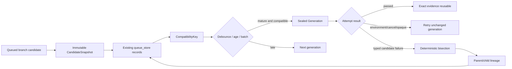

# Candidate generations

RMDD-12 turns immutable branch submissions into bounded, compatible generation
records.  This checkpoint is the pure domain seam: it snapshots exact branch and
base SHAs, derives stable identities, folds append-only records after restart,
and plans deterministic coalescing and bisection.  It does not run a worker,
allocate a lane, issue a validation certificate, move a ref, land, push, or
prune.

## Immutable inputs

`CandidateSnapshot` contains the frozen C-07 `Candidate` projection plus the
generation-selection inputs that must not be recomputed from a moving branch:

- candidate and base Git SHAs, repository/target/lane/owner identity;
- configuration, toolchain, and resource digests;
- build target, concept claims, incompatibility labels, and execution target;
- enqueue time, logical candidate ID, version, and a canonical immutable digest.

The logical candidate ID remains stable for a branch submission.  A changed
branch or base SHA creates version `N+1`; version `N` is never rewritten.
Each generation member retains that snapshot's actual version (for example,
`v3` and `v7`); no ordinal is substituted.  `Generation.derive_id` hashes the
ordered `CandidateVersion` tuple and all generation-level immutable inputs.

## Coalescing policy

Candidates are sorted by enqueue time, logical ID, version, and candidate SHA.
They can share a generation only when repository, target branch, exact base
SHA, configuration, toolchain, resource policy, build target, concepts, labels,
and target agree.  This checkpoint performs no ancestry lookup.  A debounce
window absorbs a burst; maximum age forces progress; batch size is a hard
bound.  A candidate newer than a seal is returned to the next-generation queue
and cannot alter sealed membership.

## Failure policy

The pure bisection planner distinguishes candidate, opaque, environment, and
cancellation failures from an explicit fixed failure class.  Environment
failures retry the unchanged generation and quarantine only after an explicit
attempt budget; they never reject its candidates.  Opaque or unknown failures
also retry unchanged and quarantine only when their budget is exhausted—they
never split or reject a candidate based on untrusted detail.  Only a typed
candidate failure splits an ordered multi-member set in half until one member
is attributable.  Evidence is reused only for the exact ordered membership
that produced it, preventing a passing aggregate from being incorrectly
claimed for a different synthetic tree.

The pure folds consume candidate and generation record kinds from the existing
queue store, order updates by recorded write time, and validate every
historical record's immutable membership and digest.  A conflicting rewrite
is refused rather than silently accepted during restart reconciliation; this
checkpoint creates no durable store or ledger factory.

The later merge-queue adapter may consume these pure records for object-only
trial merge and differential gates.  RMDD-29 remains the authority for typed
build execution payloads and production worker handoff; this module creates no
such payload.
