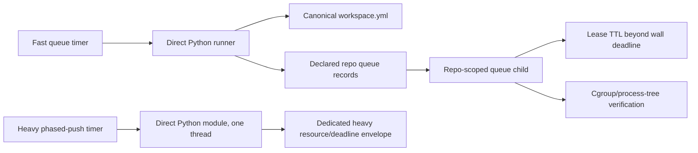

# Versioned fleet merge-queue runner

`repository-manager-install-merge-queue-runner` installs the fast queue runner,
its timer, and the separate heavy phased-push lane from the same release as
repository-manager:

```bash
repository-manager-install-merge-queue-runner \
  --workspace-root /home/apps/workspace
```

Installation writes the executable and all four units through same-directory
temporary files, checks every installed payload against its rendered source
SHA-256, then runs `systemctl --user daemon-reload`. If a write or reload
fails, the destinations are restored to their pre-install contents. The
installer does not enable or start either timer; inspect the hash report first,
then opt in explicitly:



```bash
systemctl --user enable --now merge-queue-runner.timer
systemctl --user enable --now phased-push-runner.timer
```

The runner reads the canonical `workspace.yml` under the configured workspace
root. It recursively resolves every manifest `repositories` entry, including
root-level planning/pipeline repositories and nested product/platform trees.
It validates each declared checkout before looking for queue records, and fails
closed for a missing checkout, a path mismatch, malformed YAML, or an invalid
Git root. It never walks the filesystem to invent an inventory. The manifest's
`open-source-libraries` subtree is an explicit reference-input exclusion and is
never a drain target.

Queue discovery reads each declared repository's own Git common directory. It
folds candidate records by their `recorded_at` timestamp, so a stale lane
fragment cannot revive a newer terminal state. `canonical.yaml`, terminal
states, and queued records older than `MERGE_QUEUE_MAX_AGE_SECONDS` (default
86400) are ignored. Legacy fragments written before `recorded_at` existed are
read without synthesizing a timestamp: a timestamped record wins when present,
and an entirely legacy group retains append order only for age filtering. A
fresh queued legacy record is refused until it receives an authoritative
timestamped state transition. A fresh queued candidate must retain an absolute,
registered native worktree whose Git root is the recorded path and whose Git common
directory matches the declared repository. The native worktree may live outside
the canonical checkout (as RM does for isolated lanes), but missing,
unregistered, symlinked, or cross-repository worktrees fail closed before any
gate starts. A fresh queued candidate then selects its repository; the runner
invokes the existing repo-scoped `reconciliation-merge` lease via:

```text
<installed-python> -m repository_manager --merge-queue run \
  --repo-path <repo> --queue-no-prune --queue-no-push \
  --queue-lease-ttl-seconds <ttl>
```

The fast timer passes both `--queue-no-prune` and `--queue-no-push`: it performs
the repo's fast differential merge gates and local landing only. Publication is
durably visible as `landed_unpushed` and belongs to the heavy phased-push timer;
the existing direct queue API keeps its default push-on-land behavior for
operators that explicitly request it. Exit 75 is a normal lease deferral;
other non-zero child statuses are reported as failures. The user service
invokes the direct Python interpreter captured at install time and the
versioned runner source; it does not invoke `uv`, `uvx`, or a Snap wrapper. The unit uses
`KillMode=control-group`, bounded CPU/memory/task accounting, and an explicit
stop grace period. The runner also checks every observed child/descendant
remains in the service cgroup and stop the whole process group plus the
observed process tree if one escapes. A cgroup that cannot be inspected is a
fail-closed error, so `/snap/bin/uv run ...` cannot silently escape the unit's
resource controls.

The fast runner's per-repository wall-clock deadline is 180 seconds by
default, and its whole-invocation deadline is 3600 seconds. Both are
independent from gate worker/resource limits and from fleet fan-out
concurrency. Override them with `--drain-deadline-seconds` /
`MERGE_QUEUE_DRAIN_DEADLINE_SECONDS` and `--global-deadline-seconds` /
`MERGE_QUEUE_GLOBAL_DEADLINE_SECONDS`; the global value must cover one root.
The runner gives each next root only the remaining global budget, never starts
another child after it expires, and returns a non-zero status when roots were
left unattempted. The installed unit sets `TimeoutStartSec` to the global
deadline plus a 60-second stop margin. This is a supervisor safety ceiling,
not a way to disable the per-gate deadlines declared in each `.mergequeue.yaml`.

The phased-push unit is intentionally separate: it invokes the versioned
runner, which starts `<installed-python> -m repository_manager --workspace
<root> --file <validated-generated-manifest> --threads 1 --push` directly and
checks the entire descendant process tree. The generated manifest is derived
from canonical `workspace.yml` and removes only the declared reference-input
components (including `open-source-libraries`); missing canonical roots still
fail before the child starts. It has a default 18,000-second unit
deadline and `RM_GATE_TIMEOUT_SECONDS=14400`. Its `MemoryHigh=15G`,
`MemoryMax=16G`, `MemorySwapMax=1G`, `CPUQuota=400%`, and `TasksMax=512` are
reserved for the heavy lane that previously exceeded the queue unit's 12G
limit. The fast queue lane remains at `MemoryMax=6G`, `CPUQuota=200%`, and
`TasksMax=256`.

The runner derives a repo-scoped lease TTL that is longer than the wall-clock
deadline (by a 10-minute safety margin) and passes it to the child as
`--queue-lease-ttl-seconds`. This prevents a same-host runner from reclaiming a
live multi-hour gate after the old 1800-second lease expires. The TTL remains
bounded at 24 hours and can be declared with `--lease-ttl-seconds` or
`MERGE_QUEUE_LEASE_TTL_SECONDS`; values at or below the drain deadline are
refused. Direct queue results include acquired, deadline, and released lease
receipts with `ttl_seconds`, `acquired_at`, and `expires_at`, and the same
records are emitted through the repository-manager logger for fleet telemetry.

For a portable projection, pass `--manifest` explicitly and set
`AGENT_UTILITIES_WORKSPACE_ROOT`; the projection must still declare that same
root (an unresolved or mismatched `path` is a manifest-drift error). The
installed unit embeds the workspace root and age/timeout bounds, so the timer
does not depend on its current working directory.

`REPOSITORY_MANAGER_COMMAND` may name an absolute executable (or a command on
`PATH`) for local diagnostics when the package-installed child is not desired.
The production service leaves it unset, so the runner uses
`<installed-python> -m repository_manager` directly. Any override still gets
fixed argv, never a shell, and the same cgroup fail-closed check.
