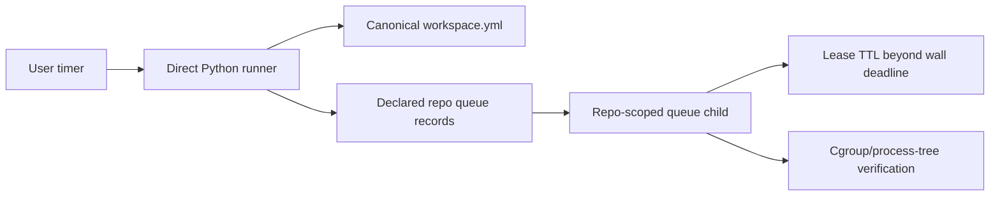

# Versioned fleet merge-queue runner

`repository-manager-install-merge-queue-runner` installs the runner and its
user-level systemd units from the same release as repository-manager:

```bash
repository-manager-install-merge-queue-runner \
  --workspace-root /home/apps/workspace
```

Installation writes the executable and both units through same-directory
temporary files, verifies every installed payload against its rendered source
SHA-256, then runs `systemctl --user daemon-reload`. If a write or reload
fails, the destinations are restored to their pre-install contents. The
installer does not enable or start the timer; inspect the hash report first,
then opt in explicitly:



```bash
systemctl --user enable --now merge-queue-runner.timer
```

The runner reads the canonical `workspace.yml` under the configured workspace
root. It recursively resolves every manifest `repositories` entry, including
root-level planning/pipeline repositories and nested product/platform trees.
It validates each declared checkout before looking for queue records, and fails
closed for a missing checkout, a path mismatch, malformed YAML, or an invalid
Git root. It never walks the filesystem to invent an inventory. The manifest's
`open-source-libraries` subtree is an explicit reference-input exclusion and is
never a drain target.

Queue discovery reads each declared repository's own Git common directory. It
folds candidate records by their `recorded_at` timestamp, so a stale lane
fragment cannot revive a newer terminal state. `canonical.yaml`, terminal
states, and queued records older than `MERGE_QUEUE_MAX_AGE_SECONDS` (default
86400) are ignored. A fresh queued candidate selects its repository; the
runner then invokes the existing repo-scoped `reconciliation-merge` lease via:

```text
<installed-python> -m repository_manager --merge-queue run \
  --repo-path <repo> --queue-no-prune --queue-lease-ttl-seconds <ttl>
```

`--queue-no-prune` preserves the queue's existing lease, branch, and worktree
lifecycle semantics. Exit 75 is a normal lease deferral; other non-zero child
statuses are reported as failures. The user service invokes the direct Python
interpreter captured at install time and the versioned runner source; it does
not invoke `uv`, `uvx`, or a Snap wrapper. The unit uses
`KillMode=control-group`, bounded CPU/memory/task accounting, and an explicit
stop grace period. The runner also verifies every observed child/descendant
remains in the service cgroup and terminates the whole process group plus the
observed process tree if one escapes. A cgroup that cannot be inspected is a
fail-closed error, so `/snap/bin/uv run ...` cannot silently escape the unit's
resource controls.

The runner's wall-clock deadline is independent from gate worker/resource
limits and from fleet fan-out concurrency. The default is three hours, which
leaves a low-concurrency heavy pre-push gate time to make progress without
raising its CPU, memory, or task budget. Override it explicitly with
`--drain-deadline-seconds` or `MERGE_QUEUE_DRAIN_DEADLINE_SECONDS`; the value
must remain positive, and the installed unit sets both `TimeoutStartSec` and
the runner deadline from the same rendered value. This is a supervisor safety
ceiling, not a way to disable the per-gate deadlines declared in each
`.mergequeue.yaml`.

The runner derives a repo-scoped lease TTL that is longer than the wall-clock
deadline (by a 10-minute safety margin) and passes it to the child as
`--queue-lease-ttl-seconds`. This prevents a same-host runner from reclaiming a
live multi-hour gate after the old 1800-second lease expires. The TTL remains
bounded at 24 hours and can be declared with `--lease-ttl-seconds` or
`MERGE_QUEUE_LEASE_TTL_SECONDS`; values at or below the drain deadline are
refused. Direct queue results include acquired, deadline, and released lease
receipts with `ttl_seconds`, `acquired_at`, and `expires_at`, and the same
records are emitted through the repository-manager logger for fleet telemetry.

For a portable projection, pass `--manifest` explicitly and set
`AGENT_UTILITIES_WORKSPACE_ROOT`; the projection must still declare that same
root (an unresolved or mismatched `path` is a manifest-drift error). The
installed unit embeds the workspace root and age/timeout bounds, so the timer
does not depend on its current working directory.

`REPOSITORY_MANAGER_COMMAND` may name an absolute executable (or a command on
`PATH`) for local diagnostics when the package-installed child is not desired.
The production service leaves it unset, so the runner uses
`<installed-python> -m repository_manager` directly. Any override still gets
fixed argv, never a shell, and the same cgroup fail-closed check.
