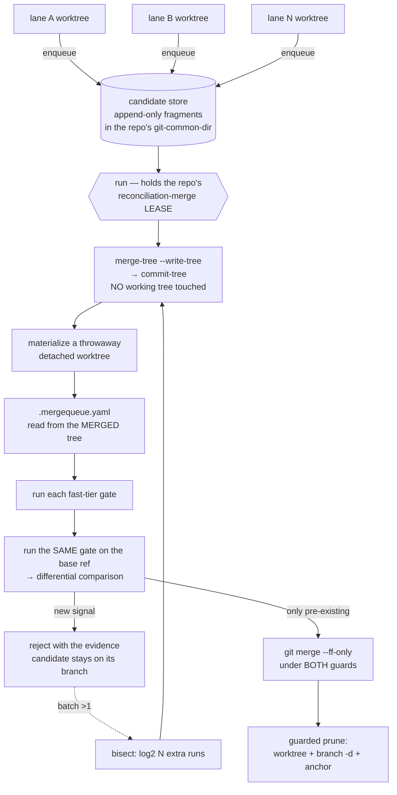

# The universal merge queue (CONCEPT:RM-MERGE-QUEUE)

> One serialized merge queue, for **any** git repository, driven by huge concurrent
> waves of agents and humans. The mechanism lives here; the gates live in each
> repository's own `.mergequeue.yaml`.

## Why it moved

`agent_utilities/governance/merge_queue.py` is mature and battle-tested, but it
could serve exactly one repository: its gates were pytest/ruff/contract-script
specific by construction. The proof that this was mis-homed is empirical —
**epistemic-graph has no merge queue at all**, so its lane had to hand-apply the
discipline from memory: verify the *merged tree* with `cargo check
--all-features`, fast-forward only, never merge in the canonical checkout.

repository-manager already owned the rest of the machinery:
`WorktreeManager` (over a backend-agnostic `GitLike` Protocol), `canonical_guard`
and `prune_guard` — the exact guards the au queue had to **reimplement inline**
when repository-manager turned out not to be importable (D-ORC-21). Only the
queue layer was in the wrong package.

## Mechanism vs gates

```
MECHANISM  (repository_manager/merge_queue.py — generic, this file)
  enqueue / status / withdraw / run / config
  per-repo candidate store        differential gating vs a base ref
  regenerate-on-land              guarded prune
  the reconciliation-merge lease  fold-by-recorded_at ordering
  optimistic batching + bisection fast-forward-only landing

GATES      (<repo>/.mergequeue.yaml — declarative, per project)
  a command, a tier, a timeout, and HOW to compare its result to the base
```

**The queue must not know what a gate IS — only how to run one and compare its
result against the base ref.** A repository that declares no config is *refused*,
not defaulted: "declared no gates" and "has no queue configured" must not be the
same value.



## The five behaviours carried over, and what each one cost

| # | Behaviour | Why it exists |
|---|---|---|
| 1 | **Differential gating** — reject only failing signals *not* present on the base ref | `main` is legitimately red. An absolute gate deadlocked the queue and stranded **19 branches**; a branch that fixed 21 of 30 failing tests was rejected because 9 remained. **A baseline that cannot be produced REFUSES the candidate — never allow-all.** |
| 2 | **Fold by `recorded_at`** | Resolving cross-lane duplicates by fragment order prefers whichever *lane name* sorts last. A candidate enqueued by `lane-foo` and landed by `canonical` folded to the stale record and reported `queued` forever (D-F6-1/D-CVG-9). |
| 3 | **Regenerate-on-land** | With ~76 candidates on one base, nearly every one conflicts on a purely-derived file where there is no real disagreement. Regenerate from the *already-merged* tree; `--theirs` silently drops a side. |
| 4 | **Guarded prune** | Merge-base re-checked *at delete time*, a `refs/lane-backup/<branch>` anchor written first, `git branch -d` **never** `-D`, and any worktree holding uncommitted work refused. |
| 5 | **Honest degradation** | Every refusal names its reason. No path reports success it did not verify — enforced by the landing post-condition (D-RMD-1, below), not just intended. |

## `.mergequeue.yaml`

```yaml
base: main
batch_size: 8
environment_signature: ["cargo", "--version"]   # busts the baseline cache on a toolchain change

gates:
  - name: cargo-check
    command: [cargo, check, --all-features, --message-format, short]
    tier: fast              # fast = inside the queue; slow = declared, run post-merge
    timeout: 1800
    baseline_timeout: 3600  # the base run is no smaller and contends differently (D-MW-10)
    compare: lines          # exit | lines | pytest-ids
    keep_lines: ['^error', '^warning']   # only these participate in the diff
    ignore_lines: ['generated [0-9]+ warnings?']
    when_changed: ['**/*.rs', 'Cargo.toml']
    on_timeout: fail        # fail | defer

generated_files: [docs/index.md]
regenerate: [["python3", "scripts/gen.py"]]
```

### `compare` — the three shapes failure actually takes

* **`pytest-ids`** — an **ID-level** compare. A failing id is permitted only when
  that *exact* id already fails on the base. Never by file, module, pattern or
  count: an id-level compare is the only shape that cannot be gamed into masking
  a real regression. A pytest exit outside `{0,1,5}` is *unreadable*, not
  "zero failures", and is refused outright.
* **`lines`** — a **line-level** compare of normalized output. Catches a genuinely
  new diagnostic even when the base was already red for something else. The tree
  path is substituted out before diffing (the merged run and the base run happen
  in two different throwaway worktrees, so every absolute path differs);
  `keep_lines` is what makes this usable for a chatty tool — `cargo`'s
  `Compiling`/`Finished in 3.4s` lines differ on every run and would otherwise
  read as new violations on every candidate.
* **`exit`** — **script granularity**, for a tool that prints one static message
  (or nothing) regardless of *why* it failed. Reported as exactly that much
  precision, never dressed up as more.

### `environment_signature` and the baseline cache

The cache is keyed on `(base_sha, gate name, command, compare, environment)`. If
the environment cannot be fingerprinted it reads `unpinned`, and an unpinned
environment **disables the cache** rather than keying it on a fiction — a stale
baseline computed against a toolchain that no longer exists is worse than a slow
one (D-MQD-1).

## Pre-commit safety (D-ORC-37)

`pre_commit/staged_files_only.py` writes your **unstaged** changes to a patch
file, `git checkout`s them away so hooks see only staged content, then restores
them in a `finally:`. `patch_dir` **is** the pre-commit store directory
(`commands/run.py` → `staged_files_only(store.directory)`), which defaults to a
single shared `~/.cache/pre-commit` for every lane on a host. Two hazards follow:
a crash inside the window loses the work to an orphaned patch nobody replays
(D-OB-12), and the same directory holds pre-commit's SQLite `db.db`, which
produced `OperationalError: database is locked` under concurrent lanes.

Four rules, all enforced rather than documented:

1. **Every lane gets its own `PRE_COMMIT_HOME`** — now a PARTITION-class resource
   in agent-utilities' `lane_resources.yaml`, resolved by `partitioned_paths()`
   and exported by `agent-utilities lane env`. One change fixes both hazards.
   This queue sets it for every gate run too (`run_fast_gates`).
2. **Never run pre-commit against a tree holding someone else's uncommitted
   work.** `refuse_precommit_on_dirty_tree()` is called before any gate whose
   command runs `pre-commit`. A clean tree has no patch-restore window at all.
3. **Never `pre-commit --all-files` on a canonical checkout without the
   `precommit-all-files` LEASE** (already LEASE-class).
4. **Treat a crashed pre-commit as a data-loss incident, not a failed check.**
   `lanes.orphaned_precommit_patches()` classifies each patch file as
   `restored` / `ORPHANED` / `in-progress` / `unknown` — a patch file alone is
   *not* proof of a crash, because pre-commit never deletes one even on success —
   and `lane env` / `lane status` surface any `ORPHANED` one loudly **with its
   path**, so the work can be replayed with `git apply <path>`.

## Landing writes the DECLARED base ref (D-RMD-1)

The queue used to run `git merge --ff-only <commit>` in the canonical checkout,
which merges into whatever `HEAD` happens to be — **not** into the candidate's
declared `base`. agent-utilities' canonical checkout always sits on `main`, so
"merge into HEAD" *coincidentally* equalled "land on base"; seven consecutive
landings were audited and all were genuinely correct. **That is luck, not
correctness**, and the coincidence breaks exactly where a cross-project driver
goes: a canonical checkout parked on another branch (a bisect, a merge in
progress, an operator poking around), a base that is a release branch or a fork,
or any repo whose checkout convention differs from au's.

The failure mode was the worst kind — **silent and positive**. The queue reported
`landed`, the guarded prune then deleted the branch *as landed*, and the work sat
on a ref nobody looks at. A rejection is loud and recoverable; this manufactured
confidence and then destroyed the evidence. Same family as a gate that reports
green while enforcing nothing.

Both halves are implemented, and **the second is the durable one**:

1. **Write the declared ref explicitly.** `_base_ref()` fully qualifies it
   (`refs/heads/<base>` — a bare `rev-parse main` can resolve a tag or a
   remote-tracking ref), and the ref moves either by `git merge --ff-only` (only
   when the canonical checkout genuinely has `base` checked out, so ref and
   working tree move atomically together) or by a compare-and-swap
   `git update-ref <ref> <new> <expected-old>`. Fast-forward-only is enforced by
   asking `merge-base --is-ancestor` of the **base ref**, not of `HEAD`, because
   `update-ref` would otherwise happily rewind history. A base checked out in
   *another* worktree is refused outright — `update-ref` would leave that tree
   inconsistent with its own `HEAD`, which git forbids for `checkout` but not
   for us.
2. ★ **Assert the post-condition.** After the write the base ref is re-read and
   must equal the computed commit, *before* anything is reported `landed` and
   before the guarded prune deletes a branch on the strength of it. This is what
   makes the fix durable rather than merely correct today: it catches the wrong
   write target **even with the bug still in place**.

That claim is proved, not asserted:
`test_the_post_condition_catches_a_wrong_write_target_by_itself` restores the
original defect verbatim (a CAS write becomes a merge into `HEAD`) and requires
the queue to refuse. With the post-condition *removed* as well, the same test
shows the queue reporting success — D-RMD-1 reproduced exactly.

**Deploy consequence of the CAS path:** when the canonical checkout is not on
`base`, the ref advances and the canonical *working tree* does not. The fleet
hostPath-mounts that working tree, so landing in that state moves `main` without
moving the deployed bytes — strictly safer, and the same merge/deploy decoupling
the promotion ref exists for.

## Safety on the canonical tree

repository-manager has destroyed work on a canonical tree before: a background
`git reset` discarded ~20 minutes of a lane's work, which is why the standing
rule is *never edit a canonical checkout, always use a worktree*. Making it the
merge **driver** raises the stakes, so `land()` holds **both** guards:

* `lanes.guarded_tree_mutation` — refuses a tree holding uncommitted work another
  lane owns;
* `canonical_guard.guarded_canonical_mutation` — takes repository-manager's own
  canonical `flock` lease *and* re-checks `git status --porcelain` under it, so a
  land can never interleave with repository-manager's background sync.

That guard is **proven**, not assumed: a clean tree is allowed, a tracked
modification is refused, an **untracked-only** tree is refused, and a lease held
by another process is refused cross-process — see
`tests/test_canonical_guard.py` and the queue's own
`test_prune_refuses_a_worktree_holding_uncommitted_work` /
`test_prune_removes_a_clean_worktree_and_anchors_the_branch` pair (the positive
half exists so the refusal test cannot be vacuous).

## Surfaces

```bash
# CLI — one repository per invocation, selected by --repo-path
repository-manager --merge-queue enqueue --repo-path /path/to/repo
repository-manager --merge-queue status  --repo-path /path/to/repo
repository-manager --merge-queue run     --repo-path /path/to/repo
repository-manager --merge-queue config  --repo-path /path/to/repo   # validate the gates

# Standalone driver — suitable as a systemd/CronJob ExecStart, no CLI import
python -m repository_manager.merge_queue run --path /path/to/repo
```

MCP: **`rm_merge_queue`** with `action` ∈ `enqueue|status|withdraw|run|config`
and `repo_path` selecting the repository. Both surfaces are thin marshallers over
`merge_queue.dispatch()` — one action core, so they cannot drift (pinned by
`test_the_mcp_tool_is_registered_and_declares_every_action`).

**Exit 75 (`EX_TEMPFAIL`) means another runner holds this repository's
`reconciliation-merge` lease — defer, do not retry in a loop.**

## Cross-project independence

The lease, the candidate store and the scratch/basetemp partitions all resolve
through `lane_scope(path)`, which is anchored on that repository's own
`--git-common-dir`. So two repositories' queues are independent **by
construction**, not by a `repo` key someone must remember to set, and draining
agent-utilities and epistemic-graph concurrently is safe. No new arbitration
class was introduced.

## Migration — the live au queue must not break

The au queue is **actively landing branches**. The migration is therefore
strictly additive and reversible, and each step is independently valuable:

| Step | Action | Risk |
|---|---|---|
| 1 ✅ | Ship the generic queue + presets + CLI + MCP here. `agent_utilities.governance.merge_queue` is **untouched**. | none — no au code path changes |
| 2 ✅ | Land the `PRE_COMMIT_HOME` PARTITION fix in agent-utilities (additive: a new `PartitionedPaths` field, a new `lane_resources.yaml` row, a new `lane env` export). | none — nothing reads the field yet |
| 3 | Adopt for **epistemic-graph first** — copy `mergequeue_presets/epistemic-graph.mergequeue.yaml` to its root and drive it. eg has **no queue today**, so there is nothing to break, and it is the honest first proof at production scale. | low |
| 4 | Copy `mergequeue_presets/agent-utilities.mergequeue.yaml` into agent-utilities and run **both** queues against it in shadow: `--merge-queue config` and a `--queue-no-prune` drain on a scratch clone, comparing verdicts candidate by candidate. | low — read-mostly |
| 5 | Cut over: `agent_utilities.governance.merge_queue` becomes a thin shim delegating to `repository_manager.merge_queue` **when importable**, keeping its current implementation as the fallback. Note the dependency direction — repository-manager depends on agent-utilities, so au importing repository-manager must stay optional (that asymmetry is exactly what D-ORC-21 recorded). | medium — do this only after step 4 agrees |
| 6 | Retire the au implementation once the shim has landed real batches, per *No Legacy* (migrate-and-delete, no deprecation window). | — |

**Do not skip to step 5.** Placing `.mergequeue.yaml` in a repository is what
switches that repository over, so the presets shipped here are inert until
copied — which is what makes steps 1-2 zero-risk.

## Deployment — live

The long-running `repository-manager-mcp` streamable-http server in k8s is the
host (replacing the stopgap systemd timer). As of 2026-08-02 it is **`1/1
Running`**, `/health` 200, all four `rm_*` tools serving real data, and
`rm__worktree` through graph-os returning 355 worktrees / 44 linked. Landed by
lane `rm-deploy-0802`; the queue now has a real deployment to run in.

Four things about that deployment are **load-bearing** — none is cosmetic, and
three of them were gaps a mount alone would not have closed:

1. **The workspace is mounted at the *identical absolute path*
   (`/home/apps/workspace`), read-write.** Absolute paths are not a
   convenience here: git worktree metadata is absolute-path-based, so mounting
   the tree anywhere else would leave ~55 linked worktrees unresolvable from
   inside the pod. Read-write because the queue moves refs, writes each repo's
   arbitration dir, and removes landed worktrees — a read-only mount would let
   `status`/`config` work and fail `run` confusingly partway through.
   It is also what makes `prune_landed()` correct across the host/pod boundary:
   it prunes by the absolute worktree path the candidate **recorded at enqueue
   time**, which only resolves identically on both sides because the mount path
   matches.
2. **`REPOSITORY_MANAGER_WORKTREE_ROOT` must be set.** It was unset, which is a
   silent trap: `worktree.py` defaults it under `XDG_STATE_HOME`, so worktrees
   created by the pod would have gone to a **container-local** path — invisible
   to every host lane and destroyed on restart. The mount alone was *not*
   enough.
3. **The pod runs as `1000:1000`** to match repo ownership. It previously ran as
   root against repos owned by uid 1000 — precisely the "destroyed a lane's
   work" hazard that motivates `canonical_guard` in the first place. A guard
   that refuses a dirty tree does not help if the process can also rewrite
   everything it touches as root.
4. **Pinned to `rw710`** via `nodeSelector`. The deployment previously used
   `hostPath` with no placement constraint at all and worked only by accident.
   The trade was taken deliberately: the queue sits on no serving path, so
   losing it while that node is down is survivable — unlike the
   `nodeSelector`+`hostPath` DNS workload whose node death took the cluster
   down. It also cannot be safely replicated anyway, because it serializes on a
   host-local `flock` lease.

`canonical_guard` was proven on the live mount in both directions.

### Remaining deployment caveat

`get_mcp_instance()`'s import chain is still fragile: `repository_manager`'s own
`mcp_server.py` never imports `fastmcp.server.extensions`, but
`agent_utilities/mcp/tasks_extension.py` does — *and* separately does
`from mcp.shared.exceptions import MCPError`, which the installed `mcp` spells
`McpError`. A defensive-import fix that guards only the first symbol leaves the
second live (D-ORC-38).
