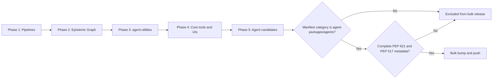

# Phased Git Push Workflow

The Phased Git Push feature orchestrates updating multiple repositories in sequential phases, use parallelism within each phase and structured wait times between phases. This ensures dependencies can be built, published, and cached cleanly without causing race conditions across the ecosystem.

## Architecture

The phased push logic is configured within the `workspace.yml` under the `maintenance` section:

```yaml
maintenance:
  description: "Phased update sequence for the agent ecosystem."
  phases:
    - name: "Phase 1: GitHub Pipelines"
      phase: 1
      projects:
        - "pipelines"
      wait_minutes: 0
    - name: "Phase 2: Epistemic Graph"
      phase: 2
      projects:
        - "epistemic-graph"
      wait_minutes: 30
    - name: "Phase 3: agent-utilities"
      phase: 3
      projects:
        - "agent-utilities"
      wait_minutes: 30
    - name: "Phase 4: Core Tools and UIs"
      phase: 4
      projects:
        - "universal-skills"
        - "skill-graphs"
        - "agent-webui"
        - "agent-terminal-ui"
        - "geniusbot"
      wait_minutes: 0
    - name: "Phase 5: Agents"
      phase: 5
      bulk_push: True
```



### Key Capabilities
- **Parallel Push**: All projects defined in the same `phase` block are pushed concurrently using a ThreadPoolExecutor (`git push --follow-tags`).
- **Gate-driven phase transitions (CONCEPT:RM-DEP-READY)**: `wait_minutes` is no longer a blind sleep. When a phase publishes a package another *later* phase's repo declares a constraint on, the transition to the next phase is decided by **running each downstream repo's explicit manual release-readiness hook** (`gates.run_gate_stage(..., "manual", hook_ids=["dependency-readiness"])`), retrying with bounded backoff up to a `wait_minutes` *ceiling*, and **aborting the whole wave** (never silently advancing) if it's still failing when the ceiling is hit — naming the specific failing repo and constraint. A phase with nothing published, or nothing downstream that depends on it, advances immediately in either case of `wait_minutes`. See `repository_manager/dependency_readiness.py` for the full design (`await_gate_readiness`); `RM_DEPENDENCY_READINESS_OVERRIDE_REASON` is the one loud/audited escape hatch.
- **Bulk Execution**: A phase marked with `bulk_push: True` resolves only unclaimed repositories that the loaded manifest structurally records under `agent-packages/agents` **and** whose local `pyproject.toml` declares a named, versioned PEP 517 distribution. Both conditions are mandatory and fail closed: `services/`, `images/`, plans, pipelines, missing/invalid package metadata or encoding, unsupported/conflicting PEP 621 `dynamic` fields, unsafe URL path segments, and unknown categories cannot enter the Phase-5 PyPI release set. An optional `exclude: [<fnmatch pattern>, ...]` phase field narrows bump, pre-commit, push, and auto-start through the same predicate.
- **Change-aware start (`auto_start`, default on)**: By default the push begins at the *lowest phase that actually has unpushed work* instead of always Phase 1. Because phases are topologically ordered (lower phase = more upstream), a change in phase *N* can only cascade to phases `>= N` — so earlier, unchanged phases (and their `wait_minutes` pauses) are safely skipped. A repo counts as having work when it is not both clean and in sync with origin (uncommitted changes, an unpushed feature commit, or an unpushed version bump). If no repo has pending work, the push is a no-op. So editing a single Phase-2 repo triggers Phase 2 onward without sitting through the Phase-1 wait. Pass `auto_start=False` (CLI `--no-auto-start`) to opt out and start at `start_phase`; it also stands down automatically when a `target_project` / `project_filter` is set.

> **Explicit start as a floor.** `auto_start` only ever advances the start phase forward. An explicit `start_phase` (CLI `--phase`) still acts as a floor, and the two compose as `max(explicit, detected)`.

## Usage

### Command Line
The operator can trigger a phased push independently or as part of the maintenance lifecycle.

```bash
# Execute only the phased push sequence
repository-manager --push

# Execute a phased version bump, run pre-commit validations, then phased push
repository-manager --maintain --push

# Execute a single phase (e.g. Phase 2) and exit without continuing to Phase 3
repository-manager --push --phase 2 --single-phase

# Push only specific projects defined in the configuration (comma-separated)
repository-manager --push --project agent-utilities,agent-webui
```

For a bulk phase, `--project` only intersects the already eligible
manifest-classified PyPI-agent set. It cannot promote an infrastructure or
otherwise ineligible repository into the release wave.

### MCP Tool Usage
The autonomous harness triggers pushes through the condensed `rm_git` MCP tool:

```json
{
  "name": "rm_git",
  "arguments": {
    "action": "phased_push",
    "phase": 1,
    "target_project": null
  }
}
```

The server automatically reports progress to the Model Context Protocol UI as it
advances through phase pushes and gate-readiness barriers.
