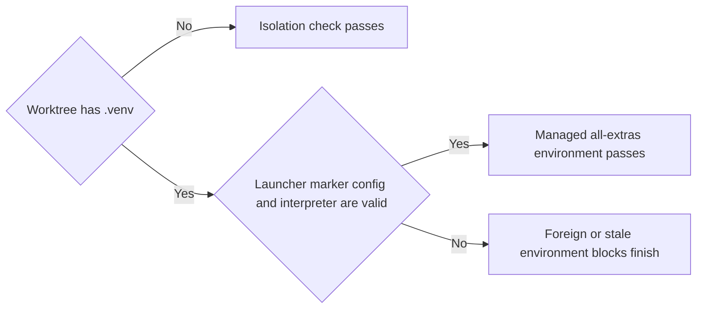
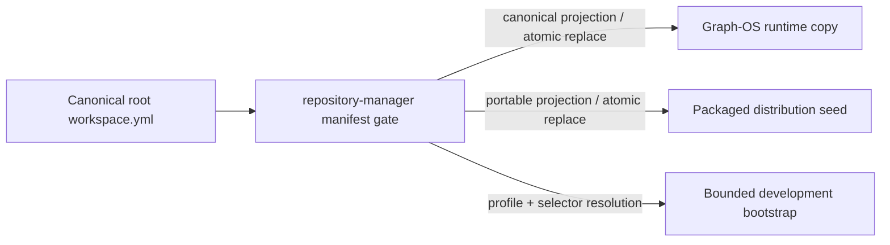

# Usage — API / CLI / MCP

`repository-manager` exposes the same capability three ways: as **MCP tools** an
agent calls, as a **Python API** (`Git`) you import, and as a **command-line
interface**.

## As an MCP server

Once [deployed](deployment.md), the server registers consolidated, action-routed tool
modules. Each module groups related methods behind one tool to keep the LLM context
small, and each can be toggled independently with its environment variable.

| Module | Toggle | Default | Action-routed methods |
|---|---|---|---|
| Misc | `MISCTOOL` | `True` | health check and miscellaneous helpers |
| Git Operations | `GIT_OPERATIONSTOOL` | `True` | `clone`, `pull`, `push`, `phased_push` (legacy `raw` is permanently retired) |
| Workspace Management | `WORKSPACE_MANAGEMENTTOOL` | `True` | `list`, `list_branches`, `maintain`, `remediate`, `save`, `setup`, `template` |
| Project Management | `PROJECT_MANAGEMENT_TOOL` | `True` | `build`, `install`, `validate`, `validate_status` |

Example agent prompts that map onto these tools:

- *"List every project in the workspace."* → `workspace_management list`
- *"Pull the latest changes for all repositories."* → `git_operations pull`
- *"Validate the workspace, then run a phased push of the agents."* → `project_management validate` + `git_operations phased_push`

## As a Python API

`Git` (`repository_manager.repository_manager`) is a workspace-aware client for bulk
Git operations and workspace introspection.

```python
import os

from repository_manager.repository_manager import Git

git = Git(path=os.environ["REPOSITORY_MANAGER_WORKSPACE"])

# Reads
projects = git.get_workspace_projects()        # list of managed project names
project_map = git.get_project_map()            # name -> absolute path
branches = git.list_branches()                 # name -> current branch

# Bulk operations
git.pull_projects()                            # pull every managed repository
git.clone_projects(["agent-utilities"])        # clone selected projects

# Validation
result = git.validate_single_project(project_map["agent-utilities"])
```

Load a workspace from its declarative `workspace.yml`:

```python
import os

git = Git(path=os.environ["AGENT_UTILITIES_WORKSPACE_ROOT"])
git.setup_from_yaml(os.environ["WORKSPACE_YML"])  # use the XDG-managed manifest
```

The packaged manifest contains only environment references for the workspace root,
private Git origin, and deployment DNS suffix. Inject those values at runtime; the
manifest never persists a user name, machine path, or private endpoint.

## As a CLI

The `repository-manager` console script drives the full maintenance lifecycle from
the command line.

```bash
# Set up the workspace from its declared configuration
repository-manager --setup

# Enumerate branches across every managed repository
repository-manager --branches

# Clone and pull in bulk
repository-manager --clone
repository-manager --pull
```

The autonomous release harness runs a validation → bump → maintain → push sequence
that aborts on the first failure:

```bash
repository-manager --validate --bump patch --maintain --push
```

- **`--validate`** runs a full pre-release validation; subsequent steps abort on failure.
- **`--bump [patch|minor|major]`** bumps semantic versions.
- **`--maintain`** propagates version changes through the dependency tree.
- **`--push`** runs a parallelized, phase-gated Git push respecting `wait_minutes`.

The phased mechanics are documented in detail in
[Phased Maintenance](phased_maintenance.md) and [Phased Push](phased_push.md).

### Lane lifecycle (`CONCEPT:RM-LANE-DOCTOR`)

When many agents and humans develop the same repositories at once, each unit of
work runs as an isolated **lane**. The `--lane` verbs make that lifecycle
executable rather than a convention:

```bash
# Open a lane: a worktree PLUS a partitioned cargo target dir, pytest basetemp,
# TMPDIR and PRE_COMMIT_HOME -- and a preflight that proves the isolation.
repository-manager --lane start --lane-repo agent-utilities --lane-branch lane/my-change

# Adopt the environment in your shell.
eval "$(repository-manager --lane env --lane-path . --lane-shell)"

# Diagnose a lane that is behaving impossibly. Mutates nothing, answers in <1s.
repository-manager --lane doctor --lane-path .

# Close it out: blocking preflight, then hand the branch to the merge queue.
repository-manager --lane finish --lane-path . --lane-base main
```

`doctor` is the one to reach for when a test fails in a way that cannot be true,
a build will not go green, a merge keeps being refused, or work has gone missing.
Each check reports its verdict, its evidence, and a **literal remedy command**;
`fail` blocks `finish`, `warn` never does. What it checks, and why each check
exists:

| Check | Failure it exists to catch |
|---|---|
| `not-canonical` | editing a canonical checkout a background `git reset` can discard |
| `no-worktree-venv` | a foreign or stale worktree-local `.venv` shadowing the workspace environment; the exact all-extras environment managed by `scripts/uv_workspace.py` is accepted |
| `cargo-partition` | a shared `CARGO_TARGET_DIR`, which corrupts concurrent builds rather than merely serializing them |
| `precommit-home` | the shared pre-commit store, where a crash inside `staged_files_only()`'s window loses unstaged work to an orphaned patch |
| `pytest-basetemp` | concurrent lanes contending on one pytest temp root |
| `shared-stash-ref` | `refs/stash` — one ref shared by every worktree of the repository |
| `test-runner` | `uv run pytest` silently resolving the *system* interpreter |
| `canonical-clean` | a dirty canonical tree, which blocks **every** lane's landing |
| `merge-queue-config` | a repository declaring no gates, which the queue refuses rather than defaults |
| `base-drift` | reasoning about the branch tip when the merged tree is what lands |
| `committed-work` | uncommitted work, the only kind a tree reset can take |

The same action core backs the `rm_lane` MCP tool and
`python -m repository_manager.lane_doctor`, so the surfaces cannot drift.



## Canonical manifest gate

For a development bootstrap, the root `workspace.yml` is the only authority.
The Graph-OS XDG copy retains its canonical bytes, including private runtime
values. This package's `workspace.yml` is a separate portable projection: the
workspace root becomes `${AGENT_UTILITIES_WORKSPACE_ROOT}`, private URL origins
become `${AGENT_UTILITIES_REPO_ORIGIN}`, and private service suffixes become
`${AGENT_UTILITIES_SERVICE_DOMAIN_SUFFIX}`. The gate rejects embedded URL
credentials, secret fields, and absolute paths outside the declared workspace
before either destination can be written.

Validate all three before cloning. `--manifest-check` never writes and exits 1
when either mirror has drifted. `--manifest-sync --manifest-dry-run` previews
the two updates. A real `--manifest-sync` stages both files first, replaces them
atomically, and rolls back the first replacement if the second one fails.

```bash
repository-manager --manifest-check \
  --manifest-source <workspace-root>/workspace.yml \
  --manifest-profile development

repository-manager --manifest-sync --manifest-dry-run \
  --manifest-source <workspace-root>/workspace.yml
```

Every destination is overridable for an isolated bootstrap or test. The command
does not search for a source manifest and never treats the packaged seed as
authority. The runtime mirror must match the canonical source byte-for-byte;
the portable seed is compared semantically, so seed-only formatting changes do
not trigger a replacement. Its JSON
result reports only roles, SHA-256 digests, declared profiles/selectors, and
selected workspace-relative repository identifiers; it omits local paths.



Profiles make a development subset explicit without changing the repository
tree. A profile names one or more selectors. Selectors use stable,
workspace-relative identifiers, unambiguous basenames, or `*`:

```yaml
profiles:
  development:
    selectors: [core]
selectors:
  core:
    include:
      - agent-packages/agent-utilities
      - agent-packages/agents/repository-manager
```

The rules are fail-closed:

- a missing `include` starts with every repository, while `include: []` starts
  empty;
- `exclude` is applied within each selector, then multiple selectors are
  unioned;
- `*` cannot be combined with another value in the same list;
- every profile reference and every selector member is validated, even when
  that profile was not requested;
- a basename that occurs in more than one directory is rejected as ambiguous;
  use its workspace-relative identifier instead.

A manifest with no requested profile or selector exposes every declared
repository. Automation should consume the reported `selected_repositories`
identifiers directly; do not collapse them to basenames when the manifest
contains duplicate names.
