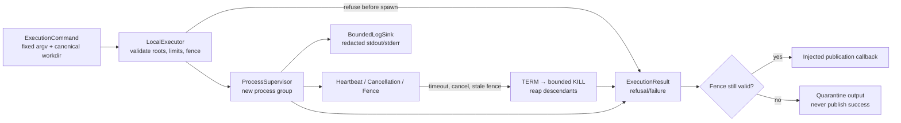

# Local execution boundary

`repository_manager.execution` is the additive RMDD-07 worker seam.  It owns
process mechanics only; scheduling, WorkItems, Git/build policy, remote
transport, and public MCP/CLI actions remain in their dedicated lanes.

## API contract

`LocalExecutor.run(command, ...)` accepts a frozen
`repository_manager.development.ExecutionCommand` and returns the matching
`ExecutionResult`.  `argv` is passed directly to `subprocess.Popen` with
`shell=False`; a public shell string, NUL, invalid executable token, missing
worktree, missing approved environment reference, invalid limit, cancelled
attempt, or stale initial fence is refused before process creation.

The executor starts the child in a new session on POSIX.  A timeout, idempotent
`CancellationToken`, failed heartbeat, or false fence check terminates the
whole process group and records the cleanup result.  A final fence check runs
before the optional `publish` callback.  Fence loss calls the log sink's
`abort()` method and cannot report a successful publication.

`BoundedLogSink` streams at most the configured per-stream capture limit to an
injected writer and retains only a bounded UTF-8 terminal tail.  Environment
references are resolved by `ApprovedEnvironment`; selected values and common
credential-named inherited variables are redacted by a per-stream streaming
scanner before output reaches the writer, digest, or result tail.  The scanner
holds at most `max_secret_length - 1` bytes of unresolved overlap, flushes that
overlap on normal close, and drops it on abort so a quarantined attempt cannot
release a split credential.  `total_bytes` remains the raw bytes read from the
child; retained/discarded counters, the digest, and the tail describe the
redacted byte stream, preserving the existing counter meaning while making
replacement-marker length explicit.  An injected `LogSink` receives the same
boundary-safe wrapper in `LocalExecutor`.  Full content-addressed log
publication is deliberately left to the later artifact/provenance consumers.

`FakeClock`, `FakeProcess`, and `FakeExecutor` are deterministic fixtures for
the scheduler, WorkItem, and remote adapter lanes.  They do not bypass the
production validation rules.

## Migration inventory

The current direct `subprocess.run`/`Popen` sites in `lane_doctor.py`,
`build_queue.py`, `merge_queue.py`, `scanner.py`, and the legacy portions of
`repository_manager.py` remain unchanged in RMDD-07.  RMDD-10/11/18 should
replace those calls at their owning service seam with `CommandExecutor`, while
preserving their declared argv, output, and validation policy.  Until those
migrations land, the existing paths are not implicitly fenced by this additive
package.

## Platform limits

Process-group escalation is strongest on POSIX hosts where a new session can be
created and addressed with `killpg`.  Windows uses a new process-group flag and
the direct-process fallback.  A worker must still report `cleanup_ok=False`
when the platform cannot prove reaping, and callers must not publish such a
result as certified evidence.
