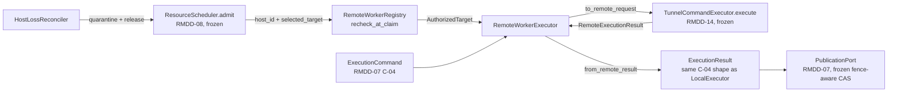

# Remote placement, worker lifecycle, and artifacts (RMDD-15)

`repository_manager.remote_execution` composes three already-frozen contracts
into one worker seam without modifying any of them:

- **RMDD-07** local execution: `repository_manager.execution` (`CommandExecutor`,
  `ExecutionCommand`/`ExecutionResult`, `PublicationPort`).
- **RMDD-08** resource scheduler: `repository_manager.resource_scheduler` /
  `repository_manager.capacity` (`ResourceScheduler`, `CapacityInventory`,
  `HostCapacity`, `TargetPolicy`).
- **RMDD-14** tunnel execution contract: `tunnel_manager.remote_execution`
  (`HostInventory`, `AuthorizedTarget`, `RemoteCommandRequest`,
  `RemoteExecutionContext`, `RemoteExecutionResult`, `TunnelCommandExecutor`).

## Defects found and fixed while writing this lane's tests

The module composition below was salvaged from a prior worker's uncommitted,
never-tested draft and audited/tested for the first time in this lane. Two
real, previously-undetected functional defects were found by the new test
suite and fixed in `executor.py` (neither is a rewrite; both are narrow,
surgical fixes to the existing design):

1. **`to_remote_request` broke every default-constructed command.** RM's
   `ExecutionCommand.max_artifact_bytes` defaults to 1 GiB; TM's own
   `max_transfer_bytes()` local transport policy defaults to 256 MiB, and
   `RemoteCommandRequest` refuses (does not truncate) a request that exceeds
   its transport policy. The translation forwarded RM's bound unchanged, so
   *any* command built with RM's own defaults failed pydantic validation
   before ever reaching a transport -- silently defeating this lane's core
   acceptance gate ("one immutable job can run locally or on an inventory
   host with identical domain result"). Fixed by clamping
   `max_stdout_bytes`/`max_stderr_bytes`/`max_artifact_bytes` to
   `min(command bound, TM policy bound)` -- this can only make a remote
   dispatch more conservative than requested, never less.
   `test_to_remote_request_translates_a_malicious_looking_argv_as_one_opaque_token`
   and the local/remote parity tests in `tests/test_remote_execution_executor.py`
   reproduced this failing before the fix.
2. **Cancellation, fence loss, and heartbeat failure were collapsed into one
   outcome.** The cooperative poll loop sent the same fixed marker command
   for all three triggers and then downgraded every post-marker success to
   `CANCELLED`/`CANCELLED_DEADLINE`, regardless of which check actually
   failed. `LocalExecutor` deliberately reports three *different* outcomes
   for these causes (`CANCELLED`/`CANCELLED_DEADLINE` for a token,
   `REFUSED`/`STALE_FENCE_DUPLICATE_EFFECT` for a lost fence,
   `REFUSED`/`WORKER_ENVIRONMENT_FAILURE` for a failed heartbeat), so the
   remote path silently lost that parity and precision. Fixed by latching
   *which* check failed first and mapping it to the matching outcome/failure
   class, matching `LocalExecutor` exactly.
   `test_fence_lost_during_dispatch_downgrades_success_to_refused` and
   `test_heartbeat_failure_mid_dispatch_sends_marker_and_refuses_not_cancels`
   reproduced this failing before the fix (the fence test asserted
   `REFUSED` and got `CANCELLED`; the heartbeat test's original
   `CANCELLED` assertion was itself wrong and was corrected alongside the
   fix -- see that test's docstring).

Everything else audited (`bootstrap.py`, `source_staging.py`,
`artifact_transport.py`, `host_loss.py`, `registry.py`'s non-import logic)
passed its new tests on the first run with no code changes; see the lane
handoff for the full per-file verdict.

## What this package owns

| Module | Responsibility |
|---|---|
| `bootstrap.py` | Fixed, code-constant argv for the installed remote worker binary. Accepts only opaque WorkItem correlations, never a caller-authored command. |
| `registry.py` | Worker capability metadata (authorized per-repository root, declared toolchains) layered over the *same* `CapacityInventory` the scheduler uses, plus dispatch-time reauthorization (`recheck_at_claim`). |
| `source_staging.py` | Fixed clone/fetch/checkout argv for one immutable 40-hex commit SHA, plus independent post-checkout verification of cleanliness and HEAD identity. Refuses a mutable ref outright. |
| `artifact_transport.py` | Checksummed, bounded, atomic content-addressed staging for artifacts/logs, with quarantine (never silent deletion) on any partial/oversized/mismatched transfer. |
| `executor.py` | `RemoteWorkerExecutor`: the same `run(command, ...) -> ExecutionResult` shape as `LocalExecutor`, translating to/from the frozen TM wire contract and applying cooperative cancellation/fence discipline. |
| `host_loss.py` | Detects a stale/unknown host, quarantines it in the shared `CapacityInventory`, and releases its held reservation through the scheduler's own fenced `release` so a retry is admitted elsewhere without duplicate effect. |
| `fakes.py` | Deterministic `RemoteExecutorPort`/`InventoryResolver` fixtures that still run every real TM/RM pydantic validator. |

## What this package never does

- Never sends a caller-supplied or model-authored shell string; every dispatch is
  `ExecutionCommand`/`RemoteCommandRequest` fixed argv (C-04).
- Never resolves a raw host, IP, or connection string; the only public target form is a
  tunnel-manager inventory alias, resolved through `HostInventory.resolve` (C-09).
- Never acquires the controller-local `canonical_guard`/NFS filesystem lock, and never
  runs a Git branch-moving command.
- Never creates a second job/reservation ledger; `RemoteWorkerRegistry` and
  `HostLossReconciler` both operate on the caller-owned `CapacityInventory` and
  `ResourceScheduler.release`, never a private store.
- Never treats an estimate or a local projection as durable authority; a stale WorkItem
  fence or a `PublicationPort.FENCED` decision always downgrades a result to `REFUSED`.

## The cooperative remote cancellation protocol

`TunnelCommandExecutor.execute` (frozen, RMDD-14) is a single blocking call with no
streaming or cancellation hook, and this lane may not modify tunnel-manager to add one.
`RemoteWorkerExecutor` therefore realizes cancellation and heartbeat-driven termination
cooperatively:

1. The primary bootstrap command runs on a background thread through the injected
   `RemoteExecutorPort`.
2. A poll loop watches the caller's `CancellationToken`, `fence_check`, and `heartbeat`
   callables at `poll_interval_seconds`.
3. On the first failing check, a **second**, fixed, single-purpose `("touch", marker_path)`
   command is dispatched to the *same* `AuthorizedTarget` over a fresh authorized
   connection, where `marker_path` is `cancellation_marker_path(workdir, fence)` --
   derived only from already-validated opaque identifiers.
4. **Contract for the installed remote worker bootstrap** (not implemented in this
   Python package -- it is deployment/RMDD-22 scope): poll for that exact marker path at
   its own `heartbeat_interval_seconds` cadence and, on sight, terminate its full process
   tree and exit non-zero with a `cancelled`/`refused` outcome.
5. If the primary dispatch still reports `succeeded` after a marker was sent,
   `RemoteWorkerExecutor` defensively downgrades the result to `cancelled` rather than
   ever publishing a race as a success -- the same defensive pattern `LocalExecutor`
   applies to its own post-hoc cancellation/fence checks.

This is honestly weaker than local in-process `SIGTERM`→`SIGKILL` process-group
termination, and is documented as such rather than silently assumed equivalent. What is
proven by this package's tests is that the correct fixed command is dispatched and that a
result already flagged cancelled/fenced is never published as a success -- not that a
live remote host actually reaped its process tree (this lane must not perform live remote
execution against production hosts; see the lane brief's stop condition).

## Frozen interfaces consumed, unmodified

- `repository_manager.execution.executor.CommandExecutor` / `PublicationPort` /
  `PublicationDecision` / `ExecutionRefused` (RMDD-07).
- `repository_manager.development.{ExecutionCommand,ExecutionResult,ExecutionOutcome,
  FailureClass,RefusalCode,TargetPolicy,TargetKind,ResourceRequest,ArtifactReference,
  LogReference,GitSha,OpaqueId,WorkItemId,JobId}` (RMDD-01/07/08).
- `repository_manager.capacity.{CapacityInventory,HostCapacity,HostState,ResourceVector,
  CapacityView}` and `repository_manager.resource_scheduler.ResourceScheduler.release`
  (RMDD-08/27).
- `tunnel_manager.remote_execution.{HostInventory,AuthorizedTarget,RemoteCommandRequest,
  RemoteExecutionContext,RemoteExecutionResult,TunnelCommandExecutor,ExecutionOutcome,
  FailureClass}` (RMDD-14).

## Optional dependency: `tunnel-manager` is required but not yet applied

RMDD-14's `tunnel_manager.remote_execution` seam is the frozen contract this package
consumes, but as of this lane's work (2026-08-10) it exists **only on tunnel-manager's own
unmerged `rmdd-program-integration-0808` branch** -- it is not on tunnel-manager `main` and
predates every published PyPI release (`tunnel-manager` on PyPI is at `2.1.0`). There is
therefore no version constraint this lane could add to `pyproject.toml` today that would
actually resolve, and adding one anyway would be exactly the unapproved "new dependency"
CONTRACT-FREEZES.md's review rule and this lane's own acceptance gate ("Optional dependency,
if needed, has explicit approval, lock/image impact, and rollback") require stopping for.

Consequently every `tunnel_manager` import in this package is **guarded, not applied**:

- `executor.py` and `registry.py` import `tunnel_manager.remote_execution` behind a
  `try/except ImportError` (or a `TYPE_CHECKING`-only import where the name is used solely as
  a type annotation), so `import repository_manager.remote_execution` succeeds in the base
  install with zero new hard dependency. Actually constructing a `RemoteWorkerExecutor` or
  calling `to_remote_request`/`from_remote_result` without tunnel-manager installed raises a
  clear `RemoteExecutionUnavailableError` naming the cause -- never a bare `ModuleNotFoundError`
  three frames deep, and never a silent no-op.
- `fakes.py` (test-only, never re-exported from `__init__.py`) still imports
  `tunnel_manager.remote_execution` unconditionally: its entire purpose is constructing
  fixtures that pass TM's *real* pydantic validators, so it is reasonable -- and disclosed here
  -- for the `remote_execution` test module to require tunnel-manager as a **test-only**
  dependency, the same way the rest of this repository already requires `pytest`.

**Residual for RMDD-20/22 (or an explicit operator decision) to close:** once RMDD-14 reaches
tunnel-manager `main` and a release, add `tunnel-manager>=<that release>` under
`[project.optional-dependencies].remote` in `pyproject.toml`, `uv lock`, and update this note.
Until then, this package's remote path is honestly unusable outside a development environment
that has tunnel-manager importable by some other means (e.g. an editable path install), and
`local` remains the only default target, exactly as the lane brief's migration/rollback section
requires ("Remote target remains feature-gated; local is default").

## What remains out of scope for this lane

- The installed remote worker **binary** itself (reads its WorkItem from graph-os, polls
  the cancellation marker, writes artifacts back) is a deployment artifact, not a Python
  module in this repository -- see the non-goals in the lane brief
  (`public tools, ... production deployment, or multi-replica controller`).
- Live remote execution against a real inventory host: the lane brief is an explicit stop
  condition on production mutation/credentials in tests; all tests here use the fakes in
  `fakes.py`, a real local `git` repository fixture for source staging, and real
  `tempfile`-backed directories for artifact transport.
