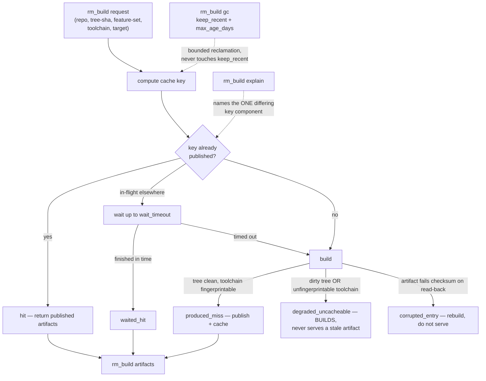

# Repository Manager — Build Coordination

`rm_build` is a content-addressed build broker for **any** repository
(`CONCEPT:RM-TASK-LEDGER`). The dedup is the entire value: N lanes each asking for
the same build today each pay for a full `cargo`/`pnpm` build into their own
`target-isolated`/`node_modules` — measured at 21.7 GB across 4 duplicate
directories in this workspace after pruning. This tool publishes named artifacts to
one shared, checksummed cache instead.

## When to use
- Request a build and get back either an already-published artifact set or a fresh
  build (`request`) — a second request for the same key waits on and reuses the
  first's result instead of rebuilding.
- Check whether a key is cached without triggering a build (`status`).
- Fetch the published artifact list for a cache key (`artifacts`).
- Find out **why** a key did NOT hit cache — the exact differing component
  (`explain`).
- Reclaim old cache entries under a bound (`gc`).

## When NOT to use
- Python project install/build via `pyproject.toml` (`rm_projects` `install`/`build`)
  → `repository-manager-workspace-validation`.
- The merge queue's own gate execution (it calls a repo's declared command directly,
  not this broker) → `repository-manager-merge-and-reconcile`.
- Deciding how many heavy builds a wave may run concurrently →
  `repository-manager-fleet-scale-operations`.

## Tools & actions
| Condensed tool | Actions |
|----------------|---------|
| `rm_build` | `request`, `status`, `artifacts`, `explain`, `gc` |

CLI: `repository-manager --build-broker {request,status,artifacts,explain,gc} --repo-path <repo>`
with `--build-spec` / `--build-key` / `--same-node` / `--build-wait-timeout` /
`--build-keep-recent` / `--build-max-age-days`.

### Key parameters
- `repo_path` — any working tree of the target repository (defaults to the server's cwd).
- `spec` — which declared build spec to use from `.buildcache.yaml` (defaults to the repo's first).
- `key` — a cache key, for `status`/`artifacts`/`explain`.
- `wait_timeout` — seconds `request` waits on an in-flight build of the same key before building anyway.
- `keep_recent` / `max_age_days` — for `gc`: always keep this many most-recent entries; reclaim
  anything else older than this, subject to `keep_recent`.

## Recipes
Request a build (dedups or builds; blocks up to `wait_timeout` on an in-flight match):
```
rm_build(action="request", repo_path="/path/to/epistemic-graph", spec="release")
```
Check a specific key without building:
```
rm_build(action="status", repo_path=".", key="<the key>")
```
Find out why a key missed cache:
```
rm_build(action="explain", repo_path=".", key="<the key>")
```
Reclaim cache, keeping the 10 most recent entries per key, or anything under 14 days old:
```
rm_build(action="gc", repo_path=".", keep_recent=10, max_age_days=14)
```

## The cache key and honest degradation
Keyed by `(repo, tree-sha, feature-set, toolchain-fingerprint, target-triple)`. Two
properties matter more than the mechanics:

- **A dirty tree or an unfingerprintable toolchain BUILDS.** It never serves a
  possibly-stale artifact and never silently treats the cache as "not consulted".
  Read a `status`/`explain` result's outcome as one of the shared `BuildOutcome`
  vocabulary values — `hit`, `waited_hit`, `produced_miss`,
  `degraded_uncacheable`, `corrupted_entry`, `refused`, `failed` — these are
  **result vocabulary you read**, not actions you call.
- **Co-location is asserted, not assumed.** This tool always passes
  `colocated=True` internally, because being inside this pinned MCP server process
  IS the proof of same-node execution a bare CLI invocation cannot provide — an
  `fcntl` lease does not arbitrate across nodes, and the lease files live under an
  NFS-exported path. The CLI's `--same-node` flag makes this an **explicit,
  caller-asserted claim**: only pass it when it is actually true (you ARE the
  pinned repository-manager-mcp process, or an operator has verified pinning) — an
  unproven assertion reintroduces the exact false-safety the flag exists to
  prevent. Unset, the broker refuses and names the MCP route instead.



## ★ Arbitration here is advisory, not enforced (D-CP-8)
An agent running `cargo build`/`uv sync` directly bypasses this broker entirely —
nothing prevents it. That is the correct default for **private, lane-local**
iteration (see `repository-manager-lane-lifecycle`'s `CARGO_TARGET_DIR`
partitioning): a quick local `cargo check` inside your own `target-isolated` does
not need to go through a shared broker. Route through `rm_build` specifically when
the build's *artifacts* are something another lane, the merge queue, or a release
step might also want — that is where the dedup pays for itself. Do not present a
direct compiler invocation as equivalent to a broker request in either direction:
they are different operations with different visibility, not two spellings of the
same call.

## Gotchas
- `request` returns **synchronously** (unlike `rm_git`/`rm_projects`/`rm_workspace`,
  which return a job id) — it already blocks internally up to `wait_timeout` on an
  in-flight match.
- `gc` never removes the `keep_recent` most-recent entries per key regardless of age.
- Any tool's live action set is self-discoverable: `rm_build(action="list_actions")`.

## Related
- `repository-manager-development-lifecycle` — the governed entrypoint; a build
  request is one step inside a lane's work, not a replacement for the lifecycle.
- `repository-manager-lane-lifecycle` — private per-lane `CARGO_TARGET_DIR`
  partitioning for iteration that does not need the shared broker.
- `repository-manager-fleet-scale-operations` — sizing how many heavy (broker or
  direct) builds may run concurrently against the real binding constraint (disk I/O
  and swap).
- Mechanism: `repository_manager/build_queue.py`, `repository_manager/build_worker.py`,
  `repository_manager/build_artifacts.py`, `.buildcache.yaml`, `repository_manager/buildcache_presets/`.
