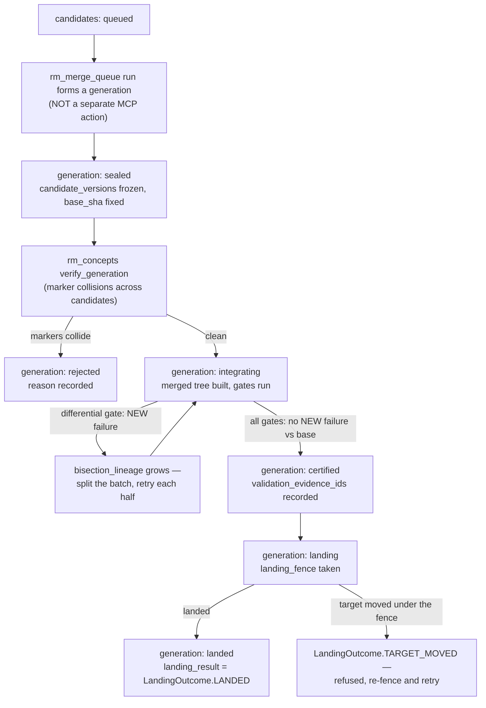

# Repository Manager — Candidate Certification

A **candidate** is one immutable branch submission offered for generation
formation; a **generation** is a sealed, ordered set of candidates with exact
certification and landing evidence. Both are typed contracts
(`repository_manager.development.models.Candidate` / `Generation`) that cross the
MCP/CLI/WorkItem/worker boundary — this skill teaches their vocabulary and the one
verification action pair (`rm_concepts verify_candidate` / `verify_generation`)
that reads them directly. **There is no separate "form/seal/certify a generation"
MCP action** — that lifecycle runs internally inside `rm_merge_queue(action="run")`;
this skill names that honestly rather than inventing a tool surface that does not
exist.

## When to use
- Explain what state a candidate or generation is in, and what that state requires.
- Verify one candidate's introduced `CONCEPT:` markers against reserved claims
  before it lands (`rm_concepts verify_candidate`).
- Verify every candidate in a sealed generation, including cross-candidate
  collisions, before landing (`rm_concepts verify_generation`).
- Understand the evidence/refusal vocabulary a rejected or bisected generation
  reports.

## When NOT to use
- Actually enqueue, watch, or land a branch → `repository-manager-merge-and-reconcile`
  (`rm_merge_queue`) — that is where batching, differential gating, and bisection
  live and run.
- Reserve a concept id before writing its marker →
  `repository-manager-concept-coordination` (`rm_concepts reserve`).
- Open/check/finish the lane that produced the candidate →
  `repository-manager-lane-lifecycle`.

## The vocabulary (read from results, never called as actions)
These are `StrEnum` wire values from `repository_manager.development.enums` that
appear inside `rm_concepts`/`rm_merge_queue` results — not a second action surface.

| Enum | Values | Meaning |
|---|---|---|
| `CandidateState` | `queued`, `validating`, `ready`, `landing`, `landed`, `rejected`, `withdrawn`, `failed` | One candidate's lifecycle. A `landing`/`landed` candidate always carries its `generation_id`; a `rejected`/`withdrawn`/`failed` one always carries a `reason`. |
| `GenerationState` | `open`, `sealed`, `integrating`, `certified`, `landing`, `landed`, `rejected`, `expired` | The sealed set's lifecycle. |
| `ValidationStage` | `feedback`, `integration`, `certification`, `smoke`, `release` | Ordered validation confidence stages — a `certification`-stage `PASSED` evidence record always carries the exact `generation_id` it certifies. |
| `EvidenceOutcome` | `passed`, `failed`, `skipped`, `refused` | One gate/evidence run's outcome. `passed` evidence never carries `failure_ids`. |
| `LandingOutcome` | `landed`, `target_moved`, `refused`, `failed` | A fenced target-branch landing attempt's result. |
| `RefusalCode` / `FailureClass` | `invalid_request`, `unauthorized_target`, `conflict_base_moved`, `capacity_disk_deferred`, `dependency_blocked`, `cancelled_deadline`, `worker_environment_failure`, `validation_candidate_failure`, `stale_fence_duplicate_effect`, `reconciliation_required`, `internal_error`, plus refinements (`path_outside_configured_root`, `invalid_git_ref`, `invalid_git_sha`, `remote_alias_required`, `remote_credentials_forbidden`, `shell_command_forbidden`, `resource_limit_invalid`, `invalid_state_combination`, `duplicate_request`) | Stable refusal categories shared by every public surface (`C-10`). |

## Tools & actions
| Condensed tool | Actions relevant here |
|----------------|---------|
| `rm_concepts` | `verify_candidate`, `verify_generation` — see `repository-manager-concept-coordination` for the full 8-action surface and every field. |
| `rm_merge_queue` | `run`, `status`, `config` — the actual certification/landing mechanics; see `repository-manager-merge-and-reconcile`. |

### `verify_candidate` / `verify_generation` fields (recap)
- `verify_candidate` — `candidate` (a serialized `Candidate` payload), `repo_path`
  (the Git repository to diff for introduced markers).
- `verify_generation` — `generation` (a serialized `Generation` payload),
  `candidates` (the list of `Candidate` payloads it contains), `repo_path`.

Both are subject to the **same fail-closed authority caveat** as every other
`rm_concepts` mutating/verification action — see
`repository-manager-concept-coordination`'s box on `ConceptAuthorityUnavailable`
before trusting a verification result on this environment.

## Certification and bisection, in one picture
This is the *shape* of what `rm_merge_queue(action="run")` does internally
(mechanics + exact fields in `repository-manager-merge-and-reconcile`), annotated
with where `rm_concepts` verification fits:

## Gotchas
- Do not expect a "generation status" call independent of `rm_merge_queue status` —
  the generation record lives inside the queue's own mechanism, not a separate
  store this skill's tools expose.
- A `rejected`/`withdrawn`/`failed` `Candidate` always carries a non-empty `reason`
  field (a Pydantic model validator enforces this) — read it rather than re-deriving
  why from the branch diff.
- `verify_candidate`/`verify_generation` check **introduced concept markers**, not
  test/lint gates — a candidate can pass concept verification and still be rejected
  by the merge queue's differential gate, and vice versa. They are independent
  checks, not a single pass/fail.

## Related
- `repository-manager-merge-and-reconcile` — the actual batching, differential
  gating, and bisection mechanics, plus the conflict-resolution decision procedure.
- `repository-manager-concept-coordination` — the full `rm_concepts` surface,
  including the fail-closed authority caveat these two actions share.
- `repository-manager-development-lifecycle` — the governed entrypoint; a
  candidate's certification is something the queue does after step 5 (submit), not
  a step an agent drives directly.
- Mechanism: `repository_manager/development/models.py`,
  `repository_manager/development/enums.py`,
  `repository_manager/candidate_generation.py`,
  `repository_manager/generation_bisection.py`,
  `repository_manager/generation_coalescing.py`.
