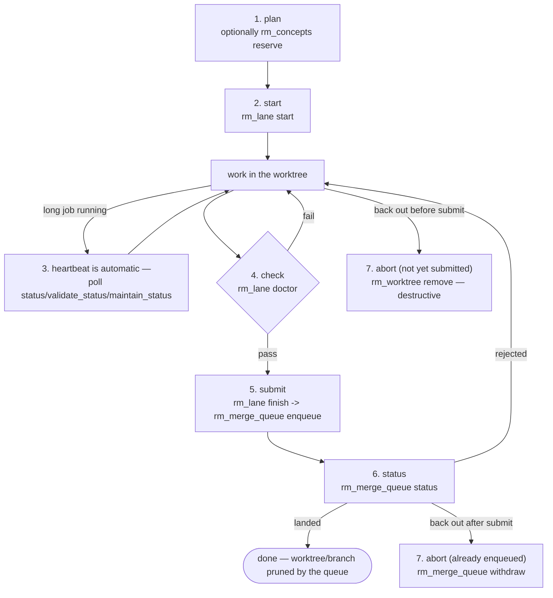

# Repository Manager — Development Lifecycle

The governed entrypoint for one unit of work: one agent session or one person,
taking one repository from "nothing started" to "landed", without ever touching a
canonical checkout, a raw shell command, a shared cargo target, or a hand-merge.

This skill invents nothing. Every step below is a named action on an existing
condensed tool (`rm_lane`, `rm_worktree`, `rm_merge_queue`, `rm_concepts`) —
confirmed against `repository_manager/mcp_tools/contracts.py`,
`repository_manager/lane_doctor.py`, and the CLI parser
(`repository_manager/cli_commands/parser.py`) on `main`. Where the brief's
lifecycle name (`heartbeat`) does not correspond to a callable action, this skill
says so explicitly rather than inventing one — see step 3.

## When to use
- **Start here** for any change an agent will eventually land into a shared base.
- You need the whole arc — open isolation, work safely, prove readiness, hand off,
  watch it land, or cleanly back out — not just one raw verb.

## When NOT to use
- Fan-out across many repositories or a whole wave of lanes →
  `repository-manager-fleet-scale-operations`.
- Bulk clone/pull/push/commit across repos with no single lane around it →
  `repository-manager-bulk-git-operations`.
- Content-addressed build/cache mechanics → `repository-manager-build-coordination`.
- Candidate/generation certification detail beyond "is my branch ready" →
  `repository-manager-candidate-certification`.
- Registering or dispatching to a remote worker host →
  `repository-manager-worker-operations`.
- Reserving/materializing a concept id in detail beyond step 1 below →
  `repository-manager-concept-coordination`.
- Workspace-wide version/release planning →  `repository-manager-workspace-release`.
- Raw worktree/merge-queue verbs with no lifecycle narrative →
  `repository-manager-worktree-orchestration` / `repository-manager-merge-and-reconcile`.
  Those skills document the same tools at the mechanism level; this one documents
  the *sequence* an implementation agent should actually run.

## The seven steps

| Step | What it means | The real call |
|---|---|---|
| **1. plan** | Decide the unit of work. If it introduces a new `CONCEPT:` marker, reserve the id first so no sibling lane collides on it. | `rm_concepts(action="reserve", ...)` — see `repository-manager-concept-coordination` for the full field list and the **fail-closed today** caveat below. Not every unit of work needs this step; skip it when no new concept id is being introduced. |
| **2. start** | Open an isolated worktree with partitioned build/test/hook state, and *prove* the isolation instead of asserting it. | `rm_lane(action="start", repo=<repo>, branch=<branch>, base="main")`. Prefer this over a bare `rm_worktree(action="add")` — `rm_lane` composes the worktree with lane-doctor's partition checks. |
| **3. heartbeat** | ★ **There is no `heartbeat` action.** A submitted background job (`rm_git`/`rm_projects`/`rm_workspace`) carries an internal `heartbeat_at` that the server advances automatically whenever the job's *observable progress* changes — polling `status`/`validate_status`/`maintain_status` is what keeps a long job from being reaped as stale (`RM_JOB_STALE_SECONDS`, default 1800s). For interactive work there is nothing to call at all — just keep working and poll the status action of whatever job you submitted. | `rm_git(action="status", job_id=...)` / `rm_projects(action="validate_status", job_id=...)` / `rm_workspace(action="maintain_status", job_id=...)`, called periodically while a job runs. |
| **4. check** | Diagnose the lane when something behaves impossibly, or before submitting. Answers in under a second and mutates nothing. | `rm_lane(action="doctor", path=<worktree>)` |
| **5. submit** | Preflight (blocking on the doctor checks), then hand the branch to the serialized, per-repository merge queue. This is not a to-do item — a scheduler drains the queue independently. | `rm_lane(action="finish", path=<worktree>, base="main")` → internally reaches `rm_merge_queue(action="enqueue", ...)` |
| **6. status** | Watch the queue land (or reject) the candidate. Never hand-merge because this looks slow. | `rm_merge_queue(action="status", repo_path=<worktree>)` |
| **7. abort** | Back out. Which call depends on whether you already submitted (step 5). | Not yet enqueued: `rm_worktree(action="remove", repo=, branch=, force=...)` — **destructive**, discards any uncommitted work; commit first if you might want it back. Already enqueued: `rm_merge_queue(action="withdraw", repo_path=, branch=, reason=...)`. |

## Routing map — the raw layer is real, but not the first move

Every one of these is a legitimate governed action. They are named here explicitly
so an agent routes to the *lifecycle* by default and only reaches for the raw verb
when it is genuinely operator/fleet-scale work, never as a substitute step 1–7.

| If the task looks like… | Do NOT reach directly for | Reach for instead |
|---|---|---|
| "just run this git command" | a raw shell / SSH command — **there is no such action; `rm_git(action="raw")` always refuses** | the typed `rm_git` action that matches (`repository-manager-bulk-git-operations`), or this lifecycle's step 2/5 if it is lane work |
| "just compile it here" | a direct `cargo build` / `uv sync` invocation outside any broker | `repository-manager-build-coordination` (`rm_build`) — dedups against every other lane asking for the same artifact |
| "just merge my branch into main" | `git merge --no-ff` by hand, or `rm_worktree(action="merge")` into a shared base | step 5/6 above (`rm_lane finish` → `rm_merge_queue`) — the queue gates the **merged** tree differentially and prunes for you; see `repository-manager-merge-and-reconcile` |
| "just write the `CONCEPT:` marker" | writing the marker before reserving its id | step 1 (`rm_concepts reserve`) — see the fail-closed caveat below |
| "just fix it on ten repos" | ten individual lifecycle runs when the intent is genuinely bulk | `repository-manager-bulk-git-operations` / `repository-manager-fleet-scale-operations` |
| "just dispatch it to another host" | a raw SSH/tunnel command | `repository-manager-worker-operations` (`rm_remote_workers`) — and read its honest refusal notes first |

## ★ Two surfaces on `main` today deliberately fail closed

Both are documented in full in their owning skills; stated here because an agent
following this lifecycle will hit them directly at step 1 and at the `abort`/remote
edges:

- **`rm_concepts` (step 1) refuses every mutating action** with a named
  `ConceptAuthorityUnavailable` refusal, because RMDD-16's concept-reservation
  authority (`agent_utilities.governance.concept_reservation`) is not present on
  `agent-utilities` `main` as of this lane. This is not a bug in
  repository-manager — it is a real, honest refusal preserving the original
  `ImportError` as its cause (never a fabricated local allocation). See
  `repository-manager-concept-coordination`.
- **`rm_remote_workers(action="host_loss_reconcile")` always refuses.** No live
  WorkItem-authoritative `ResourceScheduler` is wired into any repository-manager
  entrypoint yet. `recheck`/live remote dispatch also refuse honestly whenever the
  optional `tunnel-manager` dependency is absent. See
  `repository-manager-worker-operations`.

A skill that promised these worked today would be a lie an agent would act on —
report the refusal truthfully and escalate rather than routing around it (e.g.
never substitute a local in-memory reservation or a raw SSH command for either).

## Self-discovery
Every condensed tool answers `action="list_actions"` (or `"help"`/`"actions"`) with
its live action set — use it if any table in this skill set and the running server
ever disagree; the server is always the source of truth.

## Related
- `repository-manager-lane-lifecycle` — the full detail behind steps 2/3/4/5 (the
  four arbitration classes, the doctor checks, and why each exists).
- `repository-manager-merge-and-reconcile` — the full detail behind step 6/7
  (differential gating, conflict-resolution decision procedure).
- `repository-manager-worktree-orchestration` — the raw verb surface behind
  `rm_worktree`.
- `repository-manager-concept-coordination`, `repository-manager-build-coordination`,
  `repository-manager-candidate-certification`, `repository-manager-worker-operations`,
  `repository-manager-workspace-release` — the specialized skills this lifecycle
  routes into for their own domains.
