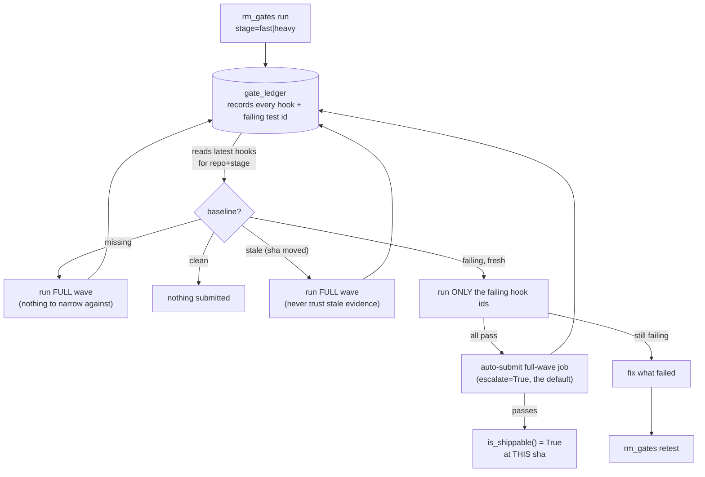

# Repository Manager — Gate Execution

`rm_gates` is the one tool that drives both tiers of the pre-commit gate:
`stage="fast"` runs a repo's `pre-commit`-stage hooks (formatters/linters, no
network/tests, target ≤5s warm); `stage="heavy"` runs its `pre-push`-stage
hooks (pytest, cargo, `uv lock --check`, ...) via
`pre-commit run --hook-stage <stage>`. The measured reason this skill exists:
on 2026-08-21 a single `epistemic-graph` push cost roughly **six hours**
because every one of six failing pre-commit hooks was re-proven, on every
fix, by re-running the repo's entire 90-minute heavy wave — there was no way
to ask "just the hooks that were failing." The same push's integration suite
was independently reporting ~500 timeout errors that turned out to be **one**
cold `cargo build` blowing a 60-second per-test fixture timeout, hiding **17
real failures** underneath the noise. `retest` and the gate ledger close the
first gap; `profile` is how you find the second kind before it hides
anything.

## When to use
- Submit a fast or heavy gate wave across one, several, or all repos (`run`).
- Re-validate a fix without re-running everything that already passed
  (`retest`) — narrows to whatever the ledger last recorded failing for that
  repo/stage, escalating to a full wave automatically once every retested
  hook passes.
- Poll a running wave, or get the roll-up of what's failing right now
  (`status`).
- Get condensed failure detail for one job/repo (`explain`).
- Find the slowest hooks or repos, fleet-wide or for one job (`profile`).

## When NOT to use
- The merge queue's own differential gate-vs-base-ref comparison at land time
  → `repository-manager-merge-and-reconcile`.
- Python `pyproject.toml` install/build (not gate execution) →
  `repository-manager-workspace-validation`.
- Content-addressed build/cache dedup → `repository-manager-build-coordination`.
- Deciding how many heavy gate waves may run concurrently across the fleet →
  `repository-manager-fleet-scale-operations`.

## Tools & actions
| Condensed tool | Actions |
|----------------|---------|
| `rm_gates` | `run`, `retest`, `status`, `explain`, `profile` |

CLI: `repository-manager --gate {fast,heavy}` / `--gate-retest {fast,heavy}
[--same-node]`. Both front ends call the exact same
`repository_manager.gate_runner.dispatch(action, **kwargs)` — one chokepoint,
so MCP and CLI can never quietly diverge on what "run the gate" or "retest"
means.

### Key parameters
- `stage` — `"fast"` or `"heavy"`, for `run`/`retest`. Default `"fast"`.
- `repos` — comma-separated repo names/paths to target; omit for the whole
  workspace.
- `threads` / `timeout` — parallel workers / per-repo pre-commit timeout
  (seconds, default 600).
- `job_id` / `repo` — target one gate job for `status`/`explain`/`profile`
  (alternative ways to name the same job).
- `summary` — for `status`: compact roll-up (counts + failed set) vs full
  per-job detail.
- `top_n` — for `profile` with no `job_id`/`repo`: how many slowest hooks to
  report fleet-wide (default 15).
- `escalate` — for `retest` only, default `True`: submit a full-wave job the
  instant a narrowed retest passes every requested hook. A narrowed pass
  alone is never sufficient evidence of shippability — see
  `GateLedger.is_shippable`'s own docstring for the deadlock that survived 95
  clean isolated runs before this existed. Turn off only if you specifically
  want the narrow result and will run a full wave yourself before trusting
  the repo shippable.

## Recipes
Run the fast gate across the whole workspace:
```
rm_gates(action="run", stage="fast")
```
Run the heavy gate against two repos:
```
rm_gates(action="run", stage="heavy", repos="agent-utilities,epistemic-graph")
```
After fixing what a wave reported failing, retest only that — narrows
automatically, escalates to a full wave on an all-pass:
```
rm_gates(action="retest", stage="heavy", repos="epistemic-graph")
```
Poll a wave (compact roll-up):
```
rm_gates(action="status")
```
Explain why one repo's gate job failed:
```
rm_gates(action="explain", repo="epistemic-graph")
```
Find the fleet's 15 slowest hooks:
```
rm_gates(action="profile")
```

## The ledger `retest` reads — read this before trusting a "clean" baseline
`repository_manager.gate_ledger.GateLedger` is a local, best-effort SQLite
projection (`${XDG_STATE_HOME}/repository-manager/gate_ledger.sqlite3`) — it
is a **record of observations**, never an authority, and three of its rules
are easy to get wrong precisely because getting them wrong is silent:

- **It is a FAILURE ledger, not a pass matrix.** `pytest -q` prints no line
  per passing test, so it only ever records what *failed*. "Not present"
  means "not observed failing" — never "observed passing."
- **`unrunnable` hooks are excluded from the retest candidate set.** A hook
  whose executable was missing found nothing about the code; re-running it
  in the same broken environment finds nothing again. Treating a missing
  toolchain as "still failing, retry it" is how a missing tool masquerades
  as a code defect.
- **`is_shippable()` requires a `full_wave` row at the exact current commit
  sha.** A retest-only pass never certifies a repo shippable by itself — by
  construction it cannot observe an interaction that only appears when the
  whole suite runs together. Anything recorded at a different sha is
  reported **stale** and a `retest` plan built on a stale baseline degrades
  to the full wave instead of trusting it.



## Sibling tools this loop leans on
- **`test_commands.ensure_no_fail_fast`** — applied at the process-launch
  chokepoint before every `subprocess.run` this package constructs. Goes
  **both directions**: cargo's truncation is opt-out, so the flag is
  *appended* if missing; pytest's/go's is opt-in (`-x`/`--exitfirst`/
  `--maxfail=N`/`-failfast`), so those are *stripped* if present.
- **`fail_fast_audit`** — statically scans a repo's own
  `.pre-commit-config.yaml` `entry:` text for the same flags, fleet-wide.
  **Detection only** — `gates.py` shells to `pre-commit run` and never
  constructs a hook's argv, so nothing here can rewrite what it finds. Not
  yet wired to `rm_gates` or a CLI flag; call
  `fail_fast_audit.dispatch("check"|"check_fleet", ...)` directly.
- **`forge_status`** — abstracts "is the tag's CI run still going, or did it
  conclude?" over GitHub Actions and GitLab CI. A confirmed non-success
  conclusion aborts a dependency-readiness wait immediately instead of
  burning the full retry ceiling; an unknown status degrades to today's
  index-polling behavior, never a silent skip.
- **`xdist_rollout`** — plan/apply for giving a repo `-n auto --dist
  loadfile -p no:randomly -rfE` when it already declares `pytest-xdist` but
  never passes `-n`. Dry-run by default; refuses any repo whose pytest hook
  entry is not byte-identical to the fleet boilerplate. Not yet wired to
  `rm_gates` or a CLI flag; call `xdist_rollout.dispatch("plan"|"apply",
  ...)` directly.

## ★ Three environment traps that produce FALSE gate verdicts
Rediscovered repeatedly enough (2026-08-21) that they belong here, not just
in one agent's memory:

- **`systemd-run --user` gives a minimal `PATH`.** A hook fails with
  "executable not found" for a tool that IS installed on the box — the unit
  just can't see it. Check the unit's actual `PATH` before concluding a
  toolchain is missing.
- **`pip install` silently no-ops when a stale same-version package already
  sits in `~/.local`.** A July 2026 build once produced 16 fabricated
  failures this way: exit code 0, but the "installed" package was never
  actually updated, so the gate ran against old code.
- **Bare `python3`/`uv run pytest` can pick the wrong interpreter.** Use
  `python scripts/run_agent_utilities_gate.py --module pytest -- ...` (or
  this workspace's equivalent per-repo gate runner), and print
  `sys.executable` whenever a result looks suspicious.

## Gotchas
- `run` and `retest` return job ids — poll with `status`/`explain`, don't
  expect inline results.
- `run` always submits a **full wave** (`scope="full_wave"`); only `retest`
  ever narrows.
- Ledger identity is `build_queue.stable_repository_id(repo_path)` — a
  content identity, not the display basename `status`/`explain`/`profile`
  key on. Two differently-located checkouts of the same repo name do not
  collide in the ledger.
- Any tool's live action set is self-discoverable:
  `rm_gates(action="list_actions")`.

## Related
- `repository-manager-development-lifecycle` — the governed entrypoint; a
  gate run/retest is one step (`check`) inside a lane's work, not a
  replacement for the lifecycle.
- `repository-manager-merge-and-reconcile` — the merge queue's own
  differential gate-vs-base comparison at land time; a separate mechanism
  from `rm_gates`, which validates a working tree directly.
- `repository-manager-workspace-validation` — `rm_projects`/`rm_workspace`
  install/build/version-bump; not gate execution.
- `repository-manager-fleet-scale-operations` — sizing how many concurrent
  heavy gate waves a workspace can sustain.
- Mechanism: `repository_manager/gate_runner.py`, `repository_manager/
  gate_ledger.py`, `repository_manager/gates.py`, `repository_manager/
  test_commands.py`, `repository_manager/fail_fast_audit.py`,
  `repository_manager/forge_status.py`, `repository_manager/
  xdist_rollout.py`.
