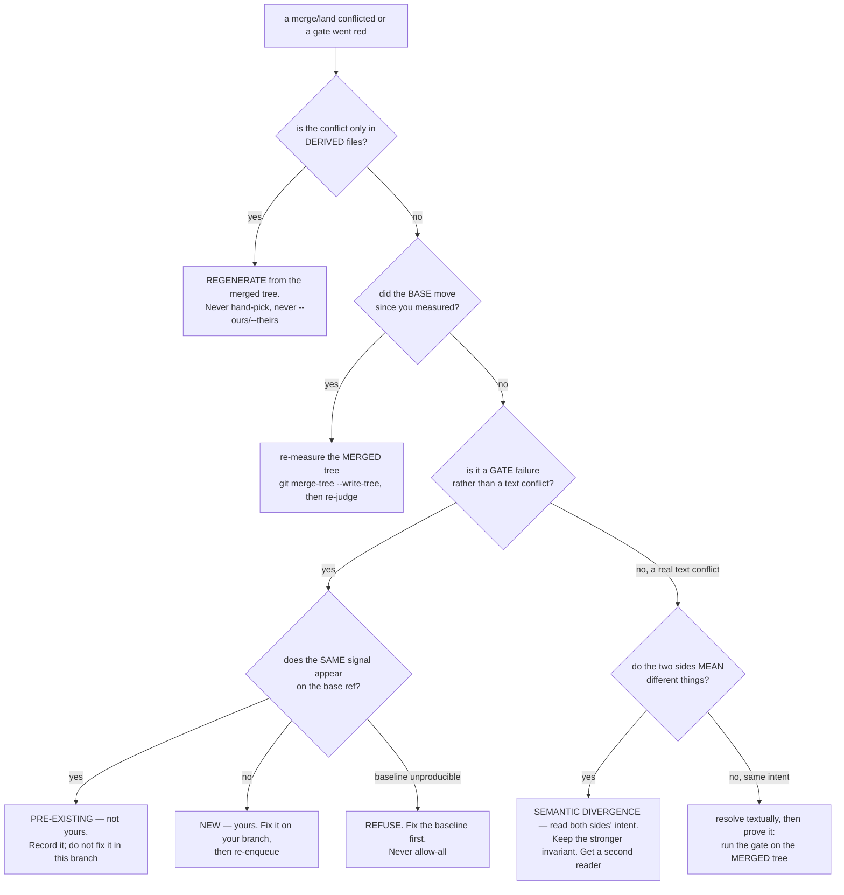

# Repository Manager — Merge & Reconcile

Landing is the one operation a lane **cannot** do independently, so it goes
through one serialized queue per repository. This skill is how to use it, and —
the harder half — how to reconcile when what you wrote and what landed while you
were writing it disagree.

## When to use
- A branch is ready to land.
- A merge conflicts, or the queue rejected your candidate.
- A gate is red and you must decide whether that failure is **yours**.
- You need to know what a branch will actually do once merged.

## When NOT to use
- Opening/isolating/diagnosing a lane → `repository-manager-lane-lifecycle`.
- Sweeping worktrees across the workspace →
  `repository-manager-fleet-scale-operations`.

## The one path in

```bash
repository-manager --merge-queue enqueue --repo-path .        # offer the branch
repository-manager --merge-queue status  --repo-path .        # watch it
repository-manager --merge-queue config  --repo-path .        # validate the gates
repository-manager --merge-queue withdraw --repo-path . --queue-branch <b>
```

MCP: `rm_merge_queue(action=…, repo_path=…)`. Standalone driver, suitable as a
systemd/CronJob `ExecStart`: `python -m repository_manager.merge_queue run --path <repo>`.

**Enqueued is not a to-do item.** A scheduler drains every ~5 minutes: it gates
the candidate *as merged*, fast-forwards the base, and prunes the worktree and
the branch. Do not hand-merge because the queue feels slow — two lanes
hand-merging is how a resolution gets orphaned.

**Exit 75 (`EX_TEMPFAIL`) means another runner holds this repository's
`reconciliation-merge` lease. Defer. Do not retry in a loop.**

## Mechanism vs gates — and why this matters to you

```
MECHANISM  (repository_manager/merge_queue.py — generic, one implementation)
  enqueue / status / withdraw / run / config     differential gating vs a base ref
  per-repo candidate store                       regenerate-on-land
  the reconciliation-merge lease                 guarded prune
  optimistic batching + bisection                fast-forward-only landing

GATES      (<repo>/.mergequeue.yaml — declarative, per project)
  a command, a tier, a timeout, and HOW to compare its result to the base
```

The queue does not know what a gate *is* — only how to run one and compare it
against the base. A repository that declares no config is **refused**, not
defaulted: "declared no gates" and "has no queue configured" must not be the same
value. If your repo has no `.mergequeue.yaml`, copy the preset from
`repository_manager/mergequeue_presets/` and validate it with `--merge-queue config`.

## ★ Two rules that override intuition

### 1. Gate DIFFERENTIALLY: "no NEW failures vs the base ref", never absolute green
`main` here is legitimately red. An absolute gate deadlocked the queue and
**stranded 19 branches**; a branch that fixed 21 of 30 failing tests was rejected
because 9 remained. The queue runs each gate twice — once on the merged tree,
once on the base — and only a signal the base does not already produce blocks the
candidate.

The three shapes a comparison can take, declared per gate as `compare:`:

| `compare` | Granularity | Use when |
|---|---|---|
| `pytest-ids` | **ID-level** — a failing id is permitted only if that *exact* id already fails on the base | pytest. Never compare by file, module, pattern, or count: an id-level compare is the only shape that cannot be gamed into masking a real regression. An exit code outside `{0,1,5}` is *unreadable*, not "zero failures", and is refused outright. |
| `lines` | **line-level** on normalized output, filtered by `keep_lines`/`ignore_lines` | chatty tools (`cargo`). Catches a genuinely new diagnostic even when the base was already red for something else. Without `keep_lines`, `Compiling`/`Finished in 3.4s` differ every run and read as new violations on every candidate. |
| `exit` | **script granularity** | a tool that prints one static message regardless of *why* it failed. Report exactly that much precision — never dress it up as more. |

★ **If the baseline cannot be produced, REFUSE the candidate. Never allow-all.**
An unproducible baseline is an unknown, and an unknown must not be spelled the
same way as a pass. Likewise `environment_signature`: if the environment cannot
be fingerprinted, the baseline cache is **disabled** rather than keyed on a
fiction — a stale baseline computed against a toolchain that no longer exists is
worse than a slow one.

### 2. Measure the MERGED tree, not the branch tip
This misled *three* people in one day. One concluded a branch had deleted a guard
that the merged tree in fact kept, and raised a false session-wide alarm from
`git show <branch>:<path>`.

```bash
git merge-tree --write-tree <base> <branch>     # the tree that will actually exist
```

Never reason from `git show <branch>:<path>`, `git diff <branch>`, or a test run
in the worktree when the base has moved. `repository-manager --lane doctor` reports
`base-drift` precisely so you find this out before you spend an hour on it. The
queue gates the merged tree by construction — which is most of why it exists.

## ★ The conflict-resolution decision procedure

Run this top-down. The first branch that matches is the answer. Do not skip to
"resolve the conflict by hand" — that step is *last* for a reason.



### Branch 1 — generated-file-only conflict → **regenerate**
With ~76 candidates on one base, nearly every one conflicts on a purely-derived
file where there is no real disagreement: lockfiles, folded ledger views,
generated manifests, `docs/` indexes. The queue does this automatically on land
from `generated_files:` / `regenerate:` in `.mergequeue.yaml`.

Doing it by hand:
```bash
# from the ALREADY-MERGED tree, not from either side
python3 scripts/<the generator>.py && git add <the generated file>
```
`--theirs` / `--ours` on a generated file silently drops one side's *input*, not
just its output. That is a data-loss bug wearing a conflict-resolution costume.

### Branch 2 — the base moved → **re-measure**
Anything you concluded from the branch tip describes a tree that will never
exist. Recompute with `git merge-tree --write-tree`, then re-enter this procedure
from the top.

### Branch 3 — a gate is red → **is it NEW or pre-existing?**
Run the *same* gate on the base ref and compare at the granularity the gate
declares (`pytest-ids` / `lines` / `exit`). Pre-existing → record it, do not fix
it here; a branch is not responsible for the base's existing red. New → yours.
Baseline unproducible → refuse; do not guess.

### Branch 4 — ★ semantic divergence inside a textual conflict
**The one that will actually bite you.** A conflict looks textual and is not: the
two sides mean different things and one of them is a *fix*.

A real instance: two lanes touched the same Cypher builder. One had replaced a
literal string splice with a bound parameter — an injection fix. Taking the other
lane's side would have compiled, passed, merged, and **silently reverted the
security fix**. The conflict markers said nothing about that.

The procedure:
1. For each side, answer *what invariant is this side trying to hold?* — not
   *what does this line say?* Read the commit message and the test that came with
   it, not just the hunk.
2. If either side is a security, correctness, or resource-safety fix, that
   invariant is **not** negotiable. Keep it, then re-apply the other side's
   feature on top of it.
3. Prove it: the merged result must satisfy **both** sides' tests. If one side
   shipped a defect-pinning test, run it and confirm it still fails against the
   restored bug (see below).
4. When both sides look equally reasonable, that is the signal to get a second
   reader — not to pick.

### Branch 5 — same intent, textual → resolve, then **prove**
Resolving is not the end. Run the gate on the merged tree. A resolution that was
never executed is a hypothesis.

## Proof obligations — the part that gets skipped

Three gates on this workspace were found **green while enforcing nothing**: one
was crashing, one was blind to 2 of 16 patterns it claimed to cover, and one was
never discovered by its own runner.

- ★ **Prove a gate catches a deliberately-introduced known-bad input.** Break the
  thing on purpose, watch the gate refuse it, then revert. A gate that has only
  ever seen good input has not been tested; it has been *observed*.
- ★ **Run a defect-pinning test against the RESTORED bug and confirm it FAILS.**
  A lane caught its own test being vacuous — it passed against the very bug it
  claimed to pin. Another found a gate meta-test that had encoded a bug as
  correct.
- ★ **Aliased imports defeat caller-discovery greps.** `import x as y`, bare
  `from … import x`, and `monkeypatch.setattr` all hide callers — three separate
  occurrences. Use `scripts/find_callers.py` (AST-based), not grep.
- **Enforce at the chokepoint, not one entrypoint.** A control wired at one
  entrypoint was deployed and changed *literally nothing*, because six callers
  bypassed it. Find every caller before you decide where a control goes.

## Landing and pruning safely

Landing is `git merge --ff-only` under **both** guards — `guarded_tree_mutation`
(refuses a tree holding another lane's uncommitted work) and
`guarded_canonical_mutation` (takes repository-manager's own canonical `flock`
lease *and* re-checks `git status --porcelain` under it, so a land cannot
interleave with a background sync). Those guards are **proven**, not assumed: a
clean tree is allowed, a tracked modification is refused, an **untracked-only**
tree is refused, and a lease held by another process is refused cross-process.

The prune that follows re-checks the merge-base **at delete time**, writes a
`refs/lane-backup/<branch>` anchor first, uses `git branch -d` and never `-D`,
and refuses any worktree holding uncommitted work.

★ **Never `git branch -D`.** `-d`'s refusal *is* the safety mechanism: it is
telling you the work is not contained in the base. `-D` converts a warning into
silent data loss.

## ★ A merge to `main` is a LIVE DEPLOY
Fleet pods `hostPath`-mount the canonical tree over `site-packages`. Landing and
deploying are the same act here. Check runtime compatibility against the
**deployed images**, not just your venv — a change that passes locally can be
unbuildable in the pod (a config-contract change is the usual culprit).

## Related
- Opening and isolating a lane → `repository-manager-lane-lifecycle`
- Workspace-wide worktree audits → `repository-manager-fleet-scale-operations`
- The full decision procedure with worked examples →
  [references/conflict-decision-procedure.md](references/conflict-decision-procedure.md)
- Mechanism: `repository_manager/merge_queue.py`, `docs/merge-queue.md`,
  `repository_manager/mergequeue_presets/`

## See also

`repository-manager-parallel-lane-orchestration` — when many worker agents are landing branches concurrently: the lane briefing contract, land-as-they-arrive discipline, provider-before-consumer ordering, verifying the merged TREE rather than the merge command's exit code, and reconciling to zero branches/worktrees.
