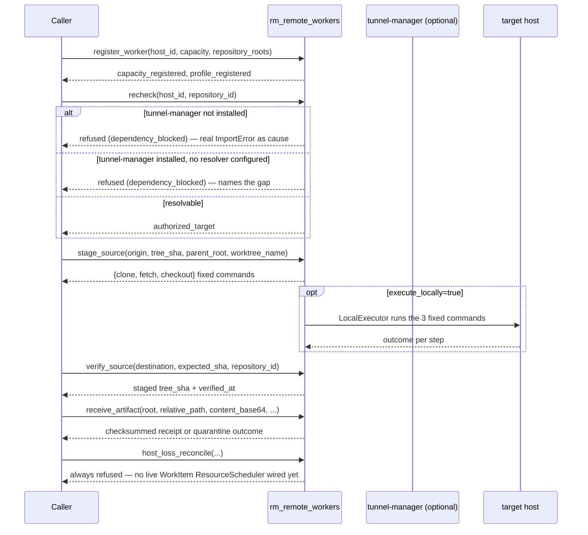

# Repository Manager — Worker Operations

`rm_remote_workers` composes RMDD-15's remote-execution registry/staging/artifact
package with RMDD-08's `CapacityInventory` weighted resource ledger. It is the
governed surface for **placing and staging** work on a non-local host — it never
builds a raw shell string, never accepts a credential, and never lets a caller
assert same-node execution the tool cannot itself verify.

## ⚠ Read this before anything else: two actions deliberately fail closed today
Verified against `agent-packages/repository-manager` `main` at `fdce825`:

- **`recheck` (and any live remote dispatch) refuses without the optional
  `tunnel-manager` dependency.** Registration (`register_worker`/`profile`) never
  needs live inventory resolution, so the registry stays constructible without
  `tunnel-manager` installed — but the dispatch-time entitlement check raises a
  named `RemoteExecutionUnavailableError` (`error_code: "dependency_blocked"`),
  preserving the real `ImportError` as its cause, the moment inventory resolution
  is actually needed. If `tunnel-manager` IS installed but no inventory resolver is
  configured for this entrypoint, the refusal says that instead — still a refusal,
  never a silent no-op.
- **`host_loss_reconcile` always refuses.** Host-loss reconciliation requires a
  live, WorkItem-authoritative `ResourceScheduler.release`
  (`repository_manager.native_reservations.NativeWorkItemReservationPort`, bound to
  a connected graph-os engine client). As of this lane, grepping the whole package
  for that construction wired into any MCP/CLI entrypoint finds **none** — not this
  one, and not RMDD-28's sibling native lane authority either. This module
  deliberately never substitutes a local in-memory reservation ledger for that
  missing authority — doing so would itself be the "parallel job ledger / second
  store" the program's correctness constraints forbid.

**Never** work around either refusal with a raw SSH command, a hand-rolled
credential, or a local reservation you invented — report the refusal and escalate.

## When to use
- Declare a host's weighted CPU/memory/disk/process-slot capacity and which
  repository roots/toolchains it is authorized for (`register_worker`).
- Read a registered worker's declared capability (`profile`).
- Run the dispatch-time entitlement recheck before a claim (`recheck`) — see the
  fail-closed note above.
- Build (and optionally execute+verify) the fixed clone/fetch/checkout command
  sequence for one immutable commit SHA on a worker (`stage_source`).
- Independently re-derive the cleanliness/HEAD identity of an already-staged
  worktree (`verify_source`).
- Stream a base64 artifact or log payload into the bounded, checksummed,
  content-addressed store (`receive_artifact`).
- Quarantine a lost host and release its reservation (`host_loss_reconcile`) — see
  the fail-closed note above; this always refuses today.

## When NOT to use
- A purely local build → `repository-manager-build-coordination`.
- Opening/checking/finishing a lane → `repository-manager-lane-lifecycle`.
- SSH host inventory / hardening outside this typed staging surface →
  `tunnel-manager-host-inventory` / `tunnel-manager-remote-execution` /
  `tunnel-manager-ssh-hardening` (a different MCP server's own skills; this skill's
  `recheck`/dispatch path *depends on* that server without wrapping its full surface).

## Tools & actions
| Condensed tool | Actions |
|----------------|---------|
| `rm_remote_workers` | `register_worker`, `seed_from_inventory`, `profile`, `recheck`, `stage_source`, `verify_source`, `receive_artifact`, `host_loss_reconcile`, `dispatch_build` |

CLI: `repository-manager --remote-workers {register_worker,seed_from_inventory,profile,recheck,stage_source,verify_source,receive_artifact,host_loss_reconcile,dispatch_build} --remote-workers-params-json '<json>'`.
Unlike `--concepts`, there is no separate top-level flag family — every field for
every action goes in the one JSON blob.

### Per-action fields
| Action | Required | Optional |
|---|---|---|
| `register_worker` | `host_id` | `cpu_weight`, `memory_mib`, `disk_mib`, `process_slots` (each defaults to `1` if omitted), `labels`, `inventory_alias`, `repository_roots` (repo id → authorized absolute worktree root), `toolchains` |
| `seed_from_inventory` | — | `path` (inventory.yaml override; default `~/.config/agent-utilities/inventory.yaml`) — registers a PLACEHOLDER capacity record, deliberately already-stale, for every host not already registered; never admits real work until a real `register_worker`/heartbeat confirms the host |
| `profile` | `host_id` | — |
| `recheck` | `host_id`, `repository_id` | `actor` (defaults to `"repository-manager"`), `inventory_alias`, `required_toolchain` |
| `stage_source` | `origin` (credential-free Git origin), `tree_sha` (full 40-hex commit SHA), `parent_root` (the worker's authorized parent root), `worktree_name` | `repository_id`, `timeout_seconds` (default 1800), `execute_locally` (default `false` — commands only, no execution) |
| `verify_source` | `destination`, `expected_sha`, `repository_id` | — |
| `receive_artifact` | `root`, `relative_path`, `content_base64`, `host_id`, `source_description` | `declared_digest`, `media_type`, `kind` (`"artifact"` default or `"log"`) |
| `host_loss_reconcile` | — (always refuses today, see above) | `reservation_id`, `work_item_id`, `attempt`, `fence`, `reason` |
| `dispatch_build` | `host_id`, `repository_id`, `origin`, `tree_sha`, `command` (argv list) | `workdir` (default `"."`), `timeout_seconds` (default 3600), `cpu_weight`/`memory_mib`/`disk_mib`/`process_slots` (admission request against the host's durable capacity) — stages the commit and runs `command` on the host over `TunnelSSHExecutor`; reached more conveniently via `rm_build(action="request", host=<host_id>)`, see repository-manager-build-coordination. Does **not** yet retrieve artifacts back to the caller. Does **not** run `recheck`'s tunnel-manager entitlement resolve (no `InventoryResolver` is configured for this entrypoint today — see the fail-closed section) — only registered-profile + authorized-root + durable-capacity admission. |

## Recipes
Register a worker's capacity and authorized roots:
```
rm_remote_workers(action="register_worker", host_id="r820", cpu_weight=64,
                   memory_mib=253952, disk_mib=327680000, process_slots=8,
                   inventory_alias="r820.arpa",
                   repository_roots={"epistemic-graph": "/home/apps/worktrees/epistemic-graph"},
                   toolchains=["rust-stable"])
```
Build (without executing) the fixed stage-source command sequence for one commit:
```
rm_remote_workers(action="stage_source", origin="https://gitlab.example/org/repo.git",
                   tree_sha="<40-hex-sha>", parent_root="/home/apps/worktrees/repo",
                   worktree_name="lane-42")
```
Same, executing and verifying it locally (only meaningful when this call itself
runs on the target host):
```
rm_remote_workers(action="stage_source", origin="...", tree_sha="...",
                   parent_root="...", worktree_name="lane-42", execute_locally=true)
```

## `stage_source` never runs a raw shell string
`stage_source` returns a **fixed clone/fetch/checkout command sequence** built for
one immutable commit SHA — `origin` is documented as credential-free, and the
result is three typed commands (`clone`/`fetch`/`checkout`), never an
interpolated shell line. `execute_locally=true` runs those exact three commands
through `repository_manager.execution.executor.LocalExecutor` (fixed argv, no
`shell=True`), scoped to `authorized_roots=parent_root`, and raises
`SourceVerificationError` on the first step that does not succeed rather than
continuing past a broken clone/fetch.



## Target policy, drain, and quarantine are states you read, not actions you call
Two more pieces of shared vocabulary this skill's results carry, neither of which
is a separate `rm_remote_workers` action:

- **Target policy** (`TargetKind`) distinguishes `local` from `inventory_alias`
  (the wire spelling `remote` uses) execution targets. `register_worker` always
  registers `target_kind="remote"` internally — this tool is the remote-worker
  surface; a purely local build never goes through it.
- **Drain / quarantine** are host states the registry enforces at claim time, not
  actions: `recheck`'s own registry-level check refuses a draining/drained host
  ("host is draining/drained and cannot claim new work") or a
  quarantined/offline one ("host is quarantined/offline and cannot claim new
  work") before any tunnel-manager call happens. `host_loss_reconcile` is the one
  action that would *drive* a host into quarantine and release its reservation —
  and it always refuses today (see above), so today quarantine is something the
  system reports on `recheck`, never something an agent triggers through this tool.

## Gotchas
- `register_worker`/`profile` work with **no** `tunnel-manager` installed;
  `recheck` and any live dispatch do not — see the fail-closed box above.
- `receive_artifact` quarantines rather than accepts on a size/digest/partial-transfer/
  path-traversal/invalid-reference problem — read `outcome`/`quarantine_path` on a
  refusal rather than retrying blindly.
- `host_loss_reconcile` always refuses today — do not build a "drain and reconcile"
  workflow that assumes it succeeds.
- Any tool's live action set is self-discoverable: `rm_remote_workers(action="list_actions")`.

## Related
- `repository-manager-development-lifecycle` — the governed entrypoint; remote
  placement is a specialized concern this skill covers, not a lifecycle step every
  lane needs.
- `repository-manager-build-coordination` — content-addressed builds, once source is
  staged.
- Mechanism: `repository_manager/remote_worker_actions.py`,
  `repository_manager/remote_execution/`, `repository_manager/capacity.py`,
  `repository_manager/mcp_tools/remote_workers.py`,
  `repository_manager/cli_commands/remote_workers.py`.
