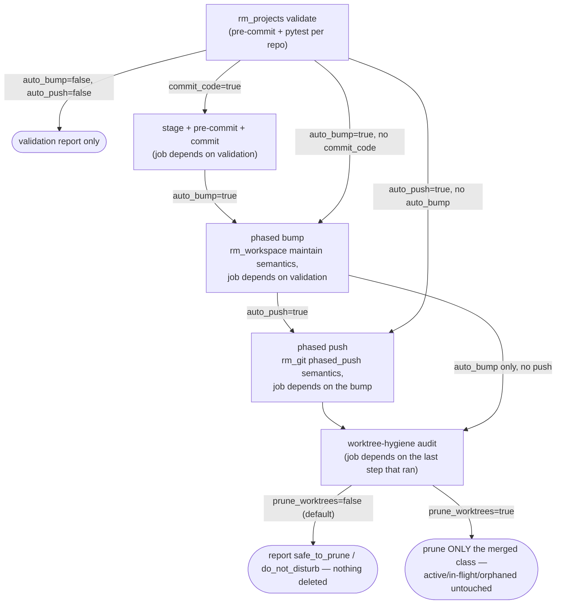

# Repository Manager — Workspace Release

Releasing a workspace is validate → bump → push, phased over a **topologically
ordered** dependency graph declared in `workspace.yml`'s maintenance config (lower
phase = more upstream; a change in phase *N* only ever cascades to phases `>= N`,
never backward — `CONCEPT:RM-PHASE-START`/`CONCEPT:RM-BUMP`). This skill is about
running that safely and previewing it before anything mutates, not about what
"valid" means per project (that is `repository-manager-workspace-validation`) or
how a push actually executes (`repository-manager-bulk-git-operations`).

## When to use
- Preview which repos would bump/push before running anything (`dry_run`).
- Run the full validate → consented-bump → consented-push chain in one call.
- Bump versions across the dependency-ordered workspace on their own.
- Scaffold, template, save, or list the `workspace.yml` manifest.

## When NOT to use
- Per-project validation semantics (pre-commit + pytest pass/fail) →
  `repository-manager-workspace-validation`.
- The actual `rm_git phased_push` mechanics and bulk clone/pull/push →
  `repository-manager-bulk-git-operations`.
- Candidate/generation certification for one branch landing →
  `repository-manager-candidate-certification`.

## Tools & actions
| Condensed tool | Actions relevant here |
|----------------|---------|
| `rm_workspace` | `maintain`, `maintain_status`, `list`, `list_branches`, `setup`, `template`, `save` |
| `rm_projects` | `validate`, `validate_status` (the consented bump/push chain lives here — see below) |

CLI: `repository-manager --maintain --bump {patch,minor,major} [--phase N]
[--single-phase] [--no-auto-start] [--project <name>] [--dry-run]
[--allow-pre-commit] [--config <path>]`, and separately `--validate [--bump ...]
[--push]` for the validate-then-release chain, or `--push` alone for phased push
only.

## DAG preview — see the plan before anything mutates
`dry_run=true` on `rm_workspace(action="maintain", ...)` walks the same
topologically-phased plan a real run would — same phase map, same `auto_start`
lowest-pending-phase logic — and reports what would bump/tag, without committing
or tagging anything:
```
rm_workspace(action="maintain", part="patch", dry_run=true)
```
`auto_start` (default `true`) begins the walk at the **lowest phase that actually
has pending work** rather than always `phase`/`1`, so an unchanged upstream phase
is skipped along with its inter-phase wait — but a change in any phase still
cascades to every phase `>= N`. Pass `projects=` to restrict the walk to specific
repo names (re-bumping ones a prior run skipped), or `force=true` to bump even with
no detected changes (auto_start then stands down and starts exactly at `phase`,
since explicit targeting deliberately bypasses change detection).

## The consented push boundary
Nothing pushes as a side effect of validating. `rm_projects(action="validate")`
only chains into a bump/push when the caller explicitly opts in on that same call
— consent is the parameter, not a separate confirmation step:

```
rm_projects(action="validate", auto_bump=true, auto_push=true, bump_part="minor")
```

- `auto_bump=false, auto_push=false` (the defaults) — validate only; nothing else runs.
- `auto_bump=true` — a phased bump submits **only after validation passes** (wired
  as a job dependency on the validation jobs, not a "then also do this" text
  instruction).
- `auto_push=true` — a phased push submits **only after the bump step** (or
  directly after validation if `auto_bump=false`), same dependency wiring.
- `commit_code=true` (+ `commit_message`) — stage + pre-commit + commit the
  targeted repos' feature code, concurrently with validation completing, **before**
  any bump — ensures untracked/new files are committed rather than left for the
  push safety net. The bump waits on this step when it runs.
- `prune_worktrees` — **report-only by default (`false`)**. Even with
  `auto_bump`/`auto_push`, the release still runs a worktree-hygiene audit and
  reports the `safe_to_prune`/`do_not_disturb` classification under
  `worktree_hygiene_job_id` **without deleting anything**. Set `true` only when you
  additionally want it to prune what it classified as `merged`; it never touches
  active/in-flight or orphaned worktrees regardless.



## Recipes
Preview a patch bump across the workspace (mutates nothing):
```
rm_workspace(action="maintain", part="patch", dry_run=true)
```
Validate, and only if everything passes, bump minor and push, phased:
```
rm_projects(action="validate", auto_bump=true, auto_push=true, bump_part="minor")
rm_projects(action="validate_status", job_id="<id>", summary=true)
```
Re-bump just the repos a prior phase run skipped:
```
rm_workspace(action="maintain", part="patch", projects="agent-utilities,gitlab-api")
```
List the workspace manifest / branches:
```
rm_workspace(action="list")
rm_workspace(action="list_branches")
```

## Gotchas
- `rm_workspace(action="maintain")` scopes on `projects`; `rm_projects(action="validate")`
  scopes on `repositories` — see `repository-manager-workspace-validation`'s Gotchas.
- `maintain`/`validate` both return **job ids** — poll `maintain_status`/`validate_status`.
- `save` overwrites `workspace.yml` — pass an explicit `yml_path` when you don't
  want the default.
- A version-floor bump for a dependency (raising a package's minimum pinned
  version to patch a CVE) is a `pyproject.toml`/`uv.lock` edit, not an action this
  tool performs — this skill's "version plan" is the workspace's own
  package-version bump/tag, a different concern.
- Any tool's live action set is self-discoverable: `rm_workspace(action="list_actions")`
  / `rm_projects(action="list_actions")`.

## Related
- `repository-manager-workspace-validation` — the `validate`/`install`/`build`
  action detail this skill's chain builds on.
- `repository-manager-bulk-git-operations` — the `rm_git phased_push` mechanics the
  consented push boundary ultimately triggers.
- `repository-manager-fleet-scale-operations` — worktree audit/prune classification
  detail behind the worktree-hygiene step.
- `repository-manager-development-lifecycle` — the governed per-lane entrypoint;
  this skill is workspace-wide release, not one lane's submission.
- Mechanism: `repository_manager/workspace_manifest.py`,
  `repository_manager/development/workspace_release.py`,
  `repository_manager/development/workspace_release_plan.py`,
  `repository_manager/development/workspace_versions.py`.
